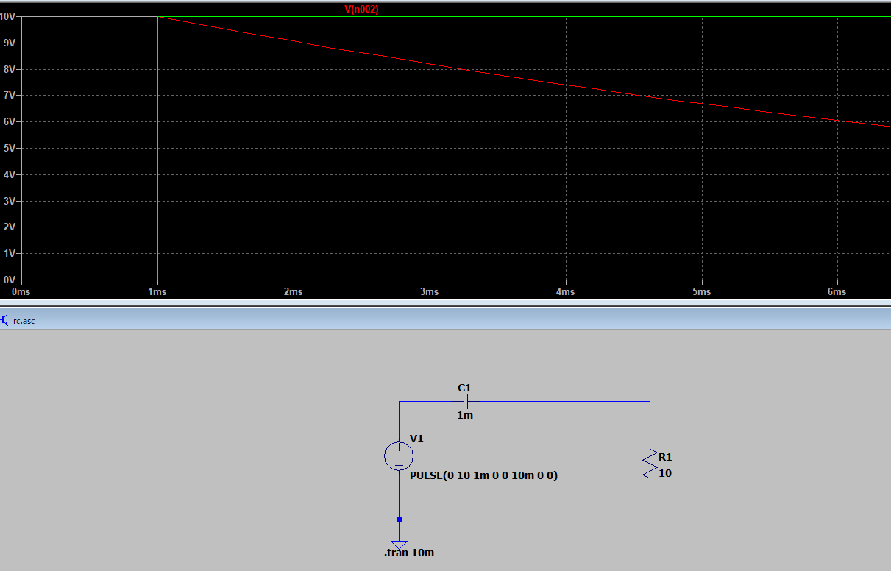
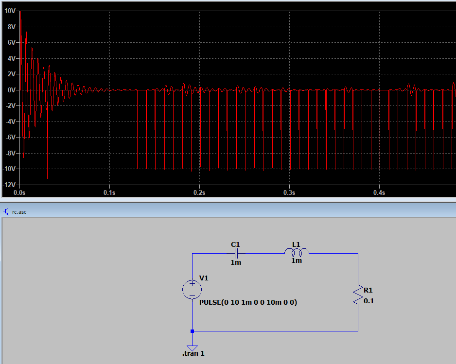
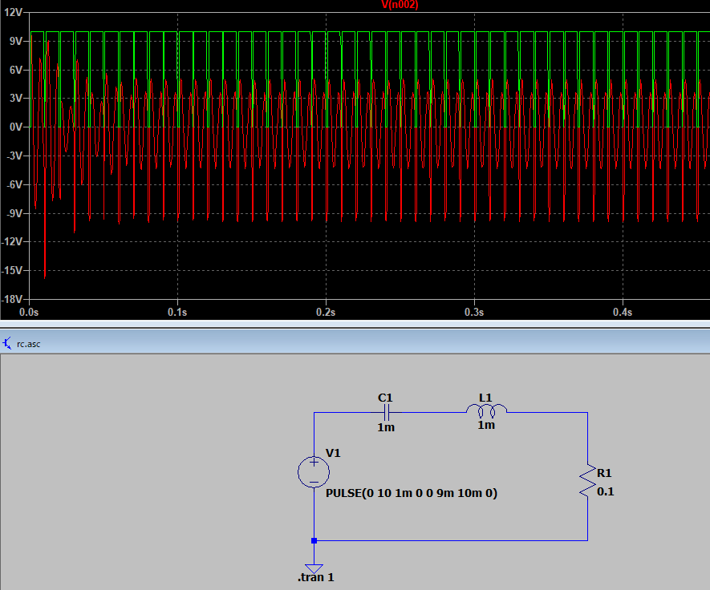
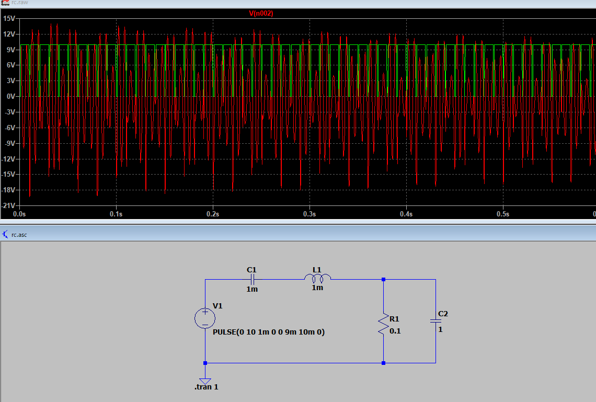
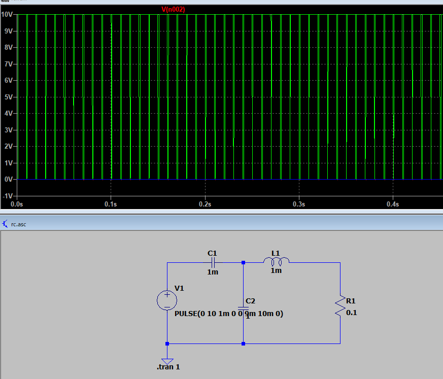
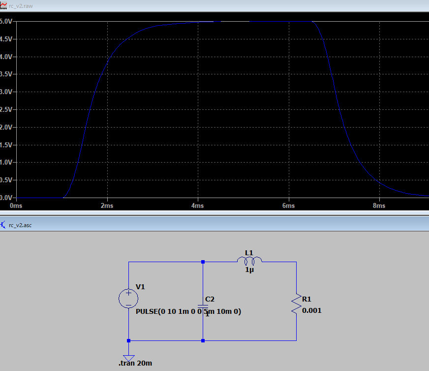
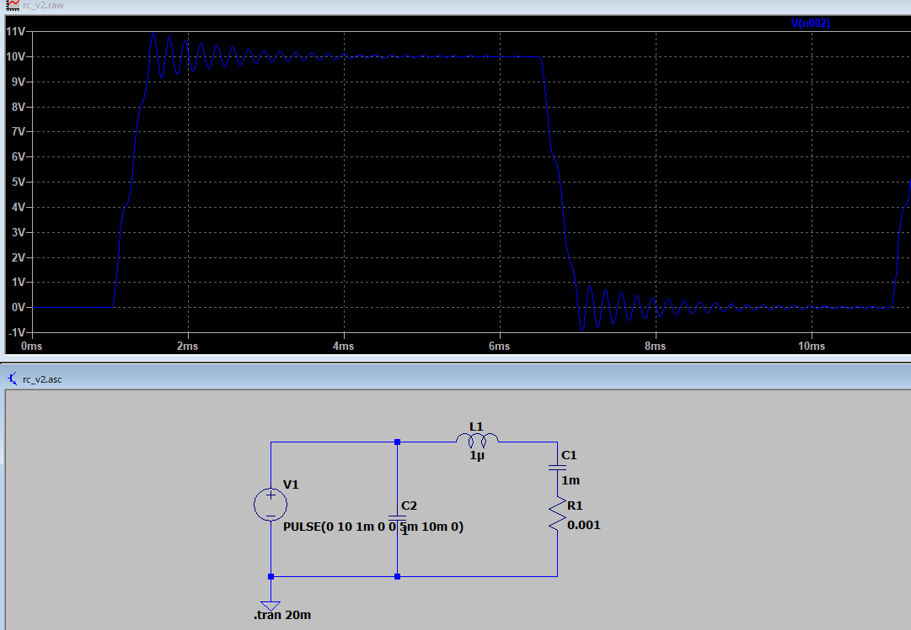
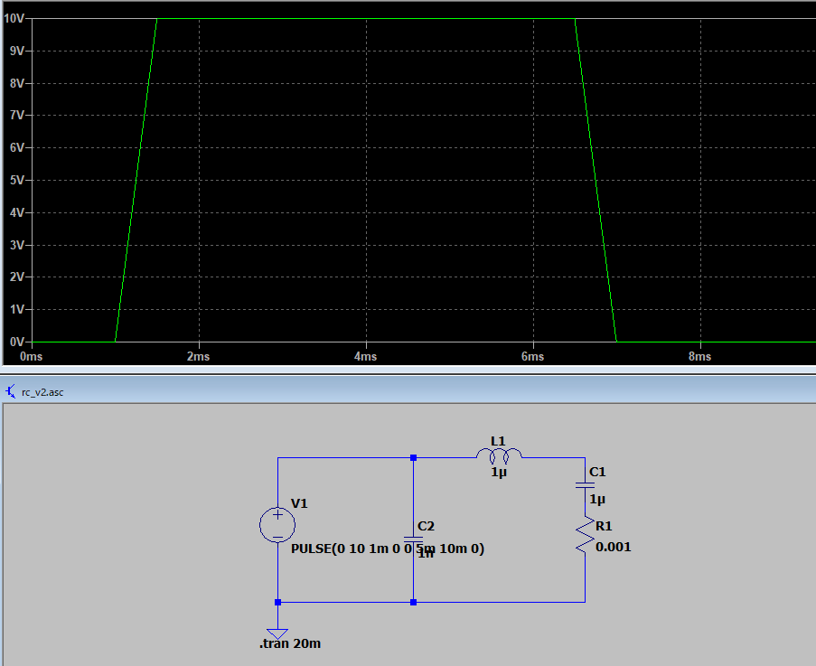
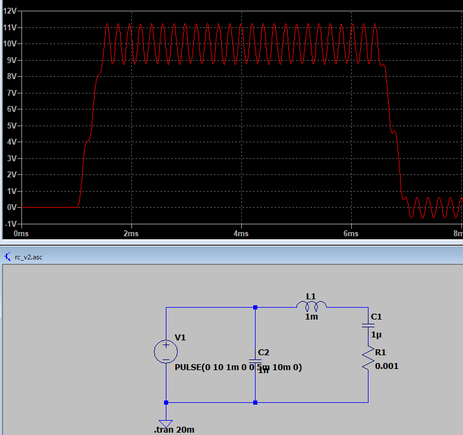

# ローパス

ローパスフィルタ（Low-Pass Filter：LPF）は**低周波を通して、高周波を遮る**回路です。

電子回路や信号処理の基礎として非常に重要なフィルタの1つです。


## 🧩 1. 基本構成

### （1）最も基本的な回路：**RCローパスフィルタ**

以下のような構成になります：

```
Vin ──R───┬─── Vout
            │
            C
            │
           GND
```

* **R：抵抗**
* **C：コンデンサ**
* **Vin：入力信号**
* **Vout：出力信号**

---

## ⚙️ 2. 動作原理

### （1）コンデンサの性質

コンデンサは、

* **直流や低周波 → 電流を通しにくい**
* **高周波 → 電流を通しやすい**

  という周波数依存の性質を持ちます。

---

### （2）信号が低周波の場合

* コンデンサのインピーダンス（抵抗に相当するもの）は大きくなります。
* したがって、電流はほとんどR側を通り、出力 ( V_{\text{out}} ) ≈ ( V_{\text{in}} )。

  → **低周波はそのまま出力される。**

---

### （3）信号が高周波の場合

* コンデンサのインピーダンスが小さくなります（ほぼ短絡状態）。
* 入力信号はコンデンサを通ってGNDに逃げるため、出力は小さくなります。

  → **高周波成分は減衰する。**

---

## 📉 3. 周波数特性

周波数 ( f ) に対して出力電圧の大きさは次のようになります：

[

\left|\frac{V_{\text{out}}}{V_{\text{in}}}\right| = \frac{1}{\sqrt{1 + (2\pi f R C)^2}}

]

---

### （1）カットオフ周波数

信号が ( 1/\sqrt{2} )（= 約0.707倍）まで減衰する周波数を**カットオフ周波数**と呼びます。

[

f_c = \frac{1}{2\pi R C}

]

* ( f < f_c )：信号がよく通る（低周波域）
* ( f > f_c )：信号が減衰する（高周波域）

---

## 🔋 4. 位相特性

RCローパスフィルタでは、信号の**位相**も変化します。

* 低周波 → 位相差ほぼ 0°
* 高周波 → 出力が入力より最大で -90° 遅れる

---

## ⚡ 5. 実用的な応用例

| 応用分野           | 目的                                         |
| ------------------ | -------------------------------------------- |
| オーディオ回路     | 高音ノイズの除去（低音だけ通す）             |
| 電源回路           | リップル（高周波ノイズ）除去                 |
| ADC（A/D変換）前段 | サンプリング前のアンチエイリアシングフィルタ |
| モータ制御         | PWM信号を平滑化して平均電圧を得る            |

---

## 🧱 6. 他の構成例（上位版）

| 種類                               | 構成                  | 特徴                         |
| ---------------------------------- | --------------------- | ---------------------------- |
| **RLローパスフィルタ**       | 抵抗 R とインダクタ L | 電流制御系でよく使用         |
| **アクティブフィルタ**       | オペアンプ＋R＋C      | 増幅とフィルタを同時に行える |
| **デジタルローパスフィルタ** | ソフトウェア実装      | 信号処理（DSPなど）に使用    |

---

## 🎯 まとめ

| 項目             | 内容                                    |
| ---------------- | --------------------------------------- |
| 目的             | 低周波信号を通し、高周波を遮断          |
| 代表回路         | RCローパスフィルタ                      |
| カットオフ周波数 | ( f_c = 1 / (2πRC) )                   |
| 原理             | コンデンサが高周波成分をバイパスする    |
| 応用             | ノイズ除去・波形平滑化・ADC入力保護など |

---

ご希望があれば、

LTspice で動作確認できる「RCローパスフィルタ回路のサンプル回路図」も書けます。

出力波形を見たい用途でしょうか？





大振動。












こうすると大分落ち着いた。

インダクタンスとコンデンサの位置は非常に重要。

直列で接続すると振動します。




はい。

振動的。




更にLCの値によって振動したりしなかったり。







# 振動的基準

 **抵抗などの減衰（損失）量** に依存します。要点は「系の特性方程式の根が複素共役（虚部を持つ）かどうか」を見ることです。以下、整理して説明します。

---

## 1) 基本モデルと特徴方程式

代表的な 2 種類の回路を扱います。

### (A) シリーズ R–L–C 回路（R, L, C が直列）

微分方程式（自然応答）：

[

L\ddot q + R\dot q + \frac{1}{C}q = 0

]

特性方程式（s について）：

[

s^2 + \frac{R}{L}s + \frac{1}{LC} = 0

]

自然角周波数：

[

\omega_0=\frac{1}{\sqrt{LC}}

]

減衰比（damping ratio）(\zeta)：

[

2\zeta\omega_0=\frac{R}{L}\quad\Rightarrow\quad \zeta=\frac{R}{2L\omega_0}=\frac{R}{2}\sqrt{\frac{C}{L}}

]

判定：

* (\zeta<1) →  **過減衰ではなく「弱減衰」** （根は複素共役）： **振動的（減衰振動）**
* (\zeta=1) → 臨界減衰（振動しないが最速でゼロへ）
* (\zeta>1) → 過減衰（振動しない）

臨界抵抗（critical R）：

[

R_\text{crit,series}=2\sqrt{\frac{L}{C}}

]

（つまり (R<R_\text{crit}) なら振動的）

シリーズ回路の Q（品質係数）：

[

Q=\frac{\omega_0 L}{R}=\frac{1}{R}\sqrt{\frac{L}{C}}

]

（Q が大きいほど鋭く振動）

---

### (B) パラレル R∥L∥C（抵抗が並列）の場合

並列 RLC の自然方程式（電圧 V の場合）は

[

s^2 + \frac{1}{RC}s + \frac{1}{LC}=0

]

したがって

[

2\zeta\omega_0=\frac{1}{RC}\quad\Rightarrow\quad \zeta=\frac{1}{2R C \omega_0}=\frac{1}{2R}\sqrt{\frac{L}{C}}

]

判定：

* (\zeta<1) →  **振動的** （ここでは R が大きいほど減衰が小さく、振動しやすい）
* 臨界抵抗（parallel）：

  [

  R_\text{crit,parallel}=\frac{1}{2}\sqrt{\frac{L}{C}}

  ]

  （(R>R_\text{crit,parallel}) なら振動的）

パラレル回路の Q:

[

Q=R\sqrt{\frac{C}{L}}

]

---

## 2) 判定を一発で行う方法（判別式）

特性方程式 (s^2 + a s + b =0) の判別式

[

\Delta = a^2 - 4b

]

を見ればよいです（実数係数の場合）。

* (\Delta < 0) → 根は複素共役 → **振動的（減衰振動）**
* (\Delta \ge 0) → 実根 → 非振動（過減衰または臨界）

シリーズ回路で (a=\dfrac{R}{L}, b=\dfrac{1}{LC}) なので

[

\Delta = \left(\frac{R}{L}\right)^2 - \frac{4}{LC}

]

が負なら振動する。

---

## 3) 実用上のポイント・注意点

* **回路に含まれる全ての損失（回路のR、導線抵抗、コア損、寄生抵抗など）を考慮**すること。実回路では「理想 L,C」だけでなく寄生抵抗が振動に影響します。
* **励振（駆動）条件** ：外部の駆動源がある場合は、共振（インピーダンス最小・最大）により高振幅が出るが自然応答の振動判定とは別に考える。
* シリーズ共振では入力に対してインピーダンスが最小（電流最大）になる周波数 ( \omega_0 )。
* 並列共振ではインピーダンスが最大（電流最小）になる周波数 ( \omega_0 )。
* **Q（品質係数）** が高いと共振が鋭く、減衰が小さい（長く ringing する）。Q と ζ は逆関係（(Q=1/(2\zeta))）です。
* 実験的には  **周波数掃引してインピーダンス振幅や位相を見る** （ネットワークアナライザやスイープ測定）と共振の有無が簡単にわかります。

---

## 4) 数値例（イメージしやすいように）

例：(L=1\ \text{mH}=1\times10^{-3}\ \mathrm{H}), (C=1\ \text{nF}=1\times10^{-9}\ \mathrm{F})

* (\omega_0 = 1/\sqrt{LC} = 10^6\ \mathrm{rad/s}) → (f_0 \approx 159\ \text{kHz})
* (\sqrt{L/C} = 1000\ \Omega)

シリーズ臨界抵抗：

[

R_\text{crit,series}=2\sqrt{\frac{L}{C}}=2000\ \Omega

]

→ もし回路の直列抵抗 (R<2000\ \Omega) なら  **振動的** （減衰振動）

パラレル臨界抵抗：

[

R_\text{crit,parallel}=\frac{1}{2}\sqrt{\frac{L}{C}}=500\ \Omega

]

→ 並列抵抗 (R>500\ \Omega) なら **振動的**

（この数値はあくまで例。実際は寄生要素を含めて計算）

---

## 5) 実務での判定フロー（チェックリスト）

1. 回路トポロジーを確認（シリーズかパラレルか、あるいは混成）
2. 実効 R を見積もる（部品の直列/並列抵抗、導線・コア損、負荷など）
3. 上の式で (\zeta)、または判別式 (\Delta) を計算する（または臨界抵抗と比較）
4. 必要ならシミュレータ（SPICE）で transient（時刻応答）と AC sweep（周波数特性）を確認する
5. 実回路でオシロスコープ・ネットワークアナライザで確認

---

## まとめ（短く）

* LC 自体は共振（振動）を生みやすいが、**抵抗が十分大きい（または小さい、トポロジー依存）と振動が抑えられる。**
* **シリーズ** : 振動的 ⇔ (R < 2\sqrt{L/C})
* **並列** : 振動的 ⇔ (R > \tfrac{1}{2}\sqrt{L/C})
* 判別式 (\Delta<0)（複素根）なら振動的。Q と ζ で振動の「鋭さ」「減衰時間」を評価。
