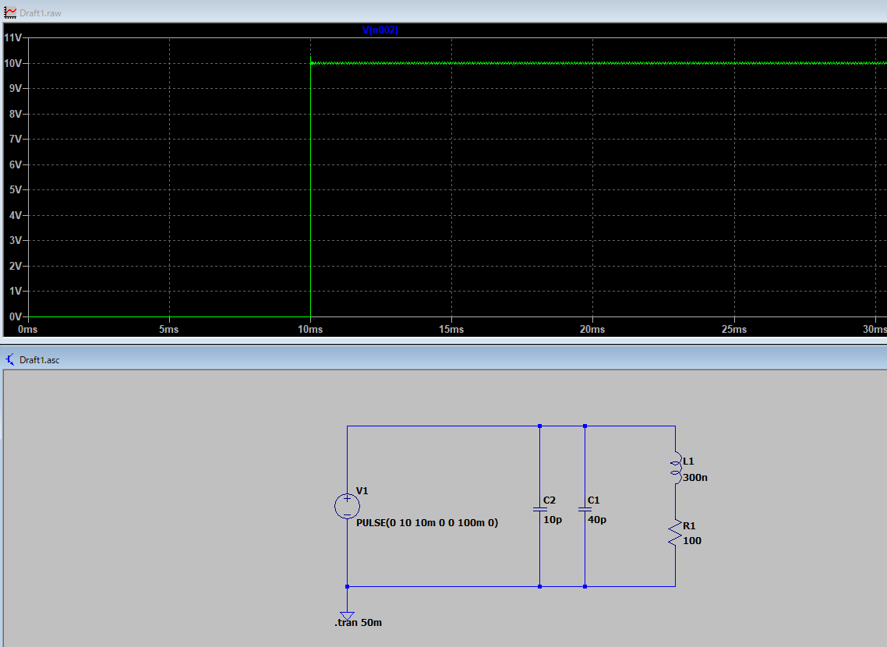
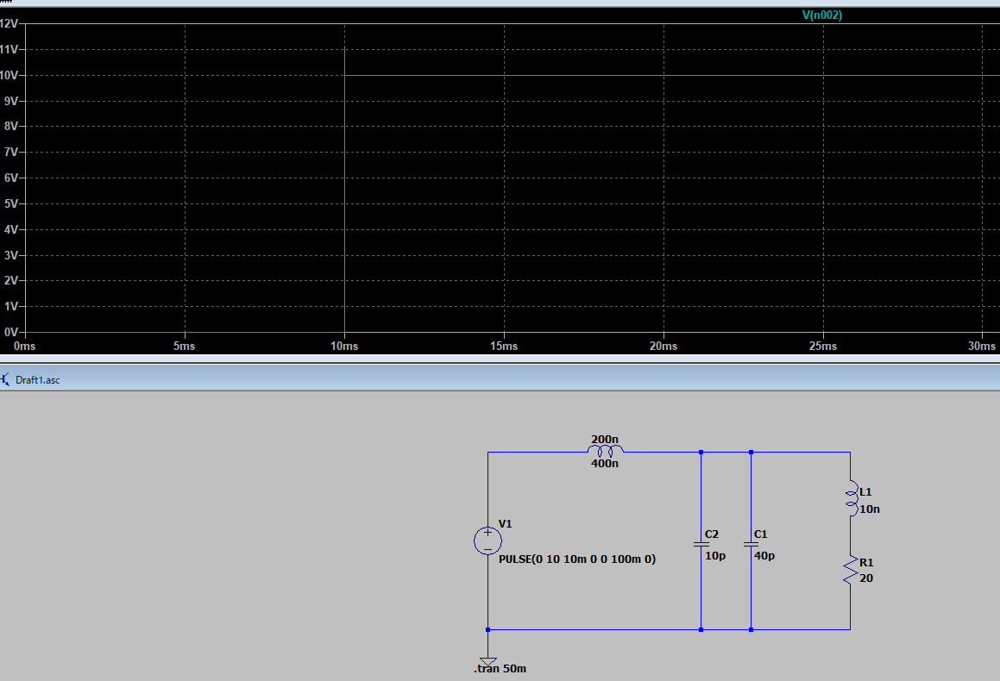

# 回路のノイズ

電気回路で「ステップ電圧（急な立ち上がりの電圧）」を加えると、オシロなどで観測した波形にノイズやリンギング（振動成分）が重なって見えることがあります。

これは偶然ではなく、いくつか物理的な理由があります。

---

# ✅ 立ち上がりにノイズが乗る主な理由

## 1. **LとCによる共振（リンギング）**

* 実際の回路には必ず **配線のインダクタンス** や **素子の寄生容量** が存在します。
* ステップ電圧を加えると、急激なエネルギー供給により L と C が共振回路のように働きます。
* その結果、**減衰振動（リンギング）**が立ち上がり部分に現れます。

  👉 ステップ応答の典型的な「ジリジリした振動成分」はこれです。

---

## 2. **伝送線路効果（反射）**

* 高速の立ち上がりは「広帯域信号」なので、配線をただの抵抗ではなく「伝送線路」として考えなければなりません。
* インピーダンス整合が取れていないと、信号が端で反射し、**重なってノイズのような波形**が見えます。
* PCB配線や長いケーブルで顕著です。

---

## 3. **電源やグランドのインピーダンス**

* ステップ電圧で急に電流が流れると、グランドや電源ラインのインダクタンスにより電圧が揺れます（ **グランドバウンス** ）。
* そのため他の回路にも一時的なノイズとして観測されます。

---

## 4. **計測系の影響**

* オシロスコープやプローブのリード線自体にも寄生LやCがあり、ステップ入力でリンギングが観測されることがあります。
* プローブのGNDリードを長くすると顕著に波形にノイズが乗る例は有名です。

---

# ✅ まとめ（直感的に言うと）

* ステップ電圧は「急に殴る」ような入力なので、高周波成分がたくさん含まれています。
* 回路や配線の「隠れたバネ（L）」と「隠れたバネ（C）」がその高周波に反応して揺れます。
* それが **立ち上がりのノイズ（リンギング、オーバーシュート）**として観測されるのです。


# 立ち上がりのリンギング（ノイズ）が寄生L/Cで発生

以下は **LTspice 用の回路（単一ファイル）** で、**寄生が無い場合（理想）** と **寄生 L／C がある場合** を並べて比較できるようにしてあります。さらに `Rser` をパラメータステップして減衰の違いも見られます。

---

## 使い方（流れ）

1. 下の netlist をテキストファイルに貼り `ring_test.asc`（または `.cir`）として保存。
2. LTspice で開いて  **Run** 。
3. 波形ビューで `V(v_no_parasitics)` と `V(v_parasitics)` を表示。`I(Lpar)` もプロットするとコイル電流の振動が見えます。
4. `.step param Rser list 0.1 1 10 50` を有効にしてあれば、Rser を変えた複数波形が同時に出ます（減衰の違いを比較）。

---

## LTspice netlist（そのまま貼って実行可）

```
* Ringing test: compare no-parasitics vs parasitics
.param Rser=1       ; 直列抵抗（ダンピング用）：ステップで変える
.param Lpar=200n    ; 寄生インダクタンス（例: 200 nH）
.param Cpar=50p     ; 寄生容量（例: 50 pF）
.param Rload=100    ; 負荷抵抗

* Fast step source (0 -> 5V)
V1 VIN 0 PULSE(0 5 0 1n 1n 10u 100u)

* --- branch A: ideal (no parasitics) ---
RsrcA VIN v_no_parasitics 0.01   ; 小さなソース抵抗だけ（ほぼ理想）
RloadA v_no_parasitics 0 {Rload}

* --- branch B: with parasitic L and C (models layout, probe, snubber-less) ---
RsrcB VIN n1 {Rser}    ; 直列抵抗をパラメータで変更
Lpar n1 n2 {Lpar}
Cpar n2 0 {Cpar}
RloadB n2 0 {Rload}

* expose nodes with nice names
.node VNODE_NOPAR v_no_parasitics
.node VNODE_PAR n2
* Labels for easier plotting
* (LTspice will show node names v_no_parasitics and n2)

.tran 0 2m 0 1u
.step param Rser list 0.1 1 10 50
.backanno
.end
```

> 注：`PULSE` の立ち上がり時間（ここでは 1ns）が非常に短いので、高周波成分が豊富に含まれ、寄生で顕著なリンギングが出ます。実機では立ち上がりが遅ければ振動が小さくなります。

---

## 何を観るか（推奨プロット）

* `V(v_no_parasitics)` ：寄生無し（理想） → べたっと立ち上がる（オーバーシュート小）
* `V(n2)` （＝寄生ありの出力） ：寄生L/Cでの立ち上がり → オーバーシュートや減衰振動（リンギング）が見える
* `I(Lpar)` ：コイル電流の振動（エネルギー交換の様子）

`.step param Rser ...` を使って波形がどのようにダンプされるか（減衰が強くなる）を比較してください。

---

## なぜ立ち上がりでノイズ（リンギング）が出るか（復習）

* 急峻な立ち上がりには高周波成分が多く含まれる → 回路の寄生 L（配線・プローブ） と寄生 C（素子・配線間容量）が **共振** を起こす。
* エネルギーが電界（C）⇄磁界（L）で交換されるため、振動（リング）が発生し、回路抵抗（実際はコイルの DCR, ケーブル・ESR）で徐々に減衰する。
* 伝送線路的な反射（インピーダンス不整合）が加わると、さらに複雑な波形になる。

---

## 実機での観測・デバッグのヒント

* オシロのプローブは**GNDリードを短く**する（アースクリップ長いと自分で寄生L作る）
* プローブの接続点に小さな同軸アダプタやグラウンドスプリングを使うと良い
* 配線・基板パターンは寄生インダクタンスと容量を作る → 配置・レイアウトで大きく変わる

---

## 振動を抑える実務的手段（設計対策）

1. **シリーズダンピング抵抗（Rser）** を入れる（これが最も直接的）
2. **RCスナバ（例：R=10Ω,C=100nF）** を寄生を跨ぐ形で追加して共振を吸収
3. **フェライトビーズ** を使って高周波成分を減衰
4. **配線短縮・グラウンドプレーンの改善** （寄生L/Cの低減）
5. **立ち上がりを遅くする（ソフトエッジ）** ：ドライバのスイッチ速度を制御
6. **インピーダンス整合** （伝送線路上で反射を抑える）

---

## 追加の実験アイデア（LTspiceで）

* `.step param Lpar list 50n 200n 1u` で L を変えてリンギング周波数の変化を見る。
* `.step param Cpar list 10p 50p 200p` で C を変えて共振周波数が ( f_0 = 1/(2\pi\sqrt{LC}) ) に従うことを確認。
* `V1` の `rise` 時間を `1n` → `10n` → `100n` と変えて、立ち上がり時間が長いほど高周波成分が減ってリンギングが抑えられることを確認。

---

必要なら、あなたの想定する実際の回路（電源電圧・立ち上がり時間・推定される寄生値・負荷）を教えてください。

その条件でカスタムの netlist を作り、期待ピーク値や共振周波数、抑制のための最適なダンピング抵抗やスナバ値を計算して差し上げます。





よい実験質問です — **リンギング（減衰振動）の振幅を大きくする**には、物理的には「共振回路に蓄えられるエネルギーを大きくして、減衰（損失）を小さくする」ことが基本です。以下に理屈、具体的な手段（実際の回路／LTspiceで使える設定）、安全注意点をまとめます。

---

## 1) 理屈（要点）

* 共振周波数：(\displaystyle f_0=\frac{1}{2\pi\sqrt{LC}})
* シリーズRLCの品質係数（Q）：(\displaystyle Q=\frac{1}{R}\sqrt{\frac{L}{C}})（ここでRは並列でなく **直列損失** ）
* **振幅を大きくする＝Qを上げる（減衰を小さくする）＋共振に供給するエネルギーを増やす** 。

---

## 2) 実務的にリンギングを大きくする方法（優先順）

### A. 損失（ダンピング）を下げる（最も効果的）

* 直列抵抗を小さくする（`Rser` を小さくする）。
* インダクタの **DCR（直流抵抗）** を下げる（高Qコイルを使う）。
* コンデンサの **ESR** を下げる（積層セラミックなど低ESR品）。

  → Q が上がり、同じ励起での振幅が増える。

### B. 共振回路のエネルギーを増やす

* L や C を大きくして（あるいは元の L,C を変えず） **入力電圧を上げる** （ただし部品定格に注意）。
* より急峻な立ち上がり（短い rise time）を与えると高周波成分が増え、共振モードに効率よくエネルギーが入る。

### C. 共振条件に合わせて励起する

* 単発ステップより、 **共振周波数に同期したパルス列** （励振を連続的に与える）を使うと共振が強化される（同期励振）。
* 例：ステップ→その後 f0 の矩形波で駆動 → 振幅が累積的に増える（ただし発散は部品破壊のリスクあり）。

### D. 共振回路の構成を変える

* 直列LCタンク（負荷側で L と C を直列）やパラレルタンクを使い、望むモードを明確化する。
* 共振点付近でインピーダンスを整合させ、エネルギーの取り込みを最大化する。

---

## 3) LTspiceで試すための具体的変更例

（前に出した netlist をベースに）

* `Rser` を小さくして比較：

```spice
.step param Rser list 0.01 0.1 1 10
```

* 立ち上がり時間を短く：

```spice
V1 VIN 0 PULSE(0 5 0 0.1n 0.1n 10u 100u)  ; rise=0.1ns
```

* 高Qコイル（モデル的にDCRを極小に）：

```spice
.param Lpar=200n
RsrcB VIN n1 {Rser}
Lpar n1 n2 {Lpar} ; use ideal inductor, DCR modeled by separate small R if needed
```

* Cを低ESR想定（理想Cに近い）：

```spice
Cpar n2 0 50p
```

* 同期励振（連続正弦/矩形で共振を励起）：

```spice
V2 n1 0 SIN(0 0.5 {f0}) ; or PULSE at period 1/f0
```

（`f0` は計算した共振周波数）

**狙いどおり振幅が上がれば、`I(L)` と `V(n2)` のピークが大きく、Damped oscillation の減衰時間が長くなります。**

---

## 4) 実験的パラメータ操作（チェックリスト）

* `Rser` ↓ → 振幅 ↑、減衰長く
* `L` ↑ または `C` ↑（ただし f0 が低下する）→ 共振により電流/電圧の振幅が変化
* `rise time` ↓（より急峻）→ 高周波成分↑ → 同じ共振モードが強く励起される
* 入力振幅↑ → 振幅↑（ただし部品定格注意）
* 連続励振（同期）→ 振幅累積（飽和や破壊のリスク有り）

---

## 5) セーフティ＆実務注意（必ず守る）

* 高Qにすると **大きな過電圧・過電流** が発生しやすい → コンデンサの定格電圧破壊、コイルの発熱破損、ダイオードサージなどの危険あり。
* 高周波ノイズやEMI を周囲に撒き散らす（法的・実験室ルールの問題）ことがある。
* オシロ/プローブ自身が共振に影響する（プローブGNDは短く、適切なアースを使う）。
* 実験は低電圧・限定的なエネルギで行い、徐々に強める。

---

## 6) 追加テクニック（高度）

* **アクティブ増幅（ループによる強制発振）** ：オペアンプやトランジスタでタンクに正帰還を与え、発振回路にする（自励発振で大振幅を得られる）。ただし回路設計が複雑で危険性高。
* **同期励振（フェーズ合わせ）** ：外部ソースで位相を合わせながら供給すると効率的に振幅を上げられる。
* **Qの人工的向上** ：共振にダンピングを与える抵抗やフェライトを除去する。

---

### 最後に（まとめ）

リンギングを大きくするには結局、

* **ダンピングを減らす（Rを下げ、DCR/ESRを低くする）** 、
* **共振回路に十分なエネルギーを供給する（鋭い立ち上がり／同期駆動／入力電圧を上げる）** 、
* **回路のQを高める** 、

  の組合せが基本です。LTspice上で `Rser` を極小にし、`rise time` を短く、L/C値と励起波形を調整して挙動を観察してみてください。

安全面に気をつけつつ（低電圧で段階的に）、具体的な netlist の調整や試すべきパラメータ値を作ってほしければ、あなたの使いたい L, C, 供給電圧、目的周波数帯を教えてください。それに合わせた推奨設定を作ります。



