# 単相電圧形フルブリッジインバータ

「単相電圧形フルブリッジインバータ（single-phase voltage source full-bridge inverter）」は、**直流電圧を交流電圧に変換する**代表的なインバータ回路の一つです。

以下で、特徴や動作、メリット・デメリットをわかりやすくまとめます。

---

## ⚙️ 1. 回路構成の概要

単相フルブリッジインバータは、次のように4つのスイッチ（例：MOSFETやIGBT）を使って構成されます：

```
       DC+
        |
       [S1]----+----[S3]
        |      |      |
       [S2]----+----[S4]
        |             |
       DC-            負荷 (R, RL, etc)
```

* スイッチ S1〜S4 は対角線上で同時にオンになります（S1とS4、または S2とS3）。
* 出力端子の間に **+Vdc** または **−Vdc** の電圧を交互に印加して、交流波形を生成します。

---

## ⚡ 2. 主な特徴

| 項目                 | 内容                                                  |
| -------------------- | ----------------------------------------------------- |
| **入力**       | 直流電圧源（DC source）                               |
| **出力**       | 単相交流（矩形波）                                    |
| **スイッチ数** | 4個（ハーフブリッジの2倍）                            |
| **出力電圧**   | ±Vdc（ハーフブリッジの2倍の振幅）                    |
| **出力電流**   | 負荷に応じて正逆に流れる（双方向）                    |
| **電圧制御**   | PWM制御などで正弦波近似が可能                         |
| **動作モード** | 定常動作時には2つの対角スイッチが交互にオン・オフする |

---

## 🔄 3. 出力波形の例

PWM制御を使わない場合（基本動作）：

* S1・S4 → ON： 出力 = +Vdc
* S2・S3 → ON： 出力 = −Vdc

  → 結果、出力は**矩形波（方形波）**となります。

PWM制御を加えると：

* 出力は正弦波に近づき、**高調波成分が減少**します。

---

## ✅ 4. 長所（メリット）

1. **出力電圧の振幅が大きい**

   　→ 同じ直流電源電圧でも、ハーフブリッジより2倍の出力が得られる。
2. **電力変換効率が高い**

   　→ スイッチング素子の損失が比較的少ない。
3. **出力の極性を自由に反転できる**

   　→ 負荷電流が双方向に流れ、モータなどの駆動にも適している。
4. **PWM制御によって正弦波出力が可能**

   　→ インバータモータなどの高性能制御にも応用できる。

---

## ⚠️ 5. 短所（デメリット）

1. **スイッチング素子が4個必要**

   　→ 回路構成が複雑でコスト・制御回路が増える。
2. **同一アーム内の直列スイッチが同時オンすると短絡** （shoot-through）

   　→ 制御上の注意が必要。
3. **出力電圧に高調波を含む**

   　→ フィルタ回路（LCフィルタなど）が必要になる場合がある。

---

## 🧠 6. 応用例

* モータドライブ（ACサーボ、ブラシレスDCモータ）
* 無停電電源装置（UPS）
* 太陽光発電インバータ
* 家庭用AC100Vインバータ
* 交流電源シミュレータ

---

## 🔍 まとめ

| 項目     | 内容                                                   |
| -------- | ------------------------------------------------------ |
| 名称     | 単相電圧形フルブリッジインバータ                       |
| 入力     | DC電源                                                 |
| 出力     | 単相AC（±Vdc）                                        |
| 特徴     | 4スイッチ構成、極性反転可能、PWMで正弦波近似可         |
| メリット | 出力電圧が大きく、モータ制御などに最適                 |
| 注意点   | 同時オンによる短絡防止、スイッチング制御の厳密性が必要 |

---

もしご希望であれば、

この回路の **動作波形（電圧・電流）を図で説明した資料** も作成できます。

作りましょうか？

## 回路図

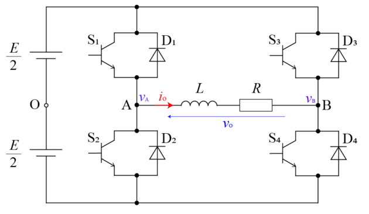

## 回路の動作モード

S1、S4をオン、S2、S3をオフ

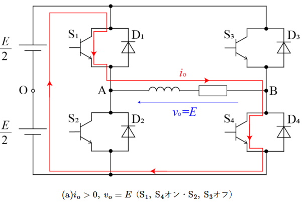

S1とS4をオフ、S2とS3をオン

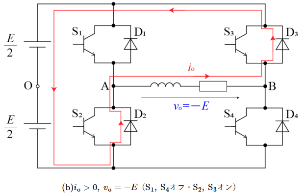

S1とS4をオン、S2とS3をオフ

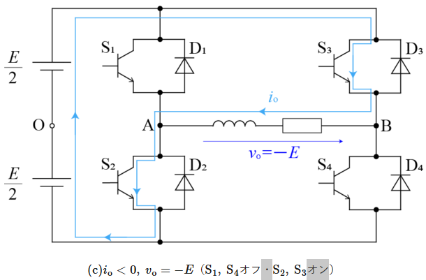

S1とS4をオン、S2とS3をオフ

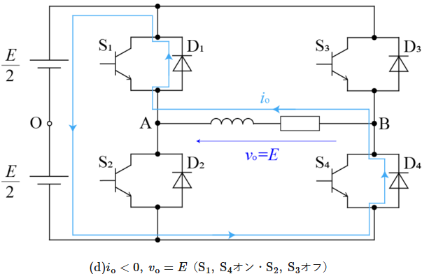

# MOS FET

ON状態のFETの電圧については以下の状態。

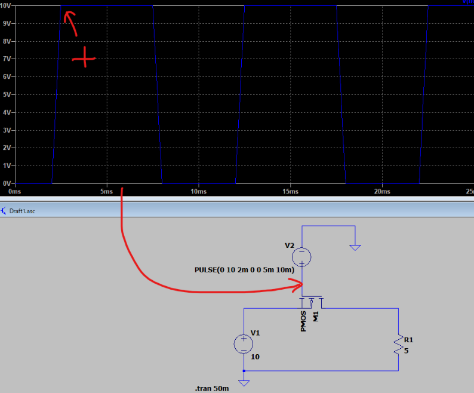

5mV!?配線間違えてないか・・・

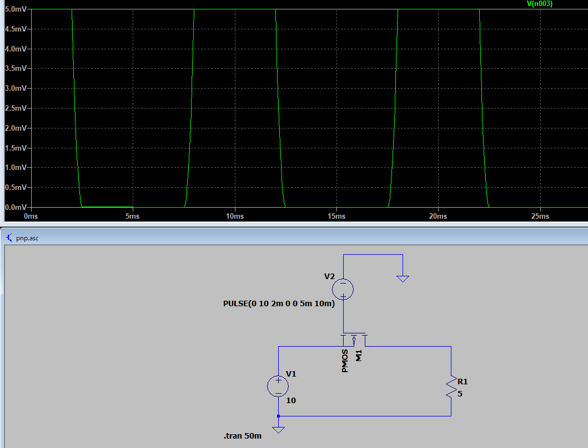

正しくはこの配線

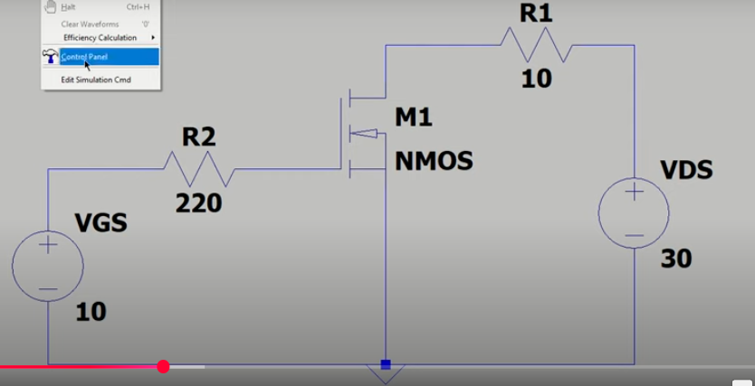


## PMOS VS NMOS

マイクロプロセッサはトランジスタ、具体的には金属酸化膜半導体 (MOS) トランジスタで構成されています。

MOS トランジスタには、正 MOS (pMOS) と負 MOS (nMOS) の 2 つの主な種類があります。

各 pMOS トランジスタと nMOS トランジスタには、ゲート、ソース、ドレインという 3 つの主要コンポーネントがあります。

PMOS トランジスタと NMOS トランジスタは、現代の電子デバイスの基本要素として機能します。

それぞれ P チャネル金属酸化膜半導体と N チャネル金属酸化膜半導体と呼ばれるこれらのトランジスタは、今日の技術環境を形成する上で不可欠です。

これらは、基本的なロジック ゲートから、コンピューター、スマートフォン、その他多数の電子デバイスに見られる複雑な集積回路まで、幅広い電子回路で使用されています。

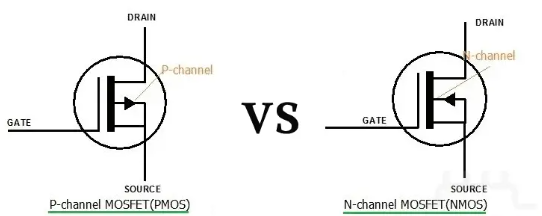


[PMOSは、ゲート電圧を介して正孔の移動を制御し、電流のオン・オフを切り替える仕組みを持っています。ゲート電圧が負になると、チャネルが形成され、ソースドレイン間に電流が流れます。この電流の流れは、ゲート電圧の変化に応じて制御され、電源電圧や電力効率の最適化に役立ちます。 ](https://www.bing.com/ck/a?!&&p=d70c603c6e5ab22e18fde5440b648ce1c53d353df2b01e62001e86553b869974JmltdHM9MTc2MDA1NDQwMA&ptn=3&ver=2&hsh=4&fclid=05959615-f31c-6eb3-3934-99b8f2f66f49&u=a1aHR0cHM6Ly9ub3RlLmNvbS91bm9sZWN0dXJlcy9uL245NGM1MzEzNjg0OTQ&ntb=1)[Note**+1**](https://www.bing.com/ck/a?!&&p=d70c603c6e5ab22e18fde5440b648ce1c53d353df2b01e62001e86553b869974JmltdHM9MTc2MDA1NDQwMA&ptn=3&ver=2&hsh=4&fclid=05959615-f31c-6eb3-3934-99b8f2f66f49&u=a1aHR0cHM6Ly9ub3RlLmNvbS91bm9sZWN0dXJlcy9uL245NGM1MzEzNjg0OTQ&ntb=1)

[PMOSの動作原理は、ゲート電圧を介してソース端子とドレイン端子間の伝導経路を制御することを中心にしています。ゲートに正電圧が印加されていない場合、ドレインとソースは分離されていますが、ゲートに正電圧が印加されると、ゲート付近に電子が吸い寄せられ、反転層が発生します。この反転層は、ドレインとソース間の架け橋となり、電流が流れやすくなります。 ](https://www.bing.com/ck/a?!&&p=61bf4d07f1a028515a564e6f219df7bd31cd928137a47556b45aee3dbabb86bdJmltdHM9MTc2MDA1NDQwMA&ptn=3&ver=2&hsh=4&fclid=05959615-f31c-6eb3-3934-99b8f2f66f49&u=a1aHR0cHM6Ly9oaXRvcGVkaWEubmV0L3Btb3Mv&ntb=1)[Hitopedia](https://www.bing.com/ck/a?!&&p=61bf4d07f1a028515a564e6f219df7bd31cd928137a47556b45aee3dbabb86bdJmltdHM9MTc2MDA1NDQwMA&ptn=3&ver=2&hsh=4&fclid=05959615-f31c-6eb3-3934-99b8f2f66f49&u=a1aHR0cHM6Ly9oaXRvcGVkaWEubmV0L3Btb3Mv&ntb=1)

[PMOSは、トランジスタを構成するソース・ドレインがp型半導体で形成され、ゲート絶縁膜を介して電圧を加えることでキャリアとしての正孔の移動を制御します。低いオン抵抗や制御性の良さを生かして電力変換やスイッチング用途に応用されてきました。 ](https://www.bing.com/ck/a?!&&p=d70c603c6e5ab22e18fde5440b648ce1c53d353df2b01e62001e86553b869974JmltdHM9MTc2MDA1NDQwMA&ptn=3&ver=2&hsh=4&fclid=05959615-f31c-6eb3-3934-99b8f2f66f49&u=a1aHR0cHM6Ly9ub3RlLmNvbS91bm9sZWN0dXJlcy9uL245NGM1MzEzNjg0OTQ&ntb=1)[Note**+1**](https://www.bing.com/ck/a?!&&p=d70c603c6e5ab22e18fde5440b648ce1c53d353df2b01e62001e86553b869974JmltdHM9MTc2MDA1NDQwMA&ptn=3&ver=2&hsh=4&fclid=05959615-f31c-6eb3-3934-99b8f2f66f49&u=a1aHR0cHM6Ly9ub3RlLmNvbS91bm9sZWN0dXJlcy9uL245NGM1MzEzNjg0OTQ&ntb=1)

### PMOS

PMOS トランジスタ (P チャネル金属酸化物半導体) は、チャネルまたはゲート領域に p 型ドーパントが使用されるタイプのトランジスタです。

このトランジスタは、NMOS トランジスタとは逆に動作します。

PMOS トランジスタには、ソース、ゲート、ドレインの 3 つの主要な端子があります。このトランジスタでは、ソースは p 型材料で作られ、ドレインは n 型材料で構成されています。PMOS トランジスタでは、正孔と呼ばれる電荷キャリアによって電流伝導が促進されます。

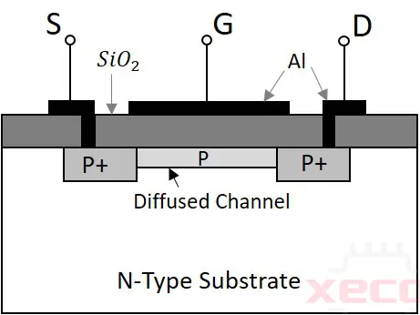

### NMOS

NMOS (n チャネル金属酸化物半導体) トランジスタは、ゲート領域に n 型ドーパントを使用するタイプのトランジスタです。

トランジスタは、ゲート端子に正の電圧を印加することでアクティブになります。

NMOS トランジスタは、主に CMOS (相補型金属酸化物半導体) 設計、およびロジック チップやメモリ チップで使用されます。

PMOS トランジスタと比較して、NMOS トランジスタはより高速で動作するため、1 つのチップにより多くのトランジスタを統合できます。

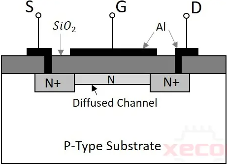


### ドーパント

N型ドーパントは、半導体に余分な電子を提供する元素です。

これにより、半導体は電子の流れ（負の電荷）を容易にするN型（ネガティブ型）の特性を持ちます。

一般的なN型ドーパントには窒素、リン、ヒ素、アンチモンなどがあります。

これらの元素は、半導体の結晶格子に組み込まれると、余分な自由電子を放出し、電子の流れを促進する役割を果たすでしょう。


P型ドーパントは、半導体に「ホール」（正孔）または正の電荷を持つ空間を作り出します。

これにより、半導体はホールの流れ（正の電荷）を容易にするP型（ポジティブ型）の特性を持ちます。

代表的なP型ドーパントにはホウ素、アルミニウム、ガリウムなどが該当するでしょう。

これらの元素は、半導体の結晶格子に組み込まれると、電子が不足することでホールを形成し、電流の流れを助けます。
