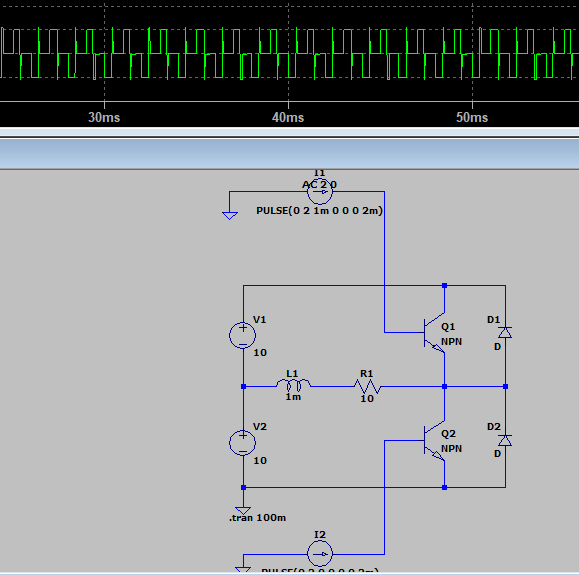
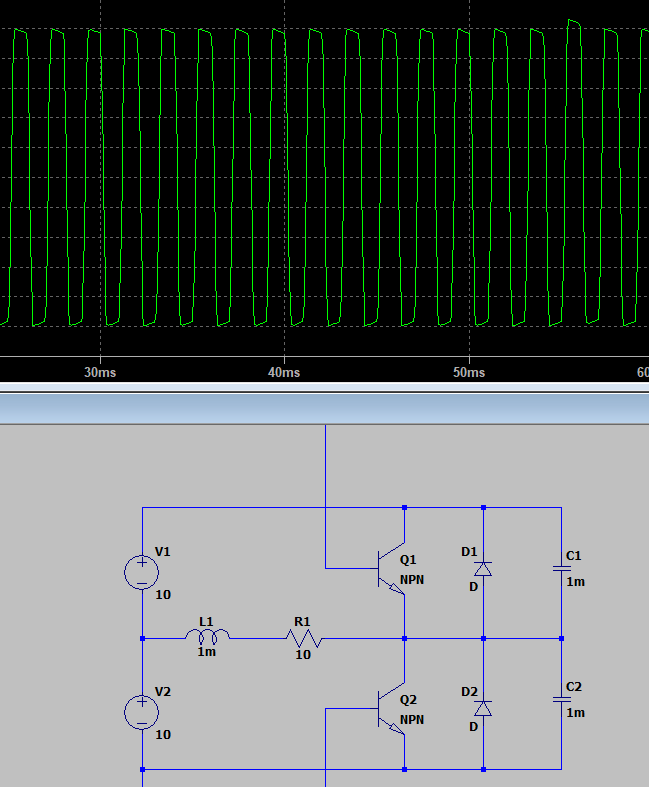

とても良いテーマです！🎯

**ハーフブリッジインバータ（Half-Bridge Inverter）** は、電力変換（DC→AC）やモータ制御、スイッチング電源などで最も基本的な構成の1つです。

LTSpiceでこれを構築する手順を、概念→回路構成→実装方法→波形観察まで分かりやすく説明します。

---

# ✅ 1. ハーフブリッジインバータとは

ハーフブリッジは以下のような構成を持ちます：

```
         DC電源 (Vdc)
              +
              |
             ┌───┐
             │上側SW（High-side）│ ← MOSFET または IGBT
             └───┘
              |
              +---- 出力端子 (Vout)
              |
             ┌───┐
             │下側SW（Low-side）│
             └───┘
              |
              └─── GND
```

* 上下のスイッチ（MOSFETやIGBT）を交互にON/OFFして、

  出力端子（Vout）に ±Vdc/2 程度の矩形波を生成します。
* 出力波形をフィルタ（LC）で平滑化すれば、擬似的なAC波形が得られます。

---

# ✅ 2. LTSpiceでの基本構成要素

| 要素         | 部品名                             | 備考                                 |
| ------------ | ---------------------------------- | ------------------------------------ |
| 電源         | `V1`                             | DC電源（例：+100V）                  |
| 上側スイッチ | `M1`                             | NMOS（High-side）                    |
| 下側スイッチ | `M2`                             | NMOS（Low-side）                     |
| ゲート駆動   | `Vgs_H`,`Vgs_L`                | 方形波パルスを発生させてスイッチ制御 |
| 負荷         | `Rload`（またはLC）              | 例えばモータ巻線やRL負荷を模擬       |
| デッドタイム | ゲート信号間に少し空白時間を設ける | 同時ON防止                           |

---

# ✅ 3. LTSpice 回路例（実行可能）

以下をコピーして LTSpice の新しいファイルに貼り付けてください👇

`half_bridge.cir` として保存すればそのまま実行可能です。

```spice
* Half-Bridge Inverter Example
Vdc Ndc 0 100          ; DC supply 100V

* Gate drive signals
Vgh Ngh 0 PULSE(0 10 0 0.1u 0.1u 20u 40u)  ; High-side gate (20us ON, 20us OFF)
Vgl Ngl 0 PULSE(0 10 20u 0.1u 0.1u 20u 40u); Low-side gate (交互駆動)

* MOSFETs
M1 Vout Ndc Ngh Ndc NMOS
M2 0 Vout Ngl 0 NMOS

.model NMOS NMOS (VTO=3 RD=0.05 RS=0.05 RDS=0.1 KP=50m)

* Load
Rload Vout 0 50

.tran 0 200u 0 0.1u
.plot tran V(Vout)
.end
```

---

# ✅ 4. 波形の観察ポイント

* **V(Vout)** ：出力端子の波形

  → +50V（上側ON）と −50V（下側ON）を交互に出力する矩形波になります。
* **ゲート信号（Vgh, Vgl）** ：

  → 片方がONの間、もう片方はOFF。

  デッドタイムを入れないと短絡（シュートスルー）します。

---

# ✅ 5. 発展的な構成（応用）

| 機能                         | 方法                                        |
| ---------------------------- | ------------------------------------------- |
| LCフィルタでAC波形出力       | 出力端子に L と C を接続して平滑化          |
| モータ負荷のシミュレーション | R-L 負荷にして電流波形を確認                |
| デッドタイム挿入             | PULSE信号の `delay`や `fall time`を調整 |
| 実在MOSFETモデル使用         | LTSpice付属の `IRFZ44N`などに置換         |
| スイッチング損失解析         | `Vds * Id`をプロットして瞬時損失を評価    |

---

# ✅ 6. 実験課題として面白いこと

1. **デッドタイムを入れないと電源がショートする理由**

   → 同時ONによるシュートスルー電流観察
2. **負荷をRLに変えると波形がどう変わるか**

   → 電流が位相遅れを持ち、スイッチング損失に影響
3. **LCフィルタを追加してAC出力を作る**

   → PWM＋フィルタで擬似正弦波が再現できる

---

# ✅ 7. もしさらに深めたい場合

* **フルブリッジインバータ（Hブリッジ）** に拡張（両極性出力）
* **SPWM制御** （正弦波PWM）を使って実際のAC波形生成
* **デッドタイム制御回路** の設計
* **スナバ回路・ダンピング抵抗** を入れて過渡応答の改善

---

👉 ご希望があれば、

「PWM制御付きハーフブリッジ（正弦波出力を再現するLTSpice例）」

を次に示します。続けて作ってみましょうか？


# 実験

なんかギザギザ・・・。

ギザギザしているのはステップ応答の直後。

高周波ノイズと思われ。→チョークコイルとコンデンサでとれるのでは？




ノイズとりのコイルで平滑化。


