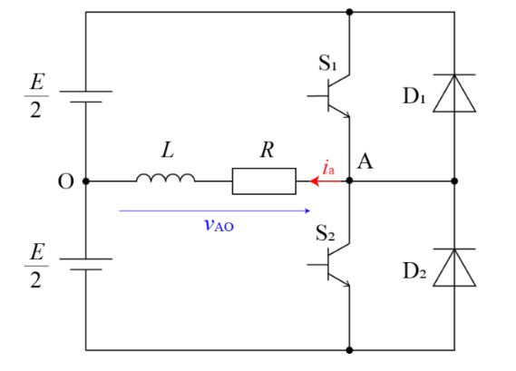
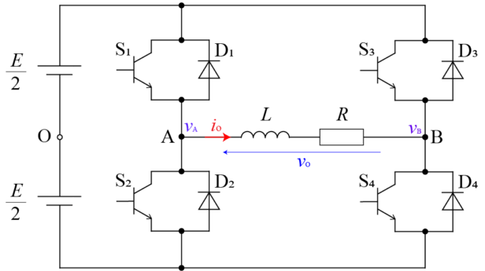
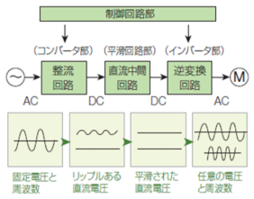
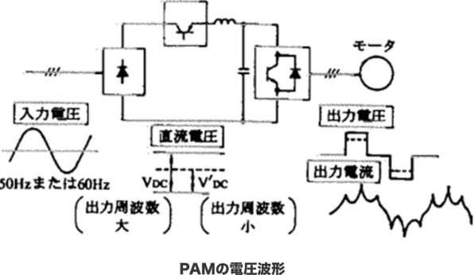
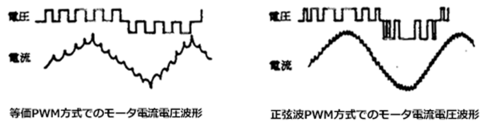
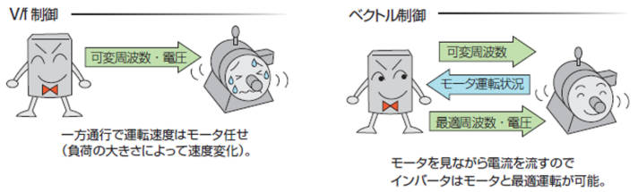

**インバータ（inverter）** は、電子回路の文脈で大きく2つの意味があります。

---

## 1️⃣ デジタル回路におけるインバータ（NOT回路）

* **論理を反転する回路** のことです。
* 入力が `0`（LOW）のとき → 出力は `1`（HIGH）
* 入力が `1`（HIGH）のとき → 出力は `0`（LOW）
* **NOTゲート** とも呼ばれます。

🔹 回路例：

* トランジスタ1本と抵抗で実現できる。
* CMOSロジックでは、NMOSとPMOSを使った組み合わせで作られ、低消費電力かつ高速に動作します。

👉 デジタルICの基本構成要素であり、これを組み合わせることで複雑な論理回路（AND, OR, フリップフロップなど）を作れます。

---

## 2️⃣ 電力変換におけるインバータ

* **直流（DC）を交流（AC）に変換する回路** のことです。
* 逆に交流を直流に変えるのは  **整流器（rectifier）** 。
* 例：
  * ソーラーパネルの直流電力 → 家庭用AC100V/200Vに変換
  * 電気自動車のモーター制御（バッテリーのDCをACモーター駆動用に変換）
  * 無停電電源装置（UPS）など

🔹 構成要素：

* スイッチング素子（MOSFET, IGBT など）を使って直流を細かくオンオフし、フィルタ回路で交流波形を合成します。
* **正弦波インバータ** ,  **矩形波インバータ** , **PWM制御インバータ** など方式がいくつかあります。

---

## ✅ まとめ

* **デジタル回路のインバータ** → 入力信号を論理反転（NOT回路）
* **電力回路のインバータ** → DCをACに変換（電源・モータ制御などに利用）

# 電力回路のインバータ

直流を交流に変換することを、整流動作（順変換）に対応して**逆変換**といい、逆変換を行う回路を **インバータ** （Inverter）という。

インバータは、半導体素子のスイッチング動作によって直流の極性をタイミングで切り換えることで、正負両方の値をもつ交流に変換する仕組みとなる。

## ハーフブリッジインバータ

### 単相電圧形フルブリッジインバータ

# インバーターの役割

## インバータがモータ速度を制御する方式

インバータはどのようにしてモータの速度を変えるのでしょうか。

モータの速度、つまり回転数を変えるには、モータに与える周波数f(Hz)を変化させます。周波数の値が高ければモータは早く回り、周波数の値が低ければモータはゆっくり回ります。

インバータは周波数を変えることで可変速運転を可能にします。

## 周波数変換回路

定格の商用電源から広範囲の周波数を作り出すのに、インバータは何をしたのでしょうか？

インバータの電力変換回路は、整流回路、中間回路、逆変換回路から構成されています。

インバータは、交流電圧を整流回路で直流電圧に変換し、その直流電圧を直流中間回路で平滑にします。

そして、その平滑された直流電圧を逆変換回路で任意の交流電圧・周波数に変換しモータに印加します。

このような電力変換は、半導体素子であるパワートランジスタの高速スイッチングによって実現されます。スイッチング制御の違いにより出力された周波数が異なります。

## 電力変換方式

インバータの電力変換方式にはPAM（pulse amplitude modulation：パルス振幅変調）方式とPWM（pulse width modulation：パルス幅変調）方式が多く適用されています。

PAMは周波数の高さ を変える制御です。比較的に低いスイッチング周波数により変換可能で、エアコンなど家庭用製品に広く使われています。

所定のスイッチングパターン（指令された周波数と電圧）により瞬時にON/OFFし三相交流に変換できるので、広範囲な可変速ドライブを必要とする産業分野で普及しています。

## インバータ制御方式 V/f制御とベクトル制御

機械には様々な種類があり、色々な動きがあります。インバータから出力された周波数を、どのように制御してそれぞれの機械に合ったモータ回転を行うのでしょうか？

汎用インバータの標準制御方式にはV/f制御とベクトル制御があります。

### V/f制御

V/f制御は、インバータから出力された電圧（V）と周波数（f）の比を一定にした制御方法です。

例えば、電源電圧200V級のインバータの場合、60Hzでは200V、30Hzでは100Vを出力します。

V/f パターンで決まっている周波数と電圧をそのまま出力できるので、1台のインバータで同時に複数台のモータを回すことができます。

一方、ベクトル制御は、モータに流れる電流のうち、トルクになる電流（トルク分電流）と回転子に磁界を発生させるための電流（励磁電流）とを分けて考え、モータ電流の方向をベクトル演算し制御する方法です。

モータの特性に見合った電流を流せるので、誤差の少ない精度の良い運転を行うことが可能です。

### ベクトル制御

ベクトル制御は、モータに流れる電流のうち、トルクになる電流（トルク分電流）と回転子に磁界を発生させるための電流（励磁電流）とを分けて考え、モータ電流の方向をベクトル演算し制御する方法です。モータの特性に見合った電流を流せるので、誤差の少ない精度の良い運転を行うことが可能です。

# すべり

## 誘導モータの回転には、「すべり」が必要

では、V/f 制御とベクトル制御を、どのように使い分けるのでしょうか？インバータ制御の特徴を話す前に、まずモータの「すべり」について簡単に説明しましょう。誘導モータの回転には、「すべり(slip)」というものが必要です。「すべり」とは固定子の回転周波数に対する回転子の回転周波数の遅れです。誘導モータの回転速度は、固定子と回転子の間に発生する電磁力を利用しているため、この「すべり」がないとトルクを発生することはできません。モータ負荷が大きいほど「すべり」が大きくなり、回転速度の遅れも大きくなります。

ベクトル制御では、その「すべり」分をリアルタイムに計算し上乗せしてモータに印加するため、モータの回転数は負荷の大きさによって変化せずに一定速度制御が実現できます。下図のコンベヤを例にすると、V/f制御では荷物が載っている場合と、そうでない場合でコンベヤ速度に変化が生じます。ベクトル制御では、荷物の重さに関わらず一定した速度制御が可能です。
