## 直列LC回路

直列の場合はインピーダンスが最小となる周波数が生じる。

今回は5kHzあたりでインピーダンスが最小となる。

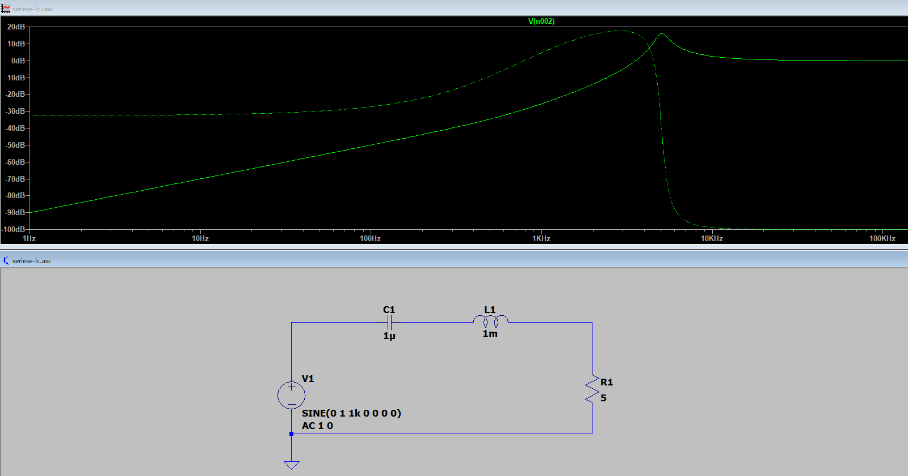

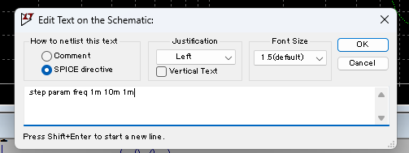

```spice
.step param freq 1m 10m 1m

```

一番振幅が大きい波形と、そうでないものが分かれます。3dB以上という定義ですが、結構差がついているように見えます。

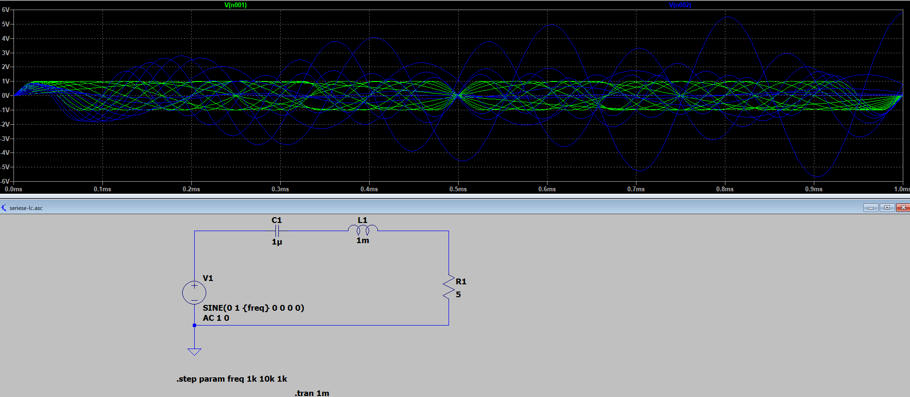

## 並列LC回路

ちょっと詳しすぎるけど、原理はここが分かりやすい

[交流回路の電圧と電流の計算とベクトル図（LC並列回路）](https://eleking.net/study/s-accircuit/sac-vi-lcp.html)

下記は**1uHのコイル**と**1uFの[コンデンサ](https://d.hatena.ne.jp/keyword/%A5%B3%A5%F3%A5%C7%A5%F3%A5%B5)**を**並列**で回路に接続した例になります。

**横軸が周波数** 、**縦軸が[インピーダンス](https://d.hatena.ne.jp/keyword/%A5%A4%A5%F3%A5%D4%A1%BC%A5%C0%A5%F3%A5%B9)**になりますが、**159kHzで[インピーダンス](https://d.hatena.ne.jp/keyword/%A5%A4%A5%F3%A5%D4%A1%BC%A5%C0%A5%F3%A5%B9)が最大**となっていることがわかります！

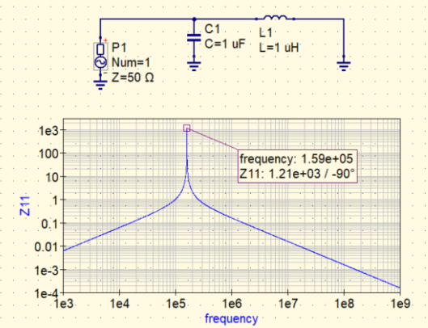

LC共振した場合のインピーダンスは最大値となる。

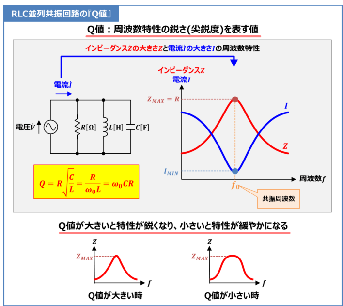

回路の共振周波数の計算自体は以下です。

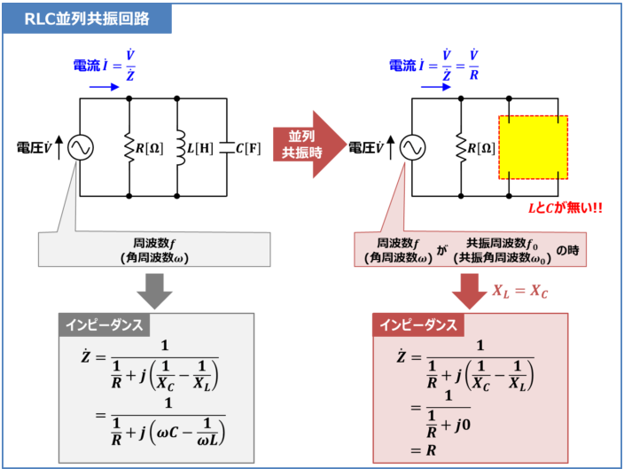

AC周波数解析の結果はこの通り。

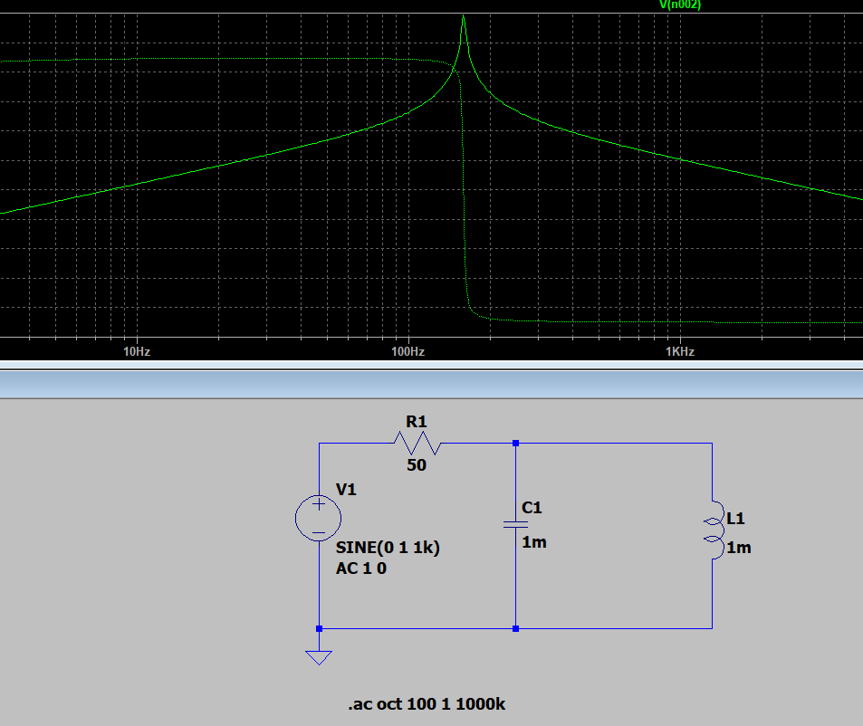

なので、こちらもパラメータ化して計測する

```
.step param fx 1 500 1000

```

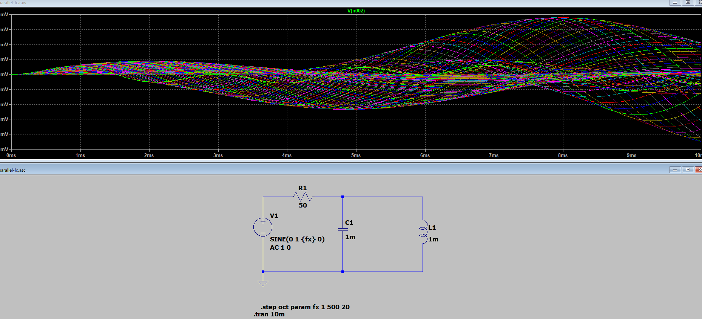

ということで、結構ふれることが確認されました。

stepの個数を1000にするとなかなか計算が収束しませんでした。

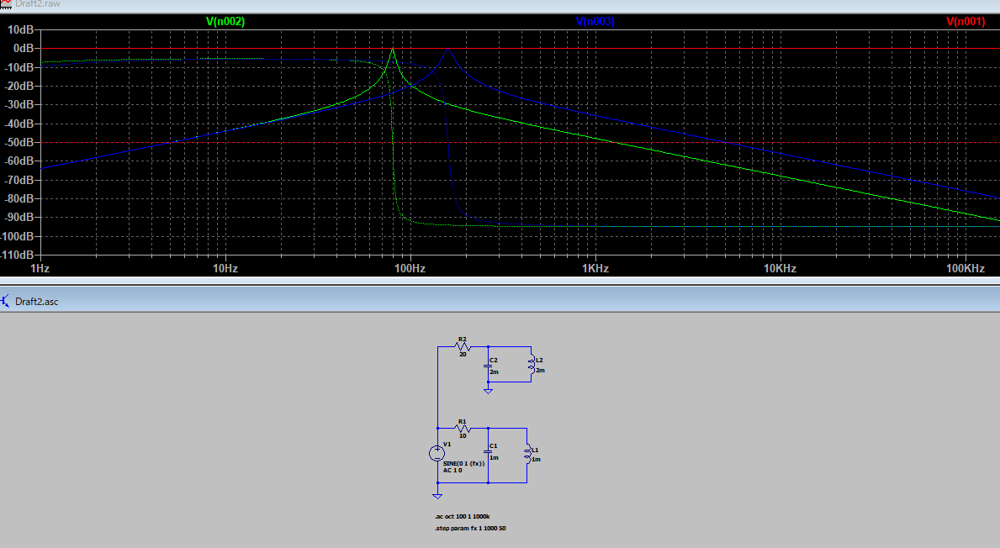

LCが並列となるとこんな感じの回路となる。

多分リアルな回路だとLC共振が複数存在するような気がする。

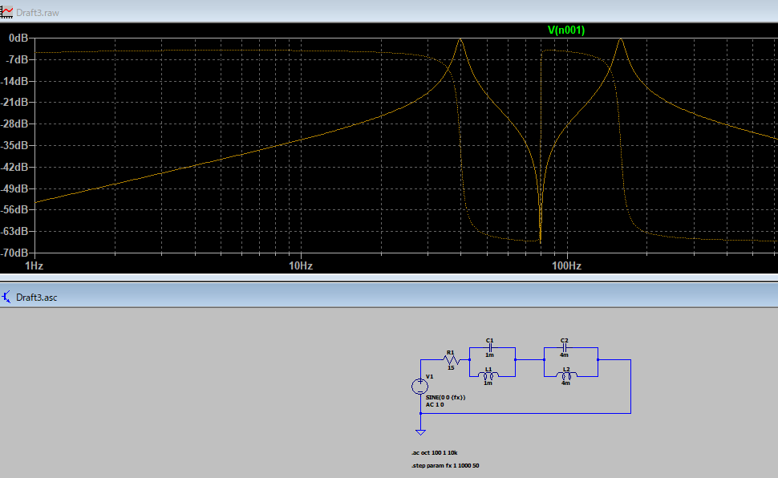


40Hzあたりが共振ポイント

並列の共振はVmaxとなっている。

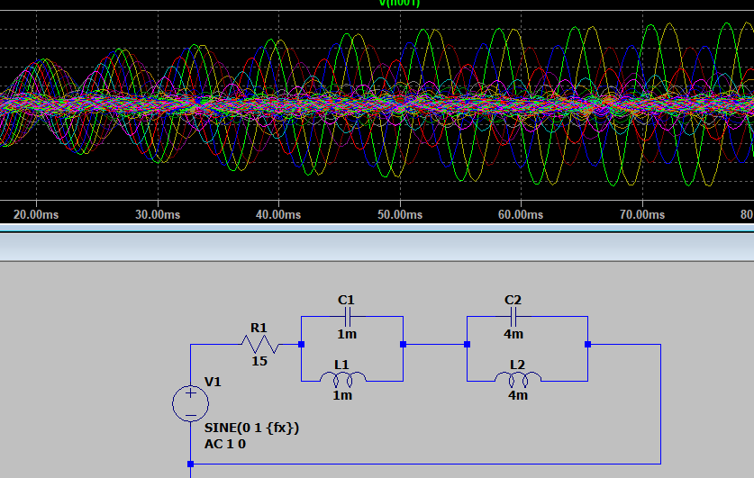
