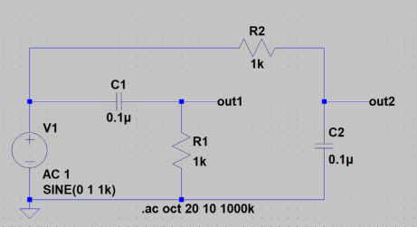
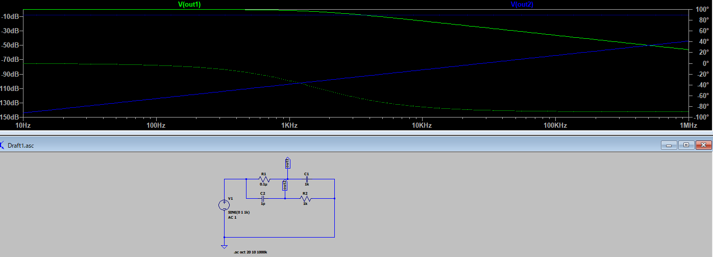

# 目的

LC回路について学習し電気回路の振動現象について理解する。

> | **(1)** レジスタ（R）は信号の周波数が変わっても電流と電圧の関係は一定で、オームの法則が成立しています。``R=E/I　　（R：抵抗値　E：電圧　I：電流）``**(2)** キャパシタ（C）は直流電圧を加えても電流は流れません。交流信号の周波数が増加すると電流が流れやすくなります。コンデンサ（キャパシタ）に入出力する電流とコンデンサの端子電圧の変化とコンデンサの容量の間には、次のような関係が成り立ちます。 **I = C　×　dV/dt** ``I：コンデンサに流れる電流値``C: コンデンサの容量（F）``dV：コンデンサの端子電圧の変化``dt：変化の時間 ``**(3)** コイル（L）は直流電圧を加えると、コイルの素材の抵抗値に応じてオームの法則に従った電流が流れます。交流信号を加えると、周波数の増加に従って電流が流れにくくなります。コイルの端子に加わる電圧と、コイルに流れる電流の変化とコイルのインダクタンスの間には次のような関係があります。 **V = L　×　dI / dt**``V： インダクタの両端に加わる電圧 ``L :　コイルのインダクタンス（H）``dI： コイルに流れる電流の変化``dt：　変化の時間

LCRの素子から、CとRの素子を直列に接続して交流の信号を加えたときの、CとRの接続点の出力がどのようになるか調べます。

## LC回路の原理

### 共振回路

 L と C を組み合わせると「特定の周波数でエネルギーがやり取りされる」性質が生まれます。

* その周波数を **共振周波数** と呼び、

  f0=12πLCf_0 = \frac{1}{2\pi \sqrt{LC}}
  で表されます。
* この性質を利用して「特定の周波数だけを通す／強める」回路が作れる。
* 例：ラジオのチューニング回路（必要な放送局の周波数だけ取り出す）。

### 2. **フィルタ回路**

---

* LC回路は「周波数ごとの通しやすさ」を制御できる。
* 役割：
  * **ローパスフィルタ** （低周波だけ通す）
  * **ハイパスフィルタ** （高周波だけ通す）
  * **バンドパスフィルタ** （ある帯域だけ通す）
  * **バンドストップフィルタ** （ある帯域だけ遮断する）
* 例：スピーカのクロスオーバーネットワーク、電源回路のノイズ除去。

---

### **エネルギーの一時保存と交換**

* コイルは磁場に、コンデンサは電場にエネルギーを蓄える。
* LC回路ではそのエネルギーが行き来して「振動回路」を形成する。
* 例：発振回路、タイミング回路。

---

### **発振器（Oscillator）の基本構成**

* LC回路に増幅回路を組み合わせると、外部信号がなくても特定周波数の交流を作り出せる。
* 例：無線機の搬送波生成、水晶発振器の基本構造。

### **インピーダンス整合**

* L と C の組み合わせで回路のインピーダンスを調整し、電力を効率よく伝送する。
* 例：アンテナと送信機を整合させて効率良く電波を飛ばす。

## 回路構成

Rのレジスタは、周波数に関係なく同じ電圧なら同じ電流が流れます。Cのコンデンサは、入力信号の電圧が同じなら周波数が低いと電流値が少なくなり、周波数が増大すると電流値も増大します。

## 解析

### 電圧値推移

青のラインのout2は、周波数が低い範囲ではC1のコンデンサにわずかしか電流が流れないため、R1の電圧降下も小さくout2の出力は小さくなります。周波数の増加に従い、

* C1に流れる電流が大きくなり
* R1の電圧降下も大きくなり

out1の出力も増大します。6kHzあたり以上になると、入力信号と同じ出力電圧を得るだけの電流がC1経由で供給されるようになります。

### 周波数ずれ

周波数が低い範囲では90°で周波数が高くなり、入力電圧と出力電圧が同じくらいになると入力信号と出力信号の位相はなくなり0°に漸近します。

## カットオフ周波数

**フィルタ回路や信号処理において、通過域と阻止域の境界となる周波数** のことです。

* フィルタ（ローパス、ハイパス、バンドパスなど）では「この周波数までは信号を通すが、それ以上は減衰させる」という境目があります。
* この境界の周波数を **カットオフ周波数** と呼びます。

## 技術的な決め方

多くの場合は「ゲイン（通過率）が最大値の 70.7%（= −3 dB）に下がる点」をカットオフ周波数と定義します。

* **ローパスフィルタ** : 高周波数側の通過→遮断に切り替わる境界
* **ハイパスフィルタ** : 低周波数側の通過→遮断に切り替わる境界
* **バンドパスフィルタ** : 下側と上側に2つカットオフ周波数があり、その間の帯域だけ通過

#### 例

* ローパスフィルタ（カットオフ 30 Hz）

  → 0〜30 Hz を主に通す、30 Hz以上は減衰させる
* ハイパスフィルタ（カットオフ 1 Hz）

  → 1 Hz以上を通す、1 Hz以下は減衰させる
* バンドパスフィルタ（カットオフ 1–30 Hz）

  → 1 Hz〜30 Hz の帯域だけを通す

## 参考

[初心者のためのLTspice入門　LCRを用いた回路の検討（4）CR回路のふるまい | LTspice](https://www.denshi.club/ltspice/2018/07/ltspicelcr4cr.html)
