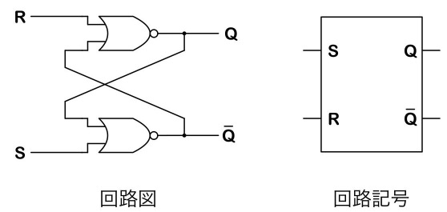
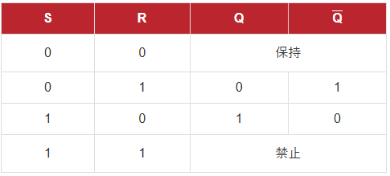
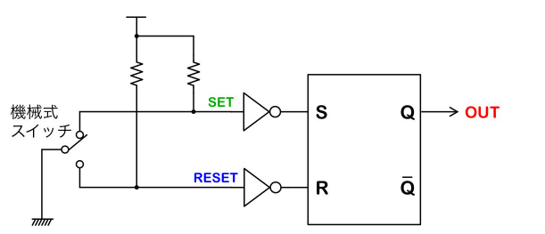
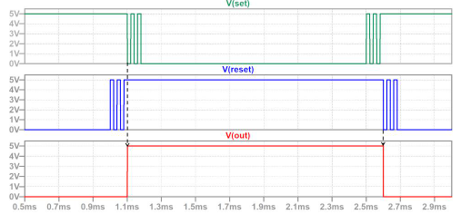
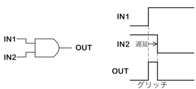
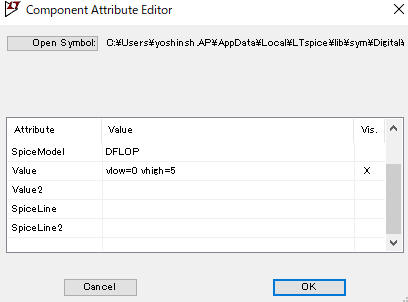
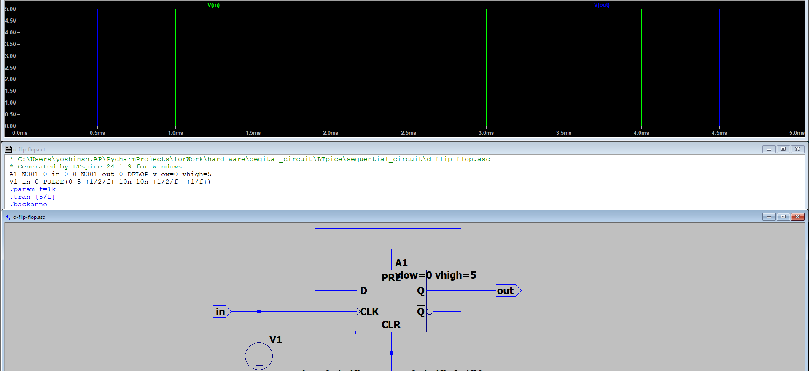

# RSフリップフロップ(RS-FF)
RSフリップフロップは、SET端子とRESET端子の2つの入力端子があり、SET端子に一度Hiが入力されるとRESETされるまで出力の状態を保持し続けます。





## RSフリップフロップの用途
RSフリップフロップは、機械式スイッチなどチャタリングの起こる電気信号の安定化に使われます。
入力端子が一度Hiを検出すれば、チャタリングが起こってLoレベルに下がったとしても、出力を保持し続けることができます。





セット、リセットともに最初の遷移のみをとらえ、チャタリングの影響を抑止できる。

# Dフリップフロップ
Dフリップフロップは、データ入力端子(D)とクロック入力端子(CLK)を持ち、CLKがHiの時のDの値を記憶して保持します。

Dフリップフロップの用途はデジタル回路のクロック同期設計です。
組み合わせ回路や非同期式回路の場合、信号の遅延の差により短い「グリッチ」が発生することがあります。

Dフリップフロップは「クロックのタイミングでD入力の値を記憶する」1ビット記憶素子です。デジタル回路の基本中の基本となる部品です。



### 特徴
- DはDelayの略

Dは入力に与えられた値がクロックの立ち上がりでQにセットされる

- 同期型回路

クロック信号によって動作が制御され、クロックのエッジのみ状態が変化する

- 構造

入力端子：D（データ）、CLK（クロック）
出力端子：Q（出力）、$Q^-$（Qの反転）

```
     ┌──────────┐
 D──▶│          │──▶Q
     │  D-FF    │
CLK─▶│          │
     └──────────┘
```

5Vへの変換






こういうことね。
Dflip flopは立ち上がりのみでVoutが変化している。

このため、クロックに比べて2倍の周期をもつことになる。

# マスタースレーブ型とは？

マスタースレーヴ型Dフリップフロップと通常のDフリップフロップ（単純なDフリップフロップ、エッジトリガ型Dフリップフロップ）の違いは、主に**動作原理と構造**にあります。

---

## 1. **構造の違い**

- **通常のDフリップフロップ**  
  一段のラッチ（またはフリップフロップ）で構成されている。  
  クロックの立ち上がり（または立ち下がり）エッジで入力Dが出力Qに伝わる（エッジトリガ）。

- **マスタースレーヴ型Dフリップフロップ**  
  2段のラッチ（マスターラッチとスレーヴラッチ）を直列に接続した構造。  
  クロック信号の反転を利用して、マスターとスレーヴが交互に動作する。

---

## 2. **動作原理の違い**

- **通常のDフリップフロップ**  
  クロックのエッジ（立ち上がりまたは立ち下がり）でのみD入力がQに反映される。

- **マスタースレーヴ型Dフリップフロップ**  
  - クロックが「L」のとき：マスターラッチが入力Dを受け付け、スレーヴラッチは保持
  - クロックが「H」になると：マスターラッチは保持、スレーヴラッチがマスターの値をQに出力
  - こうして**クロックのエッジでのみQが変化**する（エッジトリガ動作を実現する）

---

## 3. **なぜ2段構成にするのか？**

- 単純なラッチは「レベルトリガ」なので、クロックがHの間ずっと入力が伝わってしまう（グリッチや不安定動作の原因）。
- マスタースレーヴ構成にすることで、**確実にエッジトリガ（クロックの立ち上がりや立ち下がり瞬間だけ値が切り替わる）**動作を実現できる。

---

## 4. **まとめ表**

| 種類                   | 構造         | 動作方式        | 特徴                          |
|------------------------|--------------|-----------------|-------------------------------|
| 通常のDフリップフロップ | 1段          | エッジトリガ    | シンプル。ICでは内部でMS型が多い |
| マスタースレーヴ型      | 2段（直列）  | エッジトリガ    | レベルトリガラッチを組み合わせてエッジトリガを実現 |

---

## 5. **補足**

- 実際のICでは、エッジトリガ型Dフリップフロップの内部回路としてマスタースレーヴ型がよく使われています。
- マスタースレーヴ型は「ラッチスルー現象」（クロックがHの間ずっと入力が伝わる現象）を防ぐために考案されました。

---

**まとめ**  
マスタースレーヴ型Dフリップフロップは、2段のラッチ（マスターとスレーヴ）を使って、クロックのエッジでのみ出力が変化するようにした構造です。通常のDフリップフロップは1段ですが、エッジトリガ動作を確実にするため、内部的にはマスタースレーヴ型がよく使われます。