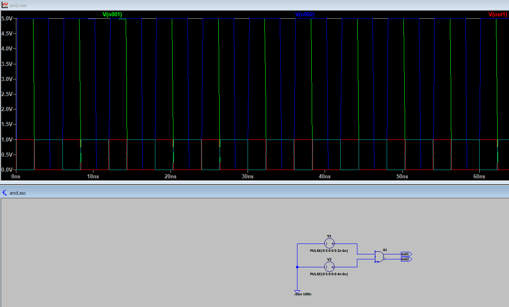

# ラッチ
- ラッチは入力信号の状態を保持する回路の総称
- レベルで動作する(電圧で動作する)
- SRラッチ、Dラッチ

## RSフリップフロップ
- RSフリップフロップは、RSラッチに「クロック（パルス）」の概念を加えたエッジトリガ動作の記憶素子です。
- クロック信号の立ち上がりや立ち下がりなど、特定のタイミングでのみ入力を受け付けます。
- 一般的には「フリップフロップ」はエッジトリガで、「ラッチ」はレベルトリガで動作するものと区別されます。

ラッチとRSフリップフロップの違いについて簡潔に説明します。

## **違いのまとめ**

| 項目          | ラッチ（Latch）              | フリップフロップ（Flip-Flop）         |
|---------------|-----------------------------|---------------------------------------|
| 動作方式      | レベルトリガ（信号の状態）  | エッジトリガ（信号の変化点）          |
| 記憶タイミング | 制御信号がHの間              | クロックの立ち上がり/立ち下がり時     |
| 例            | SRラッチ、Dラッチ           | RSフリップフロップ、JK、D、T FF       |
| 用途          | 一時的な記憶                | シーケンス制御、レジスタなど          |

## **RSラッチとRSフリップフロップの違い**

- **RSラッチ**：S（セット）とR（リセット）の入力で状態を保持するが、制御信号のレベルで変化。
- **RSフリップフロップ**：RSラッチにクロック入力がつき、「クロックのエッジ」でのみ状態が変化。

## まとめ

- **ラッチ**は「レベル」で動作する記憶素子、**フリップフロップ**は「エッジ（立ち上がり・立ち下がり）」で動作する記憶素子です。
- RSフリップフロップはRSラッチを発展させたものです。

## LTSpiceのANDについて
NANDにも使えることが判明しました。

