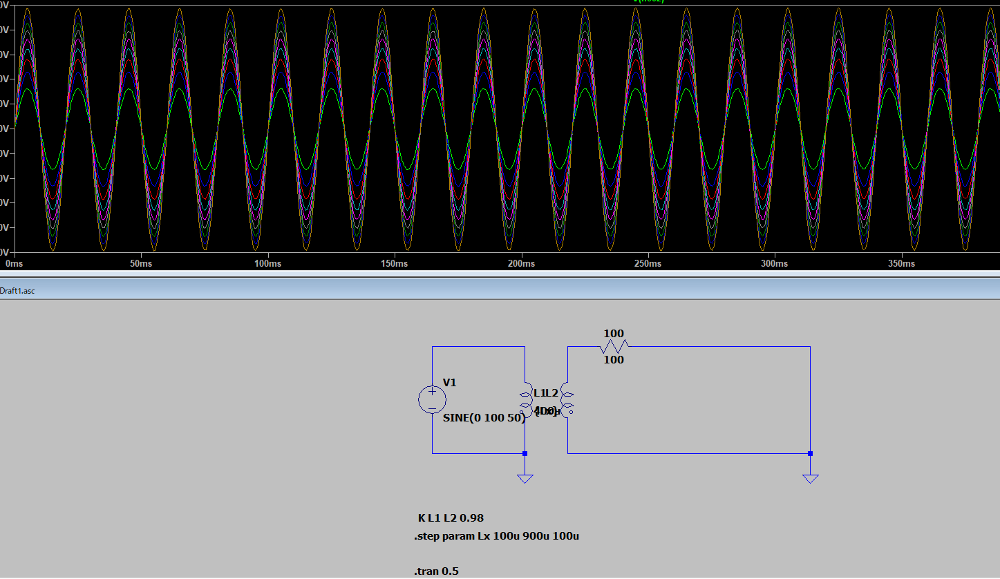
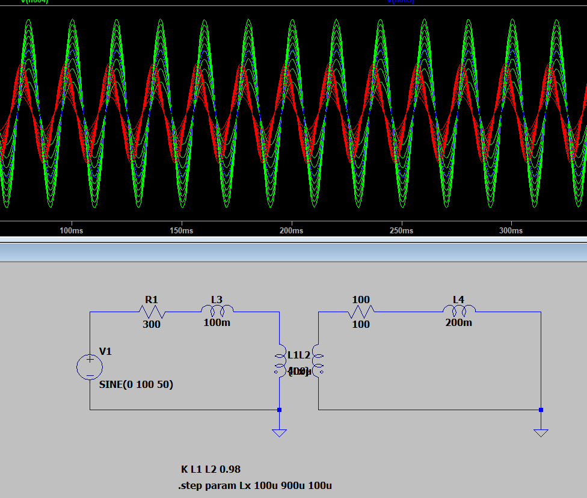

* LTspiceを開いた後、メニューバーでcomponentボタンを押します。
  
* 「Select Component Symbol」が開くので、**ind2**を選択します。
  
* indは通常のインダクタでind2は**極性の区別があるインダクタ**です。回路図だとind2に極性を示す〇印が付いています。〇印が必要なのは、コイルの極性が分からないと、誘導起電力の向きが分からなくなるためです。
  
* **ind2を2個配置します。**この時「ctrl+e」などでインダクタを反転させたり、「ctrl+r」でインダクタを回転させたりして配置しましょう。見た目を重視するなら、下図のように隣接に配置すればトランスらしくなります。しかし、隣接せずに置いてもシミュレーションは正常に動作します。2個のインダクタの〇印の上下の位置を揃えると同相、上下逆にすると逆相になります。下図は上下の〇印が揃っているので同相になります。
  
* インダクタを右クリックして、**自己インダクタンス(inductance[H]の箇所)を入力します。**一次巻線の巻き数をNp、二次巻き線の巻き数をNs、一次巻線の自己インダクタンスをLp、二次巻線の自己インダクタンスをLs、一次巻線と二次巻線の巻き数比をNとすると、自己インダクタンスの比は巻き数比の2乗に比例するため、式では
  **N**2**=**(**N**p**N**s**)**2**=**L**p**L**s**
  と表すことができます。
  今回、Np:Ns=2:1として、一次巻線の自己インダクタンスLpを400uHとしました。そのため、二次巻線の自己インダクタンスLsは100uHとなります。
  
* 次に、**直列抵抗(Series Resistance[Ω])の箇所に抵抗値を入力します。**この箇所を入力しない場合、シミュレーション実行時にエラーが表示されてしまします。エラーになるのは、インダクタの直列抵抗が0Ωで、電圧源の直列抵抗が0Ωの場合です。インダクタと直列に抵抗が入っている場合や、電圧源の直列抵抗を設定すれば、インダクタの直列抵抗(Series Resistance[Ω])を入力しなくてもエラーとなりません。
  
* SPICE Directiveから、**一次巻線と二次巻線の結合係数Kを入力します。**「K Lp Ls 1」と入力した場合、一次巻線Lpと二次巻線Lsの結合係数を1にするということです。複数トランスを使うときはKをK1、K2などと分けて、「K1 Lp1 Ls1 1」、「K2 Lp2 Ls2 0.9」のように入力します。結合係数Kは1が最大で、1に近いほど、磁束の漏れが少なくなります。K=1の場合は理想トランスであり、1次巻線の磁束は漏れることなく全て2次巻線を通過し、完全な磁気結合の状態となります。
  

## 結果

こんな感じになりました

インダクタンスを{Lx}で可変にしてます。

また、インダクタンスの設定以外に巻き線同士の接続係数を設定する必要があります。

設定はEdit→Directive→K 巻き線名 巻き線名 0～1の係数

で設定します。

せっかくなので遊んでみますか。

幻想的ですね
