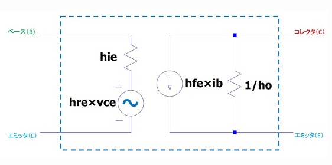

## hパラメータ

トランジスタは、特性曲線のある一部の領域内で動作させるのが一般的

この場合、特性曲線を直線とみなすことができます。したがって、特性曲線のすべてを知らなくても直線の傾きがわかればトランジスタの動作特性を考えることができます。

入力インピーダンス（**h**i**e**）、電圧帰還率（**h**r**e**）、電流増幅率（**h**f**e**）、出力アドミタンス（**h**o**e**）の4種類

### トランジスタの等価回路

hie：入力抵抗
hfe：電流増幅率

hre：電圧帰還率
hoe：出力抵抗の逆数

### 電圧帰還とは

**出力電圧により入力電圧が受ける影響**を表すので電圧帰還率と呼ばれ、hr と呼びます。

h22 はi2/v2なので出力側の抵抗の逆数です。 これは出力アドミッタンスと呼ばれます。

電圧帰還率hreは、コレクタ-エミッタ側からベース-エミッタ側（右側から左側）に、どれだけの信号が伝わったかを表しています。

トランジスタ等価回路では、左側から右側に信号が伝わるので、電圧帰還率hreは、ほとんど０になります。

よって、電圧帰還率hreを省略して問題ありません。

### 出力抵抗の逆数

**出力側（コレクタ-エミッタ側）に接続される抵抗に吸収されるから**です。
