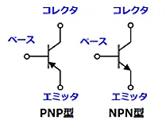
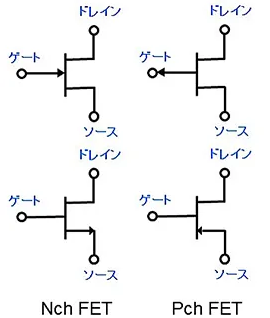
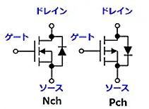
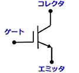
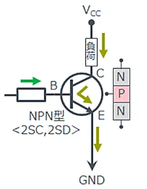
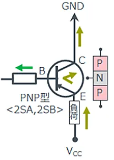

## トランジスタの種類と特徴

* バイポーラトランジスタ
* ユニポーラトランジスタ
* 絶縁ゲート型バイポーラトランジスタ（IGBT）

### バイポーラトランジスタ

バイポーラトランジスタは、N型半導体とP型半導体の組み合わせにより、電子と正孔の2種類のキャリアを利用するトランジスタです。バイポーラトランジスタにはNPN型とPNP型の2種類があり、いずれもベース、コレクタ、エミッタという3つの端子によって構成されます。

### ユニポーラトランジスタ（電界効果トランジスタ）

ユニポーラトランジスタは、電界効果トランジスタ（FET）とも呼ばれ、電圧を印加することで生じる電界によって電流を制御します。ユニポーラトランジスタには接合型FET（JFET）と金属酸化膜半導体FET（MOSFET）があり、いずれもゲート、ドレイン、ソースの3つの端子によって構成されます。ユニポーラトランジスタは、更にnチャネルとpチャネルの2種類が存在します。

・接合型FET（JFET） 回路記号

・金属酸化膜半導体FET（MOSFET）回路記号

### 絶縁ゲート型バイポーラトランジスタ（IGBT）

絶縁ゲート型バイポーラトランジスタ（IGBT）は日本で開発された技術で、大電力の高速スイッチングが可能なトランジスタです。バイポーラトランジスタとユニポーラトランジスタにはパワータイプと小信号タイプがある一方で、IGBTは大電力を扱うために開発されたため、基本的にパワータイプのみ存在します。IGBTにはNチャネル型とPチャネル型の2種類があり、いずれもゲート、コレクタ、エミッタの3つの端子で構成されます。

| ``バイポーラトランジスタ | ユニポーラトランジスタ | 絶縁ゲート型バイポーラトランジスタ（IGBT） |
| ------------------------------- | ---------------------- | ------------------------------------------ |
| 駆動方法                        | 電流駆動               | 電圧駆動                                   |
| 駆動電力                        | 多い                   | 少ない                                     |
| スイッチング速度                | 遅い                   | 早い                                       |
| 温度安定性                      | 低い                   | 高い                                       |
| 高耐圧化                        | 容易                   | 要構造変更                                 |

### NPN型トランジスタとは

NPN型トランジスタとは、エミッタがN型半導体、ベースがP型半導体、コレクタがN型半導体で構成されます。NPN型トランジスタは、ベースに流れ込むベース電流を増幅し、大きなコレクタ電流を生み出します。動作原理は以下のとおりです。

1. 電圧の印加：エミッタを接地（GND）し、コレクタには正電圧**V**~CC~を加えます。ベースにはエミッタより**V**~BE~だけ高い正電圧を加えます。
2. 電子の注入と再結合：エミッタのN型領域からベースのP型領域へ電子が流れ込みます。一部の電子はベース内で正孔と再結合し、これがベース電流となります。
3. コレクタ電流の形成：エミッタからベースへ移動した電子の大部分は、再結合せずに薄いベース領域を通過し、空乏層を超えてコレクタのN型領域に流れ込みます。これにより、コレクタ電流が形成されます。
4. 外部回路への電流：エミッタからコレクタへ移動した電子は、外部回路を通してコレクタ電流として流れます。

### PNP型トランジスタとは

PNP型トランジスタとは、エミッタがP型半導体、ベースがN型半導体、コレクタがP型半導体で構成されます。PNP型トランジスタは、ベースから流れ出るベース電流を増幅し、大きなコレクタ電流を生み出します。動作原理は以下のとおりです。

1. 電圧の印加：エミッタに正電圧**V**~CC~を加え、コレクタにはエミッタよりも低い電圧を加えます。ベースにはエミッタより**V**~BE~だけ低い正電圧を加えます。
2. 正孔の注入と再結合：エミッタのP型領域からベースのN型領域へ正孔が流れ込みます。一部の正孔はベース内で電子と再結合し、これがベース電流（ベース流出電流）となります。
3. コレクタ電流の形成：エミッタからベースへ移動した正孔の大部分は、再結合せずに薄いベース領域を通過し、空乏層を超えてコレクタのP型領域に流れ込みます。これにより、コレクタ電流が形成されます。
4. 外部回路への電流：エミッタからコレクタへ移動した正孔は、外部回路を通してコレクタ電流として流れます。

## NPN型トランジスタとPNP型トランジスタの使い方

NPN型トランジスタとPNP型トランジスタの違いはキャリアの極性にあります。電子と正孔では電子の方が移動度が大きいため、多数キャリアが電子であるNPN型トランジスタの方が、トランジスタとしての性能自体は高くなります。そのため、一般的にはPNP型トランジスタよりもNPN型トランジスタが利用されることが多いです。

また、電流の入出力方向によってNPN型トランジスタとPNP型トランジスタを使い分けるのも一般的です。トランジスタでエミッタ、コレクタ、ベースのいずれかの電位を固定する場合、その構成をそれぞれ「エミッタ接地」「コレクタ接地」「ベース接地」と呼びます。

入力信号でスイッチングを制御したいのであれば、一般的にはエミッタ接地が多く使用されます。その場合、エミッタが電源若しくはグラウンドと接続されている必要があります。電子回路の電源側で制御したいのであればPNP型トランジスタを、接地側で制御したいのであればNPN型トランジスタを使用します。

## NPN型トランジスタとPNP型トランジスタの見分け方

トランジスタがNPN型かPNP型かを見分けるには、型番で識別するか、テスターで確認します。

トランジスタの型番がわかれば、型番で識別するのが良いでしょう。トランジスタの型番は、2SA～・2SB〜・2SC〜・2SD〜の4種類あります。頭の「2S」はトランジスタを表し、A・B・C・Dは、トランジスタの特性を表します。

* ・2SA：PNP型トランジスタの高周波用
* ・2SB：PNP型トランジスタの低周波用
* ・2SC：NPN型トランジスタの高周波用
* ・2SD：NPN型トランジスタの低周波用

型番がわからない場合は、テスターを導通モードにし、テスターの赤色ピンをトランジスタのベースに、黒色ピンをコレクタ次いでエミッタにつなぐことで導通を確認できます。ベースとコレクタ間、ベースとエミッタ間それぞれが導通していれば、NPN型トランジスタです。PNP型トランジスタの場合は、赤色ピン・黒色ピンをNPN型トランジスタの場合と差し替えてつないで確認します。

### エミッタ接地の電流増幅率

エミッタ接地の電流増幅回路は、以下のような回路になります。

エミッタ接地の電流増幅率は、

hFE = IC / IB

という式で表されます。

これをベース接地のhFBで表してみると、

hFE = IC / IB
= IC / ( IE － IC )
= ( IC / IE ) / ( 1 － ( IC / IE ) )
= hFB / ( 1 － hFB )

となります。

ここで、hFB = 0.995 とすると、

hFE = 0.995 / ( 1 － 0.995 )
= 199
≒ 200

となり、エミッタ接地の**電流増幅率hFE**は、約200倍という**大きな値**を取ることになります。

言い換えると、**少ないベース電流IBで、200倍のコレクタ電流ICが得られる**ということになります。

一般的にhFEは、10～1000程度の値です。

この特性から、エミッタ接地は電子回路の分野において、広く利用されいることになります。

※設置している場合、その部分以外で性能評価することとなる。

※電流の増幅率であればエミッタ設置が秀逸。
