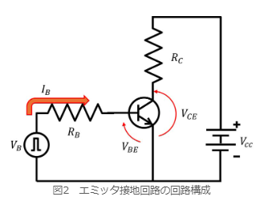
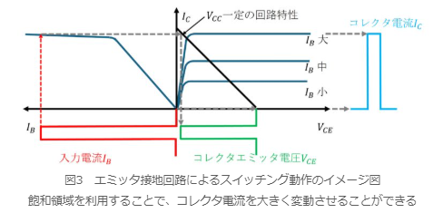
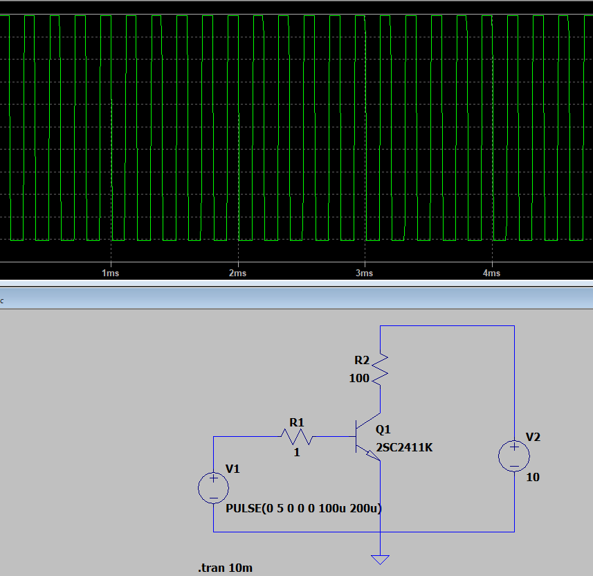
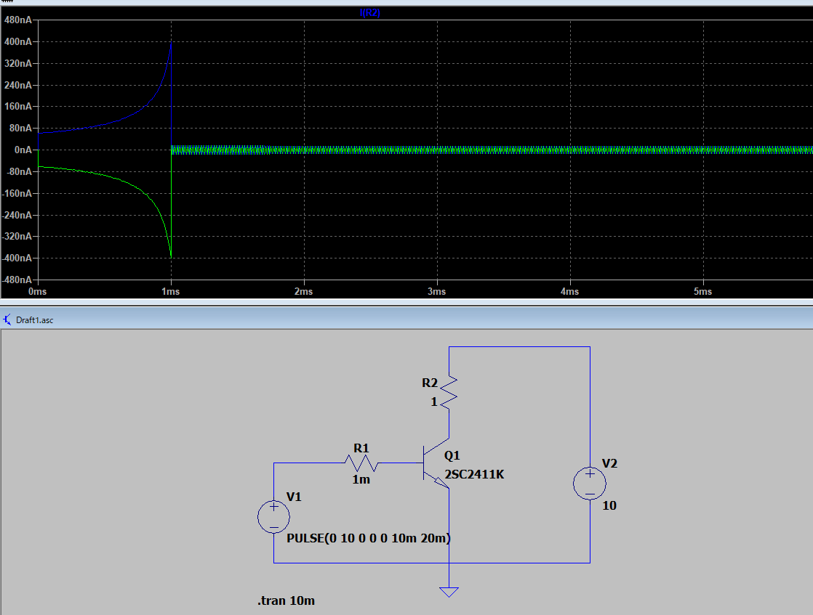
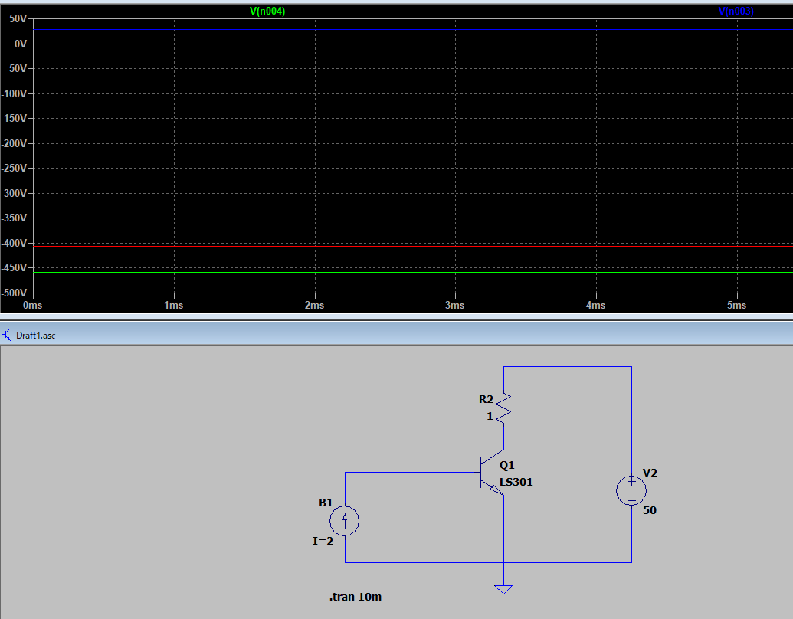

# SW回路

基本はエミッタ設置回路。

飽和領域にて運転することで電圧増幅が出来たが、同じ回路でスイッチング動作が可能。

## 原理

ベース電流を大きくして、トランジスタを飽和領域で運転させること。

ベースが0の場合、コレクタ電流は0。

コレクタエミッタ電圧は $V_{cc}$ になる。

→この状態は電流を流さない絶縁状態。

ベース電流がIbの場合、Ibが非常に大きいのであれば、コレクタ電流は飽和します。

コレクタ電流が飽和しているとき、コレクタエミッタ電圧は非常に小さい値となります。

これはトランジスタは電流を流している導通状態、つまりスイッチオンと考えられます。

> ベース電圧が0.8Vくらいまではベース電流、コレクタ電流はともに流れません。電流が流れ出すとコレクタ電流はベース電流の100倍の電流が流れています。

ほう？

多分間違えてる

ベースを電流源として抵抗を外したらうまく動作するようになった。

これだ☆

