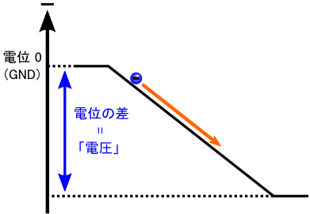
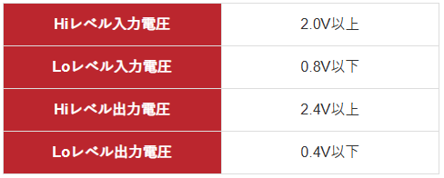
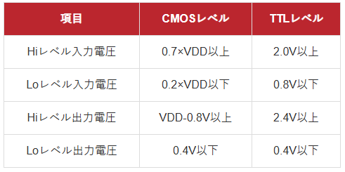

## 電流とポテンシャル
電子から見て，電池のプラス極というのは「ポテンシャルが低い場所」です． 電源を何か物質（金属など）につなぐと，プラス極側につないだ部分のポテンシャルが下がります． 電源の出力電圧を上げると，より多くポテンシャルが下がることになり， ポテンシャルの傾きが急になります．すると，電子が流れる速さが大きくなり，結果として電流が増える・・・という感じです．

ポテンシャルが高い場所からポテンシャルが低い場所に電気は流れる。
2点間のポテンシャルの差をきにすることが多い。→これが電圧。

大抵は，「２点間」と言っても片方をポテンシャルがゼロの場所に固定します． クーロン・ポテンシャルの場合は無限遠ですし，電源の場合はマイナス極です． 地球の表面（地面）は電気的に中性になっていて， 電位としてはゼロになっていると考えられています． 電源のマイナス極は，地面とだいたい同じ電位（ゼロ）だということで，“Ground”を略して“GND”と呼んだりします． たとえば，精密な測定器を複数使う現場では，全てのマイナス極を束ねて地面へ接地（アース）します． 複数の測定器で測定する電圧の基準を揃えて，精度を上げるためです．

ポテンシャル差がある２点間を電子が落ちていくと，電子は加速されることになります． 加速されるということは必ず運動エネルギーを得るわけですが， 電子1個分の電荷e（だいたい e = 1.6×10-19 Cです）が1 Vの電位差を落ちる時に得るエネルギーをそのまま 「1 eV」と書いて表します（電荷×ポテンシャル = エネルギー）． “eV”という単位は「エレクトロン・ボルト」と読みます． エネルギーの単位なら普通にJ（ジュール）を使って「1 eV = 1.6×10-19 J」としても良いのですが， １つ１つの電子のエネルギーを考えるときはeVを使う方が便利なので，しばしば使われます． イオン加速装置なんかを使う時は「keV」（キロ・エレクトロンボルト）オーダーの加速電圧を使ったりします． keVはそのまま言うと長くて言いづらいので，略して「ケブ」とか呼びます．

## TTLレベル

## CMOSレベル

