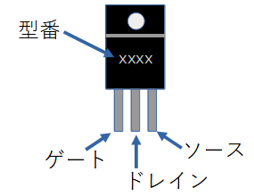
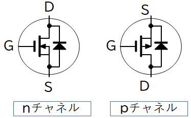

# MOSFETとは

DC/DCコンバータやモータコントローラなどの電力変換器では、MOSFETが重要な部品。

個人が使う電圧ではMOSFETが主力スイッチ素子となるはここ

## MOSFETの外観
ゲート、ドレイン、ソースの3端子がある

型番が印字されている面から見て、左からゲート、ドレイン、ソースの端子。
データシートは、欲しい情報が載っている非常に重要な文章。

## NMOS VS PMOS
形状の違いはこんな感じ。

通常良く使われるのはNMOS。
NMOSはキャリアは電子。
動作が早い。

### NMOS（N型MOS）

ソース・ドレインが「N型半導体」
基板（ボディ）は「P型半導体」

__動作__

1. ゲートに正電圧をかけるとON（電流が流れる）
2. 電子が主なキャリア（移動する電荷）

### PMOS（P型MOS）

ソース・ドレインが「P型半導体」
基板（ボディ）は「N型半導体」

__動作__

1. ゲートに負電圧をかけるとON（電流が流れる）
2. 正孔（ホール）が主なキャリア

### 

