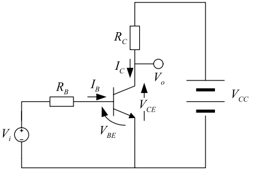
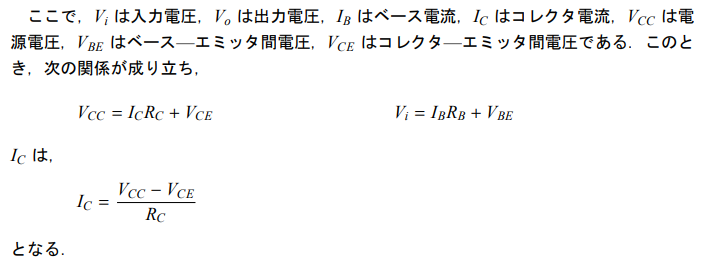
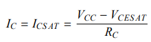

##  トランジスタのスイッチング動作

__トランジスタの動作状態__

1. 遮断状態
$I_B=0$、$I_C=0$の状態でトランジスタはオフ状態。
$V_{CE}=V_{CC}$となる。

この状態を遮断状態。

2. 飽和状態

ベース電流が十分大きい場合、コレクタ電流は一定の値

で飽和して、この時、$V_{CE} = V_{CESAT}$となる。
この時の電圧を飽和電圧と呼ぶ。

デジタル回路ではトランジスタを遮断状態か飽和状態のどちらかのみで動作させる
→切替えのことをスイッチング動作と呼ぶ

