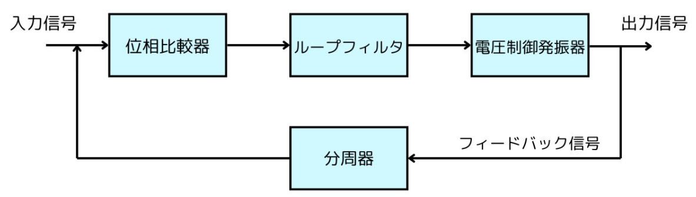

## PLL

- PLL（Phase-Locked Loop）
- 日本語で「位相同期ループ」という電子回路の一種です。
- 特定の周波数や位相を持つ信号を生成、追従、または制御するために使用されます。

特定の周波数や位相を持つ信号を生成、追従、制御するための電子回路

1. 位相比較器（Phase Detector, PD）

位相比較器は、入力信号（外部信号）とフィードバック信号（VCO出力）を比較して位相差を検出します。その位相差に基づいて、エラー信号を生成する役割があります。

エラー信号は、PLLのフィードバックループを通じて位相差がゼロ（または一定の関係）に近づくように制御されます。出力信号は位相差の方向と大きさを反映し、設計に応じてアナログ信号またはデジタル信号として表現されます。

 

アナログ位相比較器：アナログ信号同士を直接比較

デジタル位相比較器：クロック信号やデジタル信号を処理。フリップフロップを利用する場合が多い

 

2. ループフィルタ（Loop Filter）

ループフィルタは、位相比較器からのエラー信号を平滑化します。高周波ノイズを除去し、制御信号として適切な形状に整え、スムーズな電圧を生成する役割があります。

フィルタの設計（一次、二次など）は、安定性や応答速度に影響を与えるため重要です。フィルタには、単純なRCフィルタ（抵抗とコンデンサ）や、より複雑なアクティブフィルタを使用します。

 

3. 電圧制御発振器（Voltage-Controlled Oscillator, VCO）

入力された制御電圧に基づき、発振周波数を変化させる役割があります。出力信号の周波数は制御電圧と一定の関係を持ち、制御電圧が変化することで周波数が動的に調整されます。

VCOの周波数範囲は設計によりますが、広い範囲で動作するものも多く、正弦波や方形波などの信号を生成する用途に応じた設計が可能です。

 

4. 分周器（Frequency Divider）

分周器は、電圧制御発振器の出力周波数を整数または小数で分周し、位相比較器に入力します。PLLの動作周波数範囲を拡張することで、より柔軟な用途を可能にする役割があります。

分周とは、ある信号の周波数を特定の整数や小数の比率で減少させることをいいます。信号のタイミングや周波数を調整するために、頻繁に使用される技術です。

### 段階別の動作原理

__位相比較器__  
1. 入力信号とフィードバック信号を比較して、両信号の位相差を検出する
2. 位相のずれを示すエラー信号を生成する。エラー信号の極性と大きさが位相差の方向と量を示す。

エラー信号は次のループフィルタに贈られる

__ループフィルタ__

1. エラー信号を受け取り、ノイズ信号を平準化して高周波ノイズを除去する
2. 平準化された信号は制御電圧として電圧制御発信機VCDに贈られる。

__電圧制御発信機(VCO)__

VCOはループフィルタからの制御電圧を入力として受け取り、その電圧に応じた周波数で信号を発信する。

__分周器__

VCOの出力信号を分周し、フィードバック信号として位相比較器に送り返す。

__分周__

分周とは周波数を割ることで、目的の周波数を得るという手法です。
分周の意味は分かっていたのですが、何の値を何にしたら上手く分周されるのかが分からず、先輩に質問に行きました。

https://www.macnica.co.jp/business/semiconductor/articles/intel/133420/

### 生成クロック
FPGAやデジタル回路設計の分野でよく使われる用語で、外部から直接入力されるクロック信号ではなく、回路内部で新たに生成されるクロック信号のこと

#### 生成クロックの概要
外部クロック：ボード上の水晶発振器などからFPGAに直接入力されるクロック信号（例：50MHzクロックなど）。

生成クロック：外部クロックを元に、FPGA内部のPLL（Phase Locked Loop）やMMCM（Mixed-Mode Clock Manager）などの回路で分周・倍周・位相調整などを行い、新たに作り出されるクロック信号。

生成クロックの利用例
クロック周波数の変換：外部クロックが100MHzだが、内部ロジックは200MHzや25MHzで動かしたい場合、PLLなどで生成クロックを作る。
位相の調整：タイミングを合わせるために、位相をずらしたクロックを生成する。
複数クロックドメイン：異なる速度やタイミングで動作する回路ブロックごとに生成クロックを使う。

## CPLD
- コンプレックス・プログラマブル・ロジック・デバイスの略語
- ユーザー自身が何度でもプログラムの書き換えや消去を行うことができるデジタルIC
- CPLDを始めとしたプログラマブル・デバイスの出現により、製品開発がよりスピーディーに、より低コストで行えるようになりました。

### PLD
- PLDはプログラマブル・ロジック・デバイスのことで、「ユーザー自身がプログラムできる論理回路」という意味です。
- 1970年代頃から、製品購入後でもユーザー自身でプログラムの書き換えが可能な汎用デバイスが出回るようになりました。これがPLD

PLDは開発のどの段階でも外部からプログラムの書き込みや消去ができるため、中途の仕様変更やカスタマイズにも即座に対応できます。

そのため製品開発速度が格段にスピーディーになり、多くのメーカーで重宝されるようになってきました。

なお、PLDには回路規模や構造によっていくつかの種類に分かれます。

### 仕組み

CPLDは前述の通り、購入後にプログラムの書き換えが可能な汎用チップのことです。

先ほど「ゲート」という用語を使いましたが、これは簡単に言うとデジタル回路の最も基本的な単位を指します。

そもそもデジタル回路は本当にシンプルで、ゲートを構成するAND回路、OR回路、NOT回路でオンオフ制御や入出力制御を行います。

CPLDにおいては、このゲートを任意に書き換えられる、ということです。

具体的なプログラミングの流れとしては、まずハードウェア記述言語(HDL：Hardware Description Language)にて、デザインを記述(デザイン・エントリ)します。

このハードウェア記述言語というのは、CPLDだけではなくデジタル回路の設計において非常によく用いられる言語です。Verilog HDLやVHDL(Very High Speed IC DHL)などがありますね。

この設計に従って、PLDは仕様変更などを行っていくこととなります。

ここでデザインされた回路は、シミュレーションされます。

__配置・配線は製品によって対応するピンが異なる場合があるので、データシート等で事前に確認__

__FPGAとの違い__

PLDとして、よくFPGAという用語を目にするかと思います。

これはField Programmable Gate Arrayの略語で、現場(フィールド)で回路の書き換えが可能な集積回路」と訳される通り、CPLDと同様のデバイスであることがお分かり頂けるでしょう。

ただ、大きな違いは「規模」です。

前述の通りFPGAは数万ゲート以上もの巨大な規模を持つPLDで、対してCPLDは数千ゲートほどの集積度です。

また、FPGAはプログラミングされたデザインをSRAM等の揮発性メモリに保存しますが、CPLDは不揮発性メモリで保存します。

もっとも、FPGAの中にも不揮発性メモリを用いている製品も存在します。

さらに言うと一般的なFPGAはきわめて柔軟性が高く、自由なデザイン設計を行うことに優れています。そのため複雑なデジタル回路設計にも向いていると言えます。

一方でCPLDが低スペックというわけではありません。

CPLDもきわめて高度なプログラミングが可能で、さらにFPGAに比べると低価格というメリットがあります。

そのため回路規模等、使用条件でどちらが適しているかは変わってきます。
