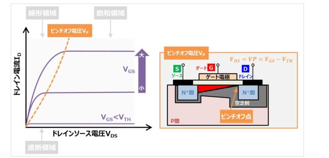
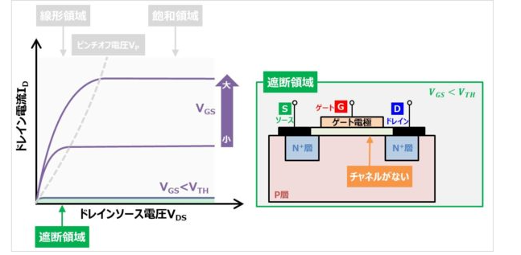
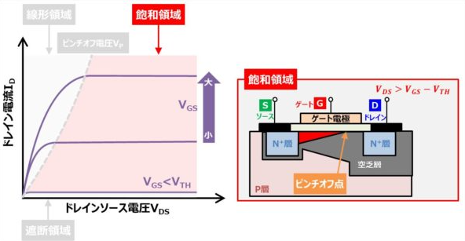
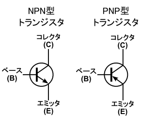
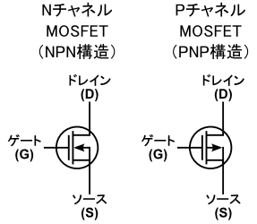
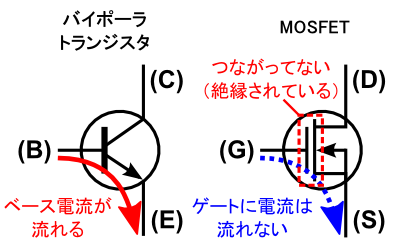
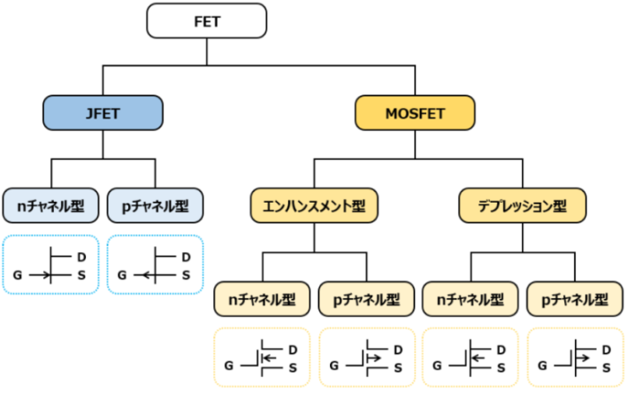
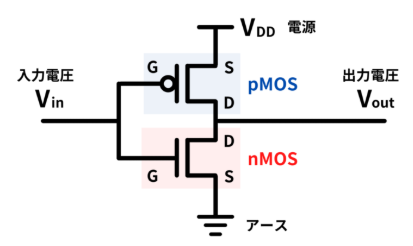
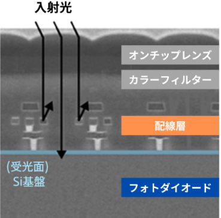

## PLL

- PLL（Phase-Locked Loop）
- 日本語で「位相同期ループ」という電子回路の一種です。
- 特定の周波数や位相を持つ信号を生成、追従、または制御するために使用されます。

特定の周波数や位相を持つ信号を生成、追従、制御するための電子回路

1. 位相比較器（Phase Detector, PD）

位相比較器は、入力信号（外部信号）とフィードバック信号（VCO出力）を比較して位相差を検出します。その位相差に基づいて、エラー信号を生成する役割があります。

エラー信号は、PLLのフィードバックループを通じて位相差がゼロ（または一定の関係）に近づくように制御されます。出力信号は位相差の方向と大きさを反映し、設計に応じてアナログ信号またはデジタル信号として表現されます。

 

アナログ位相比較器：アナログ信号同士を直接比較

デジタル位相比較器：クロック信号やデジタル信号を処理。フリップフロップを利用する場合が多い

 

2. ループフィルタ（Loop Filter）

ループフィルタは、位相比較器からのエラー信号を平滑化します。高周波ノイズを除去し、制御信号として適切な形状に整え、スムーズな電圧を生成する役割があります。

フィルタの設計（一次、二次など）は、安定性や応答速度に影響を与えるため重要です。フィルタには、単純なRCフィルタ（抵抗とコンデンサ）や、より複雑なアクティブフィルタを使用します。

 

3. 電圧制御発振器（Voltage-Controlled Oscillator, VCO）

入力された制御電圧に基づき、発振周波数を変化させる役割があります。出力信号の周波数は制御電圧と一定の関係を持ち、制御電圧が変化することで周波数が動的に調整されます。

VCOの周波数範囲は設計によりますが、広い範囲で動作するものも多く、正弦波や方形波などの信号を生成する用途に応じた設計が可能です。

 

4. 分周器（Frequency Divider）

分周器は、電圧制御発振器の出力周波数を整数または小数で分周し、位相比較器に入力します。PLLの動作周波数範囲を拡張することで、より柔軟な用途を可能にする役割があります。

分周とは、ある信号の周波数を特定の整数や小数の比率で減少させることをいいます。信号のタイミングや周波数を調整するために、頻繁に使用される技術です。

### 段階別の動作原理

__位相比較器__  
1. 入力信号とフィードバック信号を比較して、両信号の位相差を検出する
2. 位相のずれを示すエラー信号を生成する。エラー信号の極性と大きさが位相差の方向と量を示す。

エラー信号は次のループフィルタに贈られる

__ループフィルタ__

1. エラー信号を受け取り、ノイズ信号を平準化して高周波ノイズを除去する
2. 平準化された信号は制御電圧として電圧制御発信機VCDに贈られる。

__電圧制御発信機(VCO)__

VCOはループフィルタからの制御電圧を入力として受け取り、その電圧に応じた周波数で信号を発信する。

__分周器__

VCOの出力信号を分周し、フィードバック信号として位相比較器に送り返す。

__分周__

分周とは周波数を割ることで、目的の周波数を得るという手法です。
分周の意味は分かっていたのですが、何の値を何にしたら上手く分周されるのかが分からず、先輩に質問に行きました。

https://www.macnica.co.jp/business/semiconductor/articles/intel/133420/

### 生成クロック
FPGAやデジタル回路設計の分野でよく使われる用語で、外部から直接入力されるクロック信号ではなく、回路内部で新たに生成されるクロック信号のこと

#### 生成クロックの概要
外部クロック：ボード上の水晶発振器などからFPGAに直接入力されるクロック信号（例：50MHzクロックなど）。

生成クロック：外部クロックを元に、FPGA内部のPLL（Phase Locked Loop）やMMCM（Mixed-Mode Clock Manager）などの回路で分周・倍周・位相調整などを行い、新たに作り出されるクロック信号。

生成クロックの利用例
クロック周波数の変換：外部クロックが100MHzだが、内部ロジックは200MHzや25MHzで動かしたい場合、PLLなどで生成クロックを作る。
位相の調整：タイミングを合わせるために、位相をずらしたクロックを生成する。
複数クロックドメイン：異なる速度やタイミングで動作する回路ブロックごとに生成クロックを使う。

## CPLD
- コンプレックス・プログラマブル・ロジック・デバイスの略語
- ユーザー自身が何度でもプログラムの書き換えや消去を行うことができるデジタルIC
- CPLDを始めとしたプログラマブル・デバイスの出現により、製品開発がよりスピーディーに、より低コストで行えるようになりました。

### PLD
- PLDはプログラマブル・ロジック・デバイスのことで、「ユーザー自身がプログラムできる論理回路」という意味です。
- 1970年代頃から、製品購入後でもユーザー自身でプログラムの書き換えが可能な汎用デバイスが出回るようになりました。これがPLD

PLDは開発のどの段階でも外部からプログラムの書き込みや消去ができるため、中途の仕様変更やカスタマイズにも即座に対応できます。

そのため製品開発速度が格段にスピーディーになり、多くのメーカーで重宝されるようになってきました。

なお、PLDには回路規模や構造によっていくつかの種類に分かれます。

### 仕組み

CPLDは前述の通り、購入後にプログラムの書き換えが可能な汎用チップのことです。

先ほど「ゲート」という用語を使いましたが、これは簡単に言うとデジタル回路の最も基本的な単位を指します。

そもそもデジタル回路は本当にシンプルで、ゲートを構成するAND回路、OR回路、NOT回路でオンオフ制御や入出力制御を行います。

CPLDにおいては、このゲートを任意に書き換えられる、ということです。

具体的なプログラミングの流れとしては、まずハードウェア記述言語(HDL：Hardware Description Language)にて、デザインを記述(デザイン・エントリ)します。

このハードウェア記述言語というのは、CPLDだけではなくデジタル回路の設計において非常によく用いられる言語です。Verilog HDLやVHDL(Very High Speed IC DHL)などがありますね。

この設計に従って、PLDは仕様変更などを行っていくこととなります。

ここでデザインされた回路は、シミュレーションされます。

__配置・配線は製品によって対応するピンが異なる場合があるので、データシート等で事前に確認__

__FPGAとの違い__

PLDとして、よくFPGAという用語を目にするかと思います。

これはField Programmable Gate Arrayの略語で、現場(フィールド)で回路の書き換えが可能な集積回路」と訳される通り、CPLDと同様のデバイスであることがお分かり頂けるでしょう。

ただ、大きな違いは「規模」です。

前述の通りFPGAは数万ゲート以上もの巨大な規模を持つPLDで、対してCPLDは数千ゲートほどの集積度です。

また、FPGAはプログラミングされたデザインをSRAM等の揮発性メモリに保存しますが、CPLDは不揮発性メモリで保存します。

もっとも、FPGAの中にも不揮発性メモリを用いている製品も存在します。

さらに言うと一般的なFPGAはきわめて柔軟性が高く、自由なデザイン設計を行うことに優れています。そのため複雑なデジタル回路設計にも向いていると言えます。

一方でCPLDが低スペックというわけではありません。

CPLDもきわめて高度なプログラミングが可能で、さらにFPGAに比べると低価格というメリットがあります。

そのため回路規模等、使用条件でどちらが適しているかは変わってきます。

 
### 伝送ゲート

電気記号でいう「伝送ゲート（transmission gate）」とは、**スイッチとして動作するMOSトランジスタ（主にCMOS）を使った回路素子**です。  
伝送ゲートは、入力信号を制御信号によって**そのまま出力側に伝送（伝達）するか遮断するか**を切り替えるためのゲートです。  
論理ゲート（ANDやORなど）とは異なり、**アナログ信号もデジタル信号も通すことができるスイッチング素子**です。

#### 伝送ゲートの構成

- 通常、**nMOSとpMOSの2つのトランジスタ**を並列に接続し、互いに補完的な制御信号でON/OFFを切り替えます（CMOS伝送ゲート）。
- これにより、入力信号の「0」も「1」もロスなく伝送できます。

#### 動作原理

- **制御信号（Enable）がON**のとき：  
  → 入力端子と出力端子が接続され、信号がそのまま伝わる（スイッチON）

- **制御信号がOFF**のとき：  
  → 入力端子と出力端子が切り離され、信号が伝わらない（スイッチOFF）

#### 回路記号

- 長方形の中に斜め線や「T」などで表されることが多いです。
- 端子は「入力」「出力」「制御（Enable）」の3つが基本です。

#### 用途

- バスの切り替え
- マルチプレクサ（多重化器）
- サンプル＆ホールド回路
- クロックゲーティング
- メモリセルの選択回路 など

#### まとめ

**伝送ゲートとは、入力信号を制御信号によってそのまま出力に伝えるか遮断するかを切り替えるスイッチ回路であり、主にCMOSトランジスタで構成されます。アナログ・デジタル両方の信号を伝送できるのが特徴です。**

## デュアルエミッタトランジスタ

バイポーラトランジスタ（BJT）でエミッタが2つ存在するものは、**デュアルエミッタトランジスタ（dual-emitter transistor）**または**マルチエミッタトランジスタ（multi-emitter transistor）**と呼ばれます。

特に「マルチエミッタトランジスタ」は、デジタルIC（集積回路）のTTL（Transistor-Transistor Logic）ファミリの**NANDゲート**などで広く使われています。  
この構造は、入力ごとにエミッタを分けることで複数の入力信号を直接扱えるため、論理回路の実現に非常に便利です。

#### まとめ

- **デュアルエミッタトランジスタ（dual-emitter transistor）**
- **マルチエミッタトランジスタ（multi-emitter transistor）**

## 電圧レベル種類

電圧論理レベルは、論理HIGHまたは論理LOWを表す電圧を定義します。 
多くの回路はグランドに対する+5 Vまたは+3.3 Vを論理HIGH、グランドまたは0 Vを論理LOWで表しています。このタイプのシステムは、正またはアクティブHIGHと呼ばれます。 
トライステート論理では、Z状態は高インピーダンス状態で、通常はイネーブルラインとして使用されます。 
デジタル生成では、X状態は現在の論理レベルを維持します。デジタル集録では、Don't Care状態を示します。 
ロジックファミリは、論理HIGHまたは論理LOWを構成する標準化された電圧レベルを提供します。 
TTLはVCC= 5 Vに基づいています。
CMOSは、VCC= 3.3 Vに基づいています。
差動ロジックファミリは、グランド基準ではなく、2つの値の差を使用します。
LVDSは、VCC= 3.3 Vの低ノイズ、低電力、低振幅の差動方式です。
LVPECL回路は、各チャンネルに一対の信号ライン (VCC= 3または3.3 V) を必要とするECL回路の一種です。

## ピンチオフ
Nチャネル領域が遮断されることをピンチオフといい、この時のドレインソース間電圧VDSをピンチオフ電圧VPといいます。

すなわち、ピンチオフ電圧VPは、

$$
VTH=VGS−VDS
$$

のVDSをVPに置き換えて、

$$
VTH=VGS−VP
⇔VP=VGS−VTH
$$

## ピンチオフ電圧
ピンチオフ電圧Vpとは線形領域と飽和領域の境界となるドレインソース間電圧 $V_{DS}$ のこと。

MOSFETにゲートソース間電圧VGSを印加すると、ゲート(G)の絶縁膜直下にP層内の電子が引き寄せられ、電子よるNチャネル領域(反転層：上図の赤色)が形成されます。

ドレインソース間電圧VDSを大きくすると、Nチャネル領域はゲート電極下に均等に形成されなくなります。

## 遮断領域
ゲートソース間電圧VGSがゲート閾値電圧VTHより小さい領域であり、『出力特性(ID-VDS特性)』の緑色の箇所となります。

遮断領域では、ドレインソース間電圧VDSを印加しても、ドレインソース間に電流は流れません。

遮断領域においてはNチャネル領域が形成されていません。そのため、ドレインソース間の架け橋がないため、ドレインソース間電圧VDSを印加してもドレイン電流IDが流れません。

## 飽和領域
飽和領域とは、ゲートソース間電圧VGSが一定なら、ドレインソース間電圧VDSによらずドレイン電流IDが一定となる領域であり、『出力特性(ID-VDS特性)』の赤色の箇所となります。

飽和領域では、ドレイン電流IDはドレインソース間電圧VDSではなくゲートソース間電圧VGSで決まります。

###　特徴
ベース電流IBを大きくしてもコレクタ電流ICが増加しない領域。
コレクタ－エミッタ間電圧VCEが小さくても、コレクタ電流ICが流れる領域とも言われる。

飽和領域なら、この最小のコレクタ－エミッタ間電圧VCEでもコレクタ電流ICが流れる、トランジスタがONになるんです。
つまり、コレクタ－エミッタ間電圧VCEを最小限に抑えて、トランジスタをONにできる領域なのです。
言い換えると、考え得る限り損失の最も少ない条件でスイッチング動作が可能なのです。

## 電界効果トランジスタ（Field Effect Transistor：　FET）
FET（エフ・イー・ティー）は現在MOS型のものが主流で，それはMOSFET（モス・フェット）と呼ばれています．

バイポーラトランジスタ  

FET  

FETの3端子はソース、ドレイン、ゲート。
- エミッタ：ソース
- コレクタ：ドレイン
- ベース：ゲート

バイポーラで言うところのNPN型トランジスタは，MOSFETでは「NチャネルMOSFET」と呼ばれます． 逆にPNP型は「PチャネルMOSFET」です．

### MOSFETは電圧制御
バイポーラトランジスタはベースに流れる小さな電流が制御。
MOSFETは電圧制御。

回路図を見ると，バイポーラ・トランジスタはベースとエミッタがつながっています． これに対してMOSFETでの回路図を見ると，ゲートだけ切り離されています． この回路図はトランジスタの実際の構造をそのまま表しています． バイポーラ・トランジスタはベースがエミッタ・コレクタと電気的につながっています． しかし，MOSFETの場合はゲート端子だけが浮いている（他と切り離されている）ので， ゲートに電流が流れることはありません．

MOSFETのゲート電極に電池を接続した場合を想像してみます． 電池をつなげても，ゲートに電流は流れません．それでも，一応ゲート電極に「電圧」はかかっています． ・・・というわけで，MOSFETは「ゲートに電圧を印加して制御する」デバイスなんですね． 電流が流れないので省エネです． バイポーラトランジスタが「電流制御デバイス」であるのに対して， MOSFETは「電圧制御デバイス」です．

ゲートに電流が流れないから省エネ。

## フリップフロップ
フリップフロップとは、1ビットの情報を保持できる論理回路で、過去の入力によって決まった状態と現在の入力によって出力が決まる順序回路の一つです。
過去の入力情報を保持して記憶することができるため、記憶回路、または記憶素子とも呼ばれます。

フリップフロップには以下の4種類があります。

- RSフリップフロップ
- Dフリップフロップ
- JKフリップフロップ
- Tフリップフロップ

## エンハンスメント型とデプレッション型の違い
エンハンスメント型とデプレッション型の大きな違いはMOSFETの構造にあります。

MOSFETはn型半導体とp型半導体の組み合わせでできていますが、それぞれゲート-ソース間電圧が0Vのとき、ドレイン-ソース間にチャネルが形成されているかが異なります。

エンハンスメント型はチャネルが形成されてなく、デプレッション型はチャネルが形成されています。チャネルの有無で何が違うのかというと、電流が流れるかどうかです。

つまりデプレッション型はゲート-ソース間電圧0Vで、ドレイン-ソース間に電流が流れることになります。逆にエンハンスメント型は、ゲート-ソース間に電圧を印加しないと、ドレイン-ソース間に電流は流れません。

記号の違いはゲートの板が分割されているか、繋がっているか。
- 分割されている→エンハンスメント
- 繋がっている→デプレッション

ちなみに、ソースの線の向きはn型かp型か。
エンハンスの方がぶつぶつ切れてるんすね。。。

## RX / TX
IC（集積回路）や電子回路における「RX」と「TX」は、主に通信やデータ伝送の分野で使われる用語です。
- **RX**：Receive（受信）→ データや信号を受け取る端子・回路
- **TX**：Transmit（送信）→ データや信号を送る端子・回路

ICのピンやブロック図などでよく見かける基本的な用語です。
---

## RXとTXの意味

- **RX（Receiveの略）**
  - 「受信」を意味します。
  - データや信号を「受け取る」側の端子や回路を指します。
  - 例：マイコンのUARTモジュールの「RX端子」は、外部からデータを受信するための端子。

- **TX（Transmitの略）**
  - 「送信」を意味します。
  - データや信号を「送る」側の端子や回路を指します。
  - 例：マイコンのUARTモジュールの「TX端子」は、外部へデータを送信するための端子。

---

## どんなときに使う？

- シリアル通信（UART、RS-232、RS-485、SPI、I2Cなど）で、データの送受信を区別するために使われます。
- 通常、ICやモジュールのピン配置図や仕様書（データシート）で「RX」「TX」と記載されている場合、それぞれ「受信」「送信」用の端子です。

---

## 例：UARTの場合

- TX（送信端子）から出た信号が、相手側のRX（受信端子）に接続されます。
- つまり、**自分のTX → 相手のRX**、**自分のRX ← 相手のTX** となります。

## GPIO

GPIOピンとは、「General Purpose Input/Output（汎用入出力）」の略で、**マイコンやICなどで自由に入力または出力として使えるピン**のことを指します。
GPIOピンとは、**マイコンやICで自由にデジタルの入力・出力として使える汎用のピン**のことです。使い方はユーザー次第で、様々な電子回路の制御や信号の入出力に活用されます。
---

## 特徴

- **汎用性が高い：**  
  特定の機能に限定されていないので、ユーザーがプログラムで「入力」か「出力」かを選択できます。
- **デジタル信号：**  
  一般的には「HIGH（H）」または「LOW（L）」の2値（デジタル）信号を扱います。
- **ソフトウェア制御：**  
  マイコンやFPGAのレジスタ設定で、各ピンの機能（入出力切り替えや状態）を制御します。
- **多目的利用：**  
  LEDの点灯、スイッチの検出、センサ信号の読み取り、リレー制御、通信プロトコルの自作など、幅広い用途に使われます。

---

## 具体例

- **入力として使う場合：**  
  スイッチやセンサの信号を読み取る
- **出力として使う場合：**  
  LEDを点灯させたり、リレーをON/OFFしたりする

---

## 他のピンとの違い

- UARTやI2C、SPIなどの**専用通信ピン**は用途が決まっていますが、GPIOは**ユーザーが自由に使えるピン**です。
- 一部のGPIOピンは、ソフトウェア設定によって「通信機能」や「PWM機能」など**複数の役割を兼ねることも可能**です（多機能ピン）。

---

# COMポート
PC/AT互換機が使えるシリアルポートのMS-DOSやwindowsにおける呼称。
COM1からCOM9までの符号が予約されている。

RS-232C規格によるシリアル通信を行うコネクタを複数搭載するのが一般的。
MS-DOSではシリアルぷーとに対してCOMという符号をつけて識別したことからCOMポートと呼ぶようになった。

# 仮想COMポート
PCのUSBポートをCOMポートとして使用できるようにする機能。
これによりWindows上の標準COMポートを介してデバイスと通信が可能となる。
仮想COMポートを使用するには、仮想COMドライバの登録が必要。

## CMOS(Complementary Metal Oxide Semiconductor)
日本語では「相補型金属酸化膜半導体」と呼ばれます。
CMOSはnMosFetとpMosFetを組み合わせた回路。

CMOSの回路方式は省電力で高速動作が可能という特徴。

現代半導体デバイスの基本構造となっている。

CMOSは半導体デバイスの名前ではなく、あくまでもpMOSとnMOSを組み合わせた回路構造を指します。

>インバータ
>一番簡単な例はインバータ。0→1 / 1→0を出力する回路。
>

__CMOSの実用例__
1. インバータ

コンピュータは1と0の演算を行うことでデータを処理している。
最も基本的なNOTゲートはCMOS回路が使われている。

2. イメージセンサー

CMOSはカメラの目に当るイメージセンサーにも利用されている。
消費電力が小さく、高速動作が可能なため、スマホやデジカメに搭載されてる。

