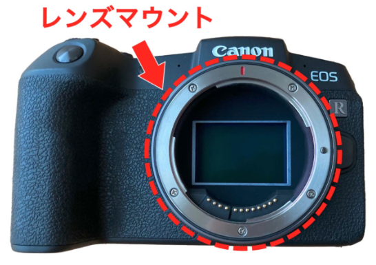

# マシンビジョン

マシンビジョンで使われるカメラは、単なる画像を撮影するだけでなく、**産業用途**での**高速**かつ**高精度**な画像取得のために、いくつかの重要な構成要素と機能を持っています。

---

## 📸 マシンビジョンカメラの主要な構成要素

マシンビジョンカメラそのものの内部構造や、システムとしてのカメラ周りの主要な構成要素は以下の通りです。

### 1. 撮像素子（イメージセンサ）
カメラの「目」となる部品で、光を電気信号に変換します。

* **種類:** 主に **CCD** (Charge-Coupled Device) と **CMOS** (Complementary Metal-Oxide Semiconductor) が用いられます。近年は高速・低消費電力化が進んだ **CMOSセンサ** が主流となっています。
* **解像度:** 撮影できる画像の画素数（例: 200万画素、500万画素など）。用途に応じて必要な検査精度から選択されます。
* **グローバルシャッター / ローリングシャッター:**
    * **グローバルシャッター:** センサの全画素が**同時に**露光を開始・終了します。高速で移動する物体でも画像の歪み（こんにゃく現象）が発生しないため、マシンビジョンで広く使われます。
    * **ローリングシャッター:** 画素列ごとに順次露光を開始・終了します。高速移動体の撮影には不向きですが、構造がシンプルで安価な傾向があります。

### 2. レンズマウント
カメラ本体とレンズを接続する部分です。
適切なレンズを選定することで、視野、倍率、被写界深度などを調整します。
* **Cマウント** や **CSマウント** など、産業用途で標準化された規格がよく使われます。

### 3. デジタルインターフェース
取得した画像データをPCなどの処理装置に送信するための接続規格です。

* **主な規格:** **GigE Vision**（ギガビットイーサネット）、**USB3 Vision**、**CameraLink**、**CoaXPress** などがあります。
* **選定基準:** 伝送速度（フレームレート）、ケーブル長、接続の安定性、コストなどによって最適なものが選ばれます。

### 4. トリガー/外部同期機能
外部信号（PLCやセンサーなど）とカメラの動作を完全に同期させるための機能です。

* **非同期リセット:** 外部からトリガー信号を受け取った**任意のタイミング**で露光を開始します。これにより、コンベア上の特定の製品がカメラの視野に入った瞬間など、正確なタイミングで撮影が可能です。

---

## 💡 マシンビジョンシステム全体の重要構成要素（カメラの周辺）

カメラ単体ではなく、システム全体として安定した画像を取得・処理するために、カメラと組み合わせて以下のような構成要素が重要になります。 

### 1. 照明
良質な画像を得るための**最も重要**な要素の一つです。
被写体の特徴（エッジ、傷、コントラスト）を際立たせるために、光源の種類、色、角度、配置が厳密に設計されます。

* **種類:** **LED照明**が長寿命、安定性、応答性から主流です（リング照明、バー照明、同軸照明、バックライトなど）。

### 2. レンズ
撮像素子に正確に光を集束させ、画像を形成します。

* **機能:** 適切な**焦点距離**と**絞り**を選択し、必要な視野と解像度を確保します。歪曲収差の少ない高品質なレンズが求められます。

### 3. フレームグラバー（画像入力ボード）
CameraLinkやCoaXPressなどの高速インターフェースを使用する場合、PCとカメラの間に入り、カメラからの信号をデジタルデータとして受け取り、PCメモリに転送する役割を果たします。
GigE VisionやUSB3 Visionの場合は、この機能がPC側のインターフェースチップで処理されるため、専用のボードは不要な場合があります。

### 4. 画像処理ソフトウェア
カメラが取得した画像データに対し、欠陥検出、寸法測定、文字認識（OCR）、位置決めなどの**自動処理**を行い、合否判定や情報出力を実行します。

