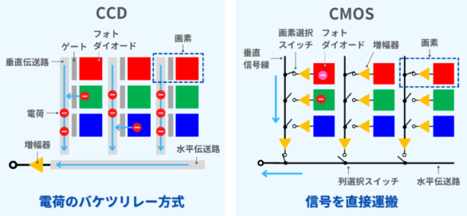

# CMOV VS CCD

## センサ概要

### CCD
フォトダイオードで生成された電荷を垂直伝送路(垂直CCD)と水平伝送路(水平CCD)で転送する方式のイメージセンサー。

電荷はバケツリレー方式で転送されます。転送された電荷は増幅器で電圧に変換され出力されます。

### CMOS
フォトダイオードで生成された電荷を各画素の増幅器で電圧に変換した後、各行列のスイッチにより電圧を転送・出力するイメージセンサー。

スイッチのON・OFFで任意の画素のみデータを読み出すことが出来ます。

CCD（Charge-Coupled Device）とCMOS（Complementary Metal-Oxide Semiconductor）は、光を電気信号（電荷）に変換する点は共通していますが、その**電荷の読み出し（転送）方法**に根本的な違いがあります。

これが、消費電力、処理速度、画質、コストなどの特性に大きな違いをもたらします。

## 動作原理

### 1. ⚛️ CCD（Charge-Coupled Device）の動作原理

CCDセンサーは、蓄積された電荷を**バケツリレー方式**で転送し、まとめて増幅・変換するのが特徴です。

#### 動作のステップ
1.  **光電変換・電荷蓄積:** 各画素の**フォトダイオード**が光（光子）を受け、その量に応じた**電荷（電子）**を蓄積します。
2.  **電荷の転送（バケツリレー）:**
    * 画素に隣接する**垂直転送路**の電極に特殊な**高電圧**を順番に印加し、蓄積された電荷を次の画素へと**同期的に**送ります。
    * 全画素からの電荷が、列ごとに下端の**水平転送路**に集められます。
3.  **電荷の読み出し・変換:**
    * 水平転送路でもバケツリレーが行われ、電荷が一つずつ**出力増幅器（アンプ）**に転送されます。
    * この**単一**のアンプで電荷が**電圧（アナログ信号）**に増幅され、その後、**A/Dコンバータ**でデジタル信号に変換されて出力されます。

#### 特徴
* **画質の良さ:** 全画素の電荷を**一つの高品質なアンプ**で処理するため、ノイズが少なく、画素間のばらつき（固定パターンノイズ）が抑えられ、高画質が得られやすいです。
* **低速/高消費電力:** 電荷の転送に時間がかかり、高電圧も必要とするため、一般的に読み出し速度に限界があり、消費電力が大きくなります。

### 2. ⚡ CMOS（Complementary Metal-Oxide Semiconductor）の動作原理

CMOSセンサーは、各画素に**読み出し回路と増幅器**を持ち、必要な画素の信号を**個別に**読み出すのが特徴です。

#### 動作のステップ
1.  **光電変換・電荷蓄積:** CCDと同様に、各画素のフォトダイオードが光を受け、電荷を蓄積します。
2.  **画素内での電圧変換:** 各画素には、**フォトダイオード**の他に**増幅器（アンプ）**や**スイッチ**などのトランジスタ回路が組み込まれています。
    * 蓄積された電荷は、この画素内の増幅器によって**直接電圧（アナログ信号）**に変換されます。
3.  **信号の読み出し:**
    * 画素内のスイッチをオン/オフすることで、変換された電圧信号を垂直信号線を経由して読み出します。
    * その後、列ごとに**A/Dコンバータ**でデジタル信号に変換されて出力されます（または、画素ごとにA/D変換を行うものもあります）。

#### 特徴
* **高速/低消費電力:** 各画素で並行して信号の読み出し・増幅ができるため、CCDより**高速**な処理が可能です。また、低い電圧で動作し、必要な部分だけを駆動させることで**低消費電力**を実現します。
* **画質の課題:** 各画素にアンプが存在するため、その特性のばらつきがそのままノイズ（固定パターンノイズ）となり、かつてはCCDより画質が劣るとされていました。しかし、近年は技術革新（裏面照射型など）により、この差はほとんどなくなっています。
* **システムオンチップ:** 駆動回路やA/Dコンバータなどの周辺回路を同一チップ上に集積できるため、**小型化**や**低コスト化**が容易です。

| 特性 | CCD (Charge-Coupled Device) | CMOS (Complementary Metal-Oxide Semiconductor) |
| :--- | :---: | :---: |
| **感度** | 〇 **高い** | × 低い |
| **画質** | ◎ **高画質** | 〇 高画質 |
| **消費電力** | × 高い | 〇 **低い** |
| **高速撮影** | × 困難 | 〇 **容易** |
| **集積性** | × 困難 | 〇 **容易** |
| **コスト** | × 高い | 〇 **安い** |

