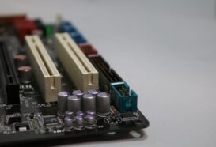

# フレームグラバー

フレームグラバー（Frame Grabber）は、マシンビジョンシステムにおいて、カメラから送られてくる**画像データ（アナログまたはデジタル）を受け取り、デジタル形式に変換して、ホストコンピューター（PC）のメモリに転送するための専用ボード**です。画像入力ボードとも呼ばれます。

特に、大量のデータを超高速で転送する必要がある**高解像度・高フレームレート**の産業用カメラを使用する場合に、その重要な役割を果たします。

---

## 1. ⚙️ フレームグラバーの主要な役割

フレームグラバーの主な機能は、カメラとPC間の**橋渡し役**となり、安定した高速データ転送を実現することです。
カメラとPCの間の画像伝送方式には、USBやEthernetといった汎用インターフェースもあれば、CameraLinkやCoaXPressといった専用形状のインターフェースもあります。

### ざっくりとした役割
カメラから送られてきたデータを1枚の画像にするの一言に尽きます。
ここではラインスキャンカメラを例に紹介します。
ラインスキャンカメラからは1Line分の画像データが送られてきますが、このままでは画像処理には使えません。
像データをフレームグラバーのメモリに蓄積し、1枚の画像を生成後、パソコンのメモリに送られて画像処理されます。

### 1. データ受信とバッファリング
カメラからの連続する画像データ（フレーム）を一時的に高速なオンボードメモリ（バッファ）に蓄えます。これにより、カメラの送信速度とPCの処理速度の違いによるデータ損失を防ぎます。

### 2. インターフェース処理
CameraLinkやCoaXPressなどの高速専用インターフェース規格の物理層とプロトコルを処理し、カメラの信号をPCが扱えるデジタルデータ形式に変換します。

### 3. PCへのDMA転送
取得した画像を、CPUの介入を最小限に抑えて**DMA（Direct Memory Access）**により、PCのメインメモリに直接、かつ高速に転送します。これにより、CPUが画像処理以外の作業に集中できるため、システム全体のパフォーマンスが向上します。

### 4. 外部同期・トリガー制御
カメラの露光や外部機器（照明、PLC、センサーなど）の動作を正確に同期させるためのI/O（入出力）ポートを備えています。これにより、**特定のタイミング**で画像をキャプチャするトリガー制御が可能になります。

---

## 2. 🎛️ フレームグラバーが必要なケースと不要なケース

すべてのマシンビジョンカメラにフレームグラバーが必要なわけではありません。カメラの**インターフェース規格**によって必要性が決まります。

### 必要性が高い規格

これらの規格はデータ転送速度が非常に速いため、PCの汎用ポート（USBやLANポート）では処理しきれず、専用のボード（フレームグラバー）が必要です。

* **CameraLink:** 産業用カメラの標準規格として長年使われてきました。非常に高い安定性と速度が特徴で、高速なラインスキャンカメラなどで使われます。
* **CoaXPress (CXP):** 非常に高速なデータ転送（1ケーブルで最大12.5 Gbps）を可能にしつつ、長距離伝送（最大40m）も可能な新しい高速規格です。

### フレームグラバーが不要な（または内蔵されている）規格

これらの規格は、PCの標準的なインターフェースを利用するか、比較的低速なデータ転送を目的としています。

* **GigE Vision (Gigabit Ethernet):** 汎用のLANケーブルとPCのNIC（ネットワークインターフェースカード）を使用します。フレームグラバーは不要で、ケーブル長も長くできます（最大100m）。
* **USB3 Vision (USB 3.0/3.1):** 汎用のUSBポートを使用します。プラグアンドプレイで手軽に接続でき、低コストです。
* **USB4 / Thunderbolt:** さらに高速なデータ転送が可能です。

---

## 3. 📈 メリット（フレームグラバーを使用する利点）

* **安定したデータ転送:** 専用設計のため、汎用インターフェースよりもデータ欠落（ドロップフレーム）が少なく、安定性に優れます。
* **高速性:** CameraLinkやCoaXPressを使用することで、PCのCPU負荷を抑えつつ、GigEやUSBの限界を超える超高速・大容量の画像データを扱えます。
* **確実な同期:** 外部I/O機能により、画像取得のタイミングをミリ秒単位で厳密に制御できます。

フレームグラバーは、特に**高速ライン検査**や**高精度な画像処理**が求められる、要求の厳しいマシンビジョンシステムにおいて不可欠な構成要素です。

## ハード的な接続法
フレームグラバーはPCIスロットを使って接続する方法が一般的です。

PCIスロットにも規格があるので注意が必要です。
PCIボード（拡張ボード）には色々な規格やサイズがありますので、パソコンにあったPCIボードを選定しないと正しく取り付けることが出来なくなります。

