# インストール

[ドローン空撮画像からオルソ画像や3D画像を変換するweb ODM (Open Drone Map)をmacにインストール](https://www.youtube.com/watch?v=MCJsJbcsONw)

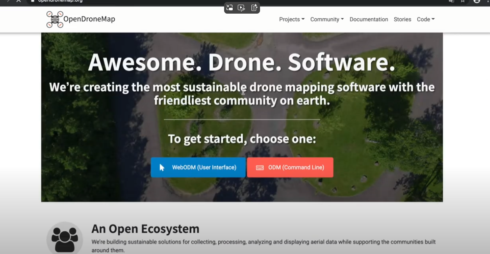

githubのサイトへGo

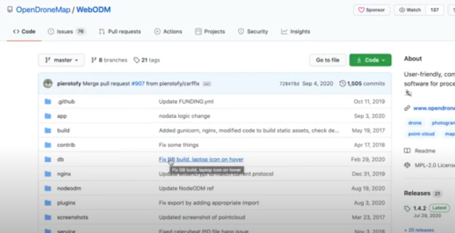

dockerを先にインストール

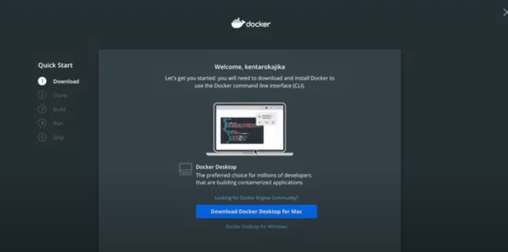

dockerインストール出来たらgithubがインストールされていることを確認

dockerのリソースを調整

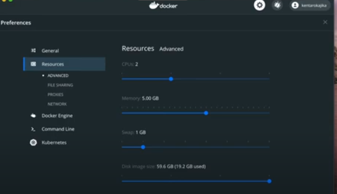

(opendroneの)githubのURLを打ち込む

DL出来たら、ディレクトリに移動

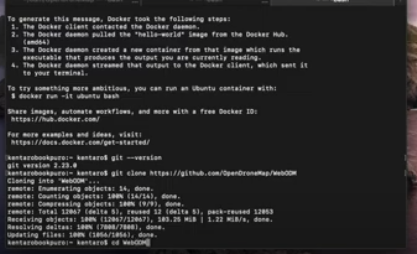

DLしたらwebadmに移動、○○.shを実行する→インストール

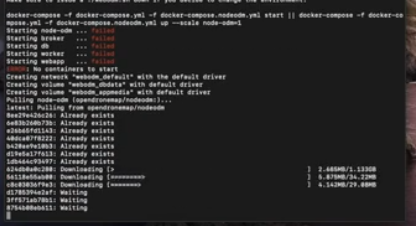

ローカルホストで実行

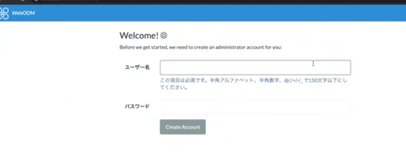

githubのメインページにaudmデータがある

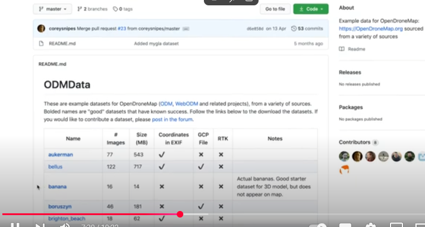

太字になっているものが処理がうまくいっているデータセット。

jpgから3Dデータを復元する

画像同士が重なるように撮影する必要あり

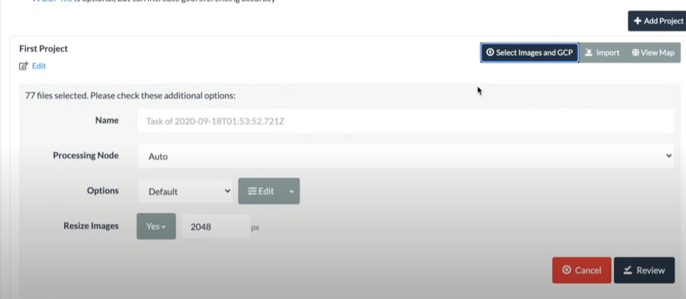

素材一式を選択→DL

タスク名は適当、ノードはAUTO

オプションで必要な画像を取得

Startすると画像アップロード→処理

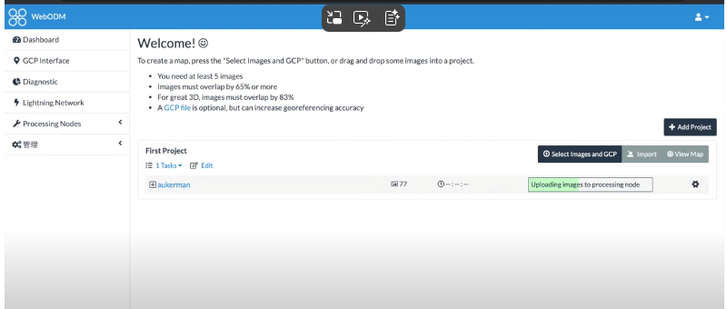

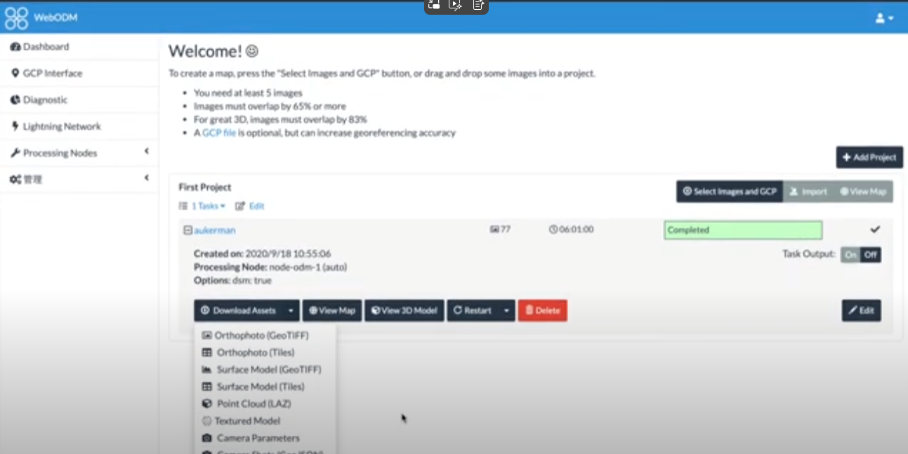

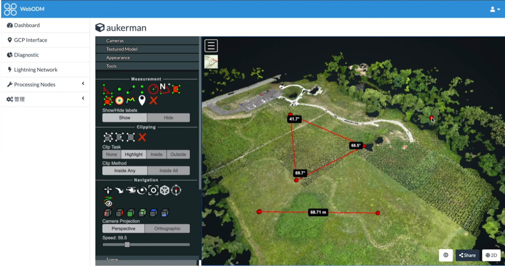
