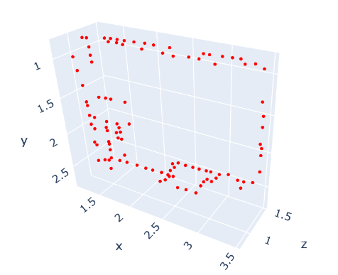

# 特徴点

---

# ✅ 3Dマップにおける特徴点とは

**特徴点 (Feature Points)** とは、3D空間や画像上で **位置を一意に認識できるような点** を指します。

ロボット工学・コンピュータビジョン・SLAM（Simultaneous Localization and Mapping）でよく使われる概念です。

---

## 📌 特徴点の性質

* 周囲と比べて **識別しやすい**
* **繰り返し観測できる** （視点が変わっても見つけやすい）
* **位置合わせ（マッチング）** に利用できる

👉 平らで均一な壁の中央点は特徴がなく識別できませんが、角・模様・エッジの交点などは「特徴的」なので特徴点になります。

---

## 📌 2D特徴点と3D特徴点

* **2D特徴点** （画像上の点）
* SIFT, SURF, ORB などのアルゴリズムで検出
* 例：画像のコーナー、模様、エッジの交差点
* **3D特徴点** （地図や点群上の点）
* LiDARやステレオカメラで得た点群の中で特徴的な位置
* 例：建物の角、ポールの頂点、交差点の目印

---

## 📌 3Dマップにおける役割

1. **自己位置推定（Localization）**
   * ロボットが「自分がどこにいるか」を再認識するために、マップ内の特徴点を利用。
2. **地図構築（Mapping）**
   * SLAMでは、カメラやLiDARで見つけた特徴点を基準にして環境を少しずつ積み上げる。
3. **マッチング**
   * 過去に観測した特徴点と現在の特徴点を対応付けて、位置の変化（移動量）を推定。

---

## 📌 具体例

* **屋内地図**
  * ドアの角、机の端、壁と床の交線などが特徴点。
* **屋外地図**
  * 電柱、標識、建物の角、道路標示などが特徴点。
* **ロボットのSLAM**
  * ORB-SLAMではカメラ画像から ORB特徴点を抽出して3D空間に再構築。

---

## ✅ まとめ

* **特徴点 = 3Dマップや点群の中で「他と区別できる、識別に役立つ点」**
* SLAMやロボットのナビゲーションで重要な役割を果たす
* コーナーやエッジ交点などが典型的な特徴点


# 3D特徴点

では **3D SLAM（Simultaneous Localization and Mapping）における特徴点の選び方と抽出アルゴリズム** を掘り下げます。

---

# ✅ 3D SLAMにおける特徴点の選び方

特徴点は **ロボットが環境を安定して認識できるポイント** である必要があります。

選び方の基準は以下のとおりです：

1. **識別性が高い**
   * 平坦な壁では位置が分からない → 壁の角や模様がある場所が特徴点になる。
2. **再現性が高い**
   * 観測するたびに同じ場所が特徴点として検出される必要がある。
   * ランダムノイズや一時的な物体（人や車）は不適。
3. **環境内に十分存在する**
   * まばらすぎると位置推定が不安定。
   * 多すぎても処理が重くなるのでバランスが必要。

---

# ✅ 特徴点抽出のアルゴリズム

## 1. **画像ベースの特徴点**

カメラ画像から 2D特徴点を検出し、それを3D空間に投影して特徴点マップを作る方式。

* **SIFT (Scale-Invariant Feature Transform)**
  * スケール変化や回転に強い。精度高いが計算重い。
* **SURF (Speeded Up Robust Features)**
  * SIFTを高速化したもの。特許の関係で研究用が多い。
* **ORB (Oriented FAST and Rotated BRIEF)**
  * 軽量かつ高速。ORB-SLAM で利用される。

👉 **ORB-SLAM** では、カメラ画像からORB特徴点を検出 → それを三角測量して3D特徴点に変換。

---

## 2. **点群ベースの特徴点**

LiDARやRGB-Dカメラの点群から直接抽出。

* **ISS (Intrinsic Shape Signatures)**
  * 点群の局所的な幾何特徴を使って「コーナー」に相当する点を見つける。
* **Harris3D**
  * 2Dのハリスコーナー検出を3D点群に拡張したもの。
* **FPFH (Fast Point Feature Histogram)**
  * 点群の局所的な法線分布を記述子にする。特徴点の比較やマッチングに使える。

👉 **LOAM (Lidar Odometry and Mapping)** では、点群から「エッジ点」と「平面点」を抽出して特徴点として利用。

---

## 3. **ハイブリッド方式**

* カメラとLiDARを組み合わせ、画像の特徴点と点群の幾何特徴を融合。
* **Visual-LiDAR SLAM** として高精度かつロバストな地図を作成できる。

---

# ✅ 特徴点の利用方法（SLAMでの流れ）

1. **特徴点検出** （画像や点群から候補を抽出）
2. **特徴記述子の生成** （SIFT, ORB, FPFH などのベクトル表現に変換）
3. **特徴点マッチング** （過去フレームと現在フレームを対応付け）
4. **姿勢推定** （PnPやICPなどを使ってロボットの移動量を推定）
5. **マップ更新** （新しい特徴点を地図に追加）

---

# ✅ まとめ

* **特徴点は、環境を繰り返し認識できる「目印」**
* 抽出方法は
  * 画像ベース（ORB, SIFT, SURF）
  * 点群ベース（ISS, Harris3D, FPFH）
  * 融合方式（Visual-LiDAR SLAM）
* SLAMでは特徴点を **検出 → 記述 → マッチング → 姿勢推定** に使う


では、**実際のSLAM（例：ORB-SLAM, LOAM）で「特徴点がどう地図に保存されるか」** を説明します。

---

# ✅ ORB-SLAMにおける特徴点の地図保存

### 1. **地図の基本データ構造**

ORB-SLAM では以下の2つを中心に地図を表現します：

* **Keyframe（キーフレーム）**
  * ロボット（カメラ）がある地点で撮影した画像＋その時の自己位置推定
  * 画像上の特徴点（ORB特徴）をたくさん含む
* **MapPoint（マップポイント）**
  * 環境中の3次元点（特徴点の3D位置）
  * 複数のキーフレームから観測される

👉 環境の3Dマップは「キーフレームとマップポイントの関係グラフ」で表されます。

---

### 2. **特徴点の保存の流れ**

1. カメラ画像から **ORB特徴点** を検出（2D座標 + ORB記述子）
2. ステレオカメラや多視点から三角測量して **3D座標** を推定
3. 新しい **MapPoint** として保存
4. どのキーフレームから観測されたかをリンク付け

---

### 3. **地図データの構造イメージ**

```
KeyFrame #1
 ├─ ORB特徴点 (2D座標, 記述子)
 ├─ 観測した MapPoint A, B, C
KeyFrame #2
 ├─ ORB特徴点 (2D座標, 記述子)
 ├─ 観測した MapPoint B, C, D

MapPoint A (3D座標, ORB記述子, 観測フレーム: #1)
MapPoint B (3D座標, ORB記述子, 観測フレーム: #1,#2)
MapPoint C (3D座標, ORB記述子, 観測フレーム: #1,#2)
MapPoint D (3D座標, ORB記述子, 観測フレーム: #2)
```

👉 **MapPoint** が「地図上の特徴点」、

👉 **KeyFrame** が「どこから見たか」の情報になります。

---

# ✅ LOAM (Lidar Odometry and Mapping) の場合

### 1. 特徴点の種類

* **Edge feature（エッジ点）**
  * 点群の急峻な変化（建物の角、ポールなど）
* **Plane feature（平面点）**
  * 平坦な部分（壁、地面など）

### 2. 保存方法

* 点群から特徴点を抽出し、局所マップに保存
* 新しいスキャンが来るたびに、過去の特徴点と対応付けして **ICP（Iterative Closest Point）** で位置合わせ

---

# ✅ ORB-SLAM vs LOAM の地図保存の違い

| 項目         | ORB-SLAM (カメラベース)        | LOAM (LiDARベース)                 |
| ------------ | ------------------------------ | ---------------------------------- |
| 特徴点の種類 | ORB特徴（画像のコーナー）      | Edge / Plane 特徴点（点群）        |
| 地図の単位   | KeyFrame + MapPoint            | 点群ブロック                       |
| 記述子       | ORB記述子（バイナリベクトル）  | 法線ベクトル、幾何情報             |
| 保存方法     | KeyFrameにリンクされた3D特徴点 | 点群の一部を抽出して特徴点クラウド |

---

# ✅ まとめ

* **特徴点は「3Dマップを作るための基準点」**
* ORB-SLAMでは **画像特徴点(ORB) → 3D座標化 → MapPointとして保存**
* LOAMでは **点群からEdge/Planeを抽出して保存**
* 共通点は「特徴点を過去フレームと対応付けて、ロボットの自己位置とマップを同時に更新」すること


## 実演

ISS Keypoint 抽出した結果。

```pytkon
keypoints = o3d.geometry.keypoint.compute_iss_keypoints(
    pcd,
    salient_radius=0.05,
    non_max_radius=0.05,
    gamma_21=0.5,
    gamma_32=0.5
)
```



