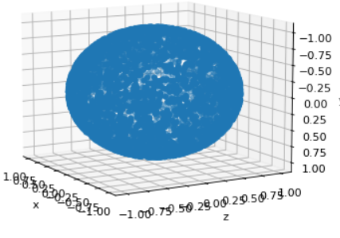

なるほど！💡

ICP（Iterative Closest Point）は強力ですが「局所最適解」に陥りやすいので、初期位置が悪いと精度が出ません。

「思ったより正確に結合できない」ときの改善策を整理します。

---

# ✅ ICPが正確に結合できないときの対策

## 1. **初期位置合わせを工夫する**

* ICPは「入力が近い位置にある」ことを前提にしているので、

  初期位置が遠いと間違った位置に収束します。
* 方法：

  * センサーの外部パラメータを使って大まかに位置を合わせる
  * 粗い特徴点マッチング（FPFH + RANSAC）を使って初期変換を推定する

👉 Open3D では以下の流れがよく使われます：

1. FPFH特徴量抽出
2. RANSACベースで粗い位置合わせ
3. ICPで微調整（ファインアライメント）

---

## 2. **特徴量ベースの位置合わせを使う**

ICPがダメなときは「局所的な形状特徴量」を使うと改善できます。

* **FPFH (Fast Point Feature Histogram)**
* **SHOT descriptors**

Open3Dの例：

```python
# 粗い位置合わせ（RANSAC）
reg_ransac = o3d.pipelines.registration.registration_ransac_based_on_feature_matching(
    source_fpfh, target_fpfh, True,
    max_correspondence_distance=0.05,
    estimation_method=o3d.pipelines.registration.TransformationEstimationPointToPoint(),
    ransac_n=4,
    checkers=[
        o3d.pipelines.registration.CorrespondenceCheckerBasedOnEdgeLength(0.9),
        o3d.pipelines.registration.CorrespondenceCheckerBasedOnDistance(0.05)
    ],
    criteria=o3d.pipelines.registration.RANSACConvergenceCriteria(4000000, 500)
)
```

👉 RANSACで得た変換行列をICPの初期値にすれば、精度がぐっと上がります。

---

## 3. **正規化と前処理をする**

* **ダウンサンプリング**

  点群が大きすぎると局所最適に陥りやすい → `voxel_down_sample` で点数を減らす
* **外れ値除去**

  ノイズ点が多いと結合がブレる → `remove_statistical_outlier`
* **法線推定**

  特に Point-to-Plane ICP を使う場合は法線を正しく推定する必要あり

---

## 4. **全体最適化を行う**

複数スキャンを順番にICPで重ねると、最後にズレが溜まります。

→ **Pose Graph Optimization (PGO)** を使うと全体で矛盾が少ない配置に調整できます。

Open3Dにも `pose_graph` API があり、

「ループ閉じ込み + グローバル最適化」が可能です。

---

## 5. **他の手法を検討**

* **Colored ICP** （色情報も使ってマッチング）
* **NDT (Normal Distributions Transform)** → 点群の密度分布で位置合わせ
* **GICP (Generalized ICP)** → 点群の局所構造を考慮してより安定

---

# ✅ まとめ

* ICPがズレるときは **「初期位置が悪い」「ノイズが多い」** のが原因。
* 改善の順番は：
  1. ダウンサンプリング・外れ値除去で前処理
  2. FPFH + RANSACで粗い位置合わせ
  3. ICPで細かい調整
  4. 複数点群なら Pose Graph Optimization で全体最適化

---

👉 もしよければ、次回は「 **FPFH + RANSAC + ICP を組み合わせた Open3D のサンプルコード** 」を書きますか？

良い観点ですね — RANSAC（特徴量ベースの粗位置合わせ）が「全然当たらない」原因はだいたい決まっていて、**前処理／特徴量設計／RANSACパラメータ**のどれかを直せば急に成功率が上がります。以下は実践的なチェックリスト＋具体的な改善手順（Open3D向けのパラメータ例付き）です。

---

# 1) まず確認する「前提ミス」

* 点群の**スケール単位（m/mm）**が一致しているか？（違うと距離閾値が合わない）
* 点群に**大きな外れ値・ノイズ**がないか？（外れ値を先に除去）
* 点群の**重なり（overlap）**が十分あるか？（重なりが少ないとRANSACは無力）
* 法線（normals）は**正しく推定**されているか（Point-to-planeを使うなら必須）

---

# 2) 前処理（高効果）

* **ボクセルダウンサンプリング（voxel downsample）**でノイズ除去と計算量削減。例：`voxel_size = 0.02`（実データに合わせて変更）
* **外れ値除去** ：`remove_statistical_outlier` を実行。
* **領域クロップ** ：不要領域（床や移動物体）を切り落とすと安定。

---

# 3) 特徴量（FPFH等）の作り方 — ここが最重要

* **法線推定半径** と **FPFH計算半径** はデータのスケール依存。経験則で：
  * `radius_normal = 2 * voxel_size`
  * `radius_feature = 5 * voxel_size`
* 半径が小さすぎる → 特徴が粗すぎてマッチしない。大きすぎる → 異なる構造を混同する。
* **キーポイント抽出** （ISS等）で特徴点のみを使うと効率＆耐ノイズ性が上がる。

---

# 4) RANSACパラメータ調整（Open3Dでの例）

* `distance_threshold` は **voxel_size の 1.0～1.5 倍** に設定するのが安全。
* サンプル点数 `ransac_n` は通常  **3 or 4** （点群なら4を使うことが多い）。
* `RANSACConvergenceCriteria` の `max_iteration` と `confidence`（または `max_validation`）を十分に大きく（ただし計算時間が増える）する。
* **CorrespondenceChecker** を複数使う（距離＋エッジ長チェックなど）と誤対応を減らせる。

### Open3Dの実践的パラメータ（テンプレ）

```python
voxel_size = 0.05  # データスケールに合わせる（例: 5cm）
radius_normal = 2 * voxel_size
radius_feature = 5 * voxel_size
distance_threshold = 1.5 * voxel_size

# 法線とFPFH計算
pcd_down.estimate_normals(
    search_param=o3d.geometry.KDTreeSearchParamHybrid(radius=radius_normal, max_nn=30))
pcd_fpfh = o3d.pipelines.registration.compute_fpfh_feature(
    pcd_down,
    o3d.geometry.KDTreeSearchParamHybrid(radius=radius_feature, max_nn=100))

# RANSAC 粗位置合わせ
result_ransac = o3d.pipelines.registration.registration_ransac_based_on_feature_matching(
    source_down, target_down, source_fpfh, target_fpfh,
    mutual_filter=True,
    max_correspondence_distance=distance_threshold,
    estimation_method=o3d.pipelines.registration.TransformationEstimationPointToPoint(False),
    ransac_n=4,
    checkers=[
        o3d.pipelines.registration.CorrespondenceCheckerBasedOnEdgeLength(0.9),
        o3d.pipelines.registration.CorrespondenceCheckerBasedOnDistance(distance_threshold)
    ],
    criteria=o3d.pipelines.registration.RANSACConvergenceCriteria(400000, 500)
)
```

* `mutual_filter=True`（相互一致性フィルタ）を有効にすると誤マッチを減らせる。
* `CorrespondenceCheckerBasedOnEdgeLength(0.9)` は対応点集合の幾何的一貫性を確認します。

---

# 5) 成功率を上げる工夫（戦術）

* **粗→細の段階的処理（coarse-to-fine）**
  1. 大きめの `voxel_size` で粗いFPFH/RANSAC を行う（広い探索域）
  2. 得られた変換で元の密な点群を ICP（Point-to-plane）で微調整
* **色情報（Colored ICP）** が使える場面なら色情報を利用すると良い（屋内など）。
* **キーポイントに限定** ：点全体でやるよりキーポイント（ISS）でやる方がRANSACが当たりやすい。
* **複数試行** ：RANSACは確率的なので、パラメータを微妙に変えて複数回やると当たりが出ることがある。

---

# 6) 代替手法（RANSACで解決しづらい場合）

* **Global registration（Go-ICP, TEASER++）** ：厳密/ロバストな初期整列が得られるライブラリを検討。
* **NDT（Normal Distributions Transform）** ：密なスキャンやレーザスキャンに有効。
* **学習ベースのマッチング** ：データセットが揃っているなら深層学習ベースの対応推定も選択肢。

---

# 7) デバッグ用チェックリスト（可視化）

1. downsample後の点群を表示して見た目で重なりがあるか確認。
2. FPFH特徴を可視化（対応点をプロット）して**初期に対応が取れているか**確認。
3. RANSACで選ばれた対応集合を抽出して、明らかに誤対応が多くないか確認。
4. 法線の向き（sign）が揃っているか確認（Point-to-planeで重要）。

---

# 8) 最後に――実用的なパラメータの出発点

* `voxel_size = characteristic_scale`（点群の平均間隔や計測精度に合わせる）
* `radius_normal = 2 * voxel_size`
* `radius_feature = 5 * voxel_size`
* `distance_threshold = 1.5 * voxel_size`
* `ransac_n = 4`
* `RANSACConvergenceCriteria(max_iter=400000, max_validation=500)` をベースに、計算時間許容で `max_iter` を増やす

---

もしよければ、あなたの具体的な状況（点群のスケール／voxel_sizeにした値／失敗時の様子のスクリーンショット or サンプル）を教えてください。

その情報を元に、**あなたのデータに合った Open3D の具体的なパラメータセット + 完全なサンプルコード** を即座に作ります。

（もしデータをアップロードできない場合は、voxel_size と「点群は屋内/屋外/LiDAR/深度カメラ」のどれかだけ教えてください。それだけで充分改善案を出せます。）



