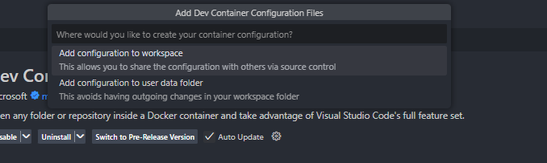

# Docker化

Pythonスクリプトを **Docker 上で動かしつつ、外部からフォルダパスと `-o` オプションを渡したい** ということですね。

典型的な実装手順を整理します。

---

## 1. Pythonスクリプト側の対応

まず、Python 側では `argparse` で `-o` やフォルダパスを受け取れるようにしておくと便利です。

```python
# app.py
import argparse
import os

def main():
    parser = argparse.ArgumentParser()
    parser.add_argument("input_dir", help="入力フォルダのパス")
    parser.add_argument("-o", "--output", required=True, help="出力先のフォルダパス")
    args = parser.parse_args()

    print(f"入力フォルダ: {args.input_dir}")
    print(f"出力フォルダ: {args.output}")

    # 例: 入力フォルダ内のファイルを出力フォルダへコピー
    os.makedirs(args.output, exist_ok=True)
    for f in os.listdir(args.input_dir):
        print(f"処理中: {f}")
        # 実際の処理を書く

if __name__ == "__main__":
    main()
```

---

## 2. Dockerfile の作成

Python を実行できるイメージをベースにして、スクリプトをコピーしておきます。

```dockerfile
FROM python:3.10-slim

WORKDIR /app

# スクリプトをコンテナにコピー
COPY app.py .

# 依存ライブラリがあれば requirements.txt を使う
# COPY requirements.txt .
# RUN pip install -r requirements.txt

ENTRYPOINT ["python", "app.py"]
```

---

## 3. 実行時にフォルダをマウント

Docker の外のフォルダを中に渡すために **bind mount** を使います。

例えば、ホストの `./data` をコンテナの `/input` に渡して、出力を `./out` に保存する場合:

```bash
docker build -t myapp .

docker run --rm \
    -v $(pwd)/data:/input \
    -v $(pwd)/out:/output \
    myapp /input -o /output
```

---

## 4. ポイント

* `ENTRYPOINT` を使うと、`docker run myapp ...` の後の引数が `app.py` に渡ります。
* `-v` オプションでホストのフォルダをコンテナにマウントすることで、外部のファイルをそのまま扱えます。
* 出力もマウント先に書き出すと、ホスト側にファイルが残ります。

---

👉 これで「外部フォルダを入力にして、`-o` で出力先を指定」できる Docker コンテナになります。

---

ご希望は **フォルダの入力・出力を両方とも外部パス指定可能にしたい** 形ですか？

# 外部フォルダ固定

入力フォルダだけを外部から指定して、出力は常に決まった場所（例: `/output`）に固定する形にしますね。

---

## 1. Python スクリプト

出力先は固定 `/output` にしてしまいます。

ユーザは `-o` を指定する必要がありません。

```python
# app.py
import argparse
import os

def main():
    parser = argparse.ArgumentParser()
    parser.add_argument("input_dir", help="入力フォルダのパス")
    args = parser.parse_args()

    output_dir = "/output"  # 固定
    os.makedirs(output_dir, exist_ok=True)

    print(f"入力フォルダ: {args.input_dir}")
    print(f"出力フォルダ: {output_dir}")

    # 処理例: 入力ファイル一覧を出力フォルダに記録
    files = os.listdir(args.input_dir)
    with open(os.path.join(output_dir, "files.txt"), "w") as f:
        for file in files:
            f.write(file + "\n")

if __name__ == "__main__":
    main()
```

---

## 2. Dockerfile

```dockerfile
FROM python:3.10-slim

WORKDIR /app
COPY app.py .

ENTRYPOINT ["python", "app.py"]
```

---

## 3. 実行方法

入力フォルダだけマウントすれば OK。出力は常に `/output` に固定してあるので、ここもホスト側とつなげばよいです。

```bash
docker build -t myapp .

docker run --rm \
    -v $(pwd)/data:/input \
    -v $(pwd)/out:/output \
    myapp /input
```

* `$(pwd)/data` … ホスト側の入力データ
* `$(pwd)/out` … ホスト側の出力先（固定）
* `/input` … コンテナ内での入力フォルダ
* `/output` … コンテナ内での出力フォルダ（固定）

---

これならユーザが毎回 `-o` を指定する必要がなくなり、常に決まった場所に出力されます。

---

❓質問ですが：

出力を固定する場合、ホスト側のフォルダも固定（例: `./out`）にしてしまってよいですか？

それとも `-v` のマウント先だけ変えて柔軟に使えるようにしたいですか？

# Dev Container



なるほど！

VS Code の **Dev Containers** を使い始めたときによく出るメッセージですね。

---

## 状況

「Add configuration to workspace」というメッセージは、**ワークスペースにまだ devcontainer の設定ファイルが存在しない**ために出ています。

Dev Containers 拡張機能は以下のような設定ファイルを必要とします：

* `.devcontainer/devcontainer.json`
* （必要なら）`.devcontainer/Dockerfile` または `docker-compose.yml`

これらが無いと「コンテナを開く」ための構成が分からないので、VS Code が「設定を追加してね」と促しています。

---

## 対応方法

### 方法 1: VS Code で自動生成する

1. コマンドパレットを開く（`Ctrl+Shift+P` / Mac: `Cmd+Shift+P`）。
2. **Dev Containers: Add Dev Container Configuration Files...** を選択。
3. 提案されるテンプレート（例: Ubuntu, Node.js, Python, etc.）から選ぶ。

   → `.devcontainer` フォルダが自動的に作成され、`devcontainer.json` が追加されます。

### 方法 2: 既存の Dockerfile や docker-compose を利用する

すでに Dockerfile や Compose があるなら：

1. コマンドパレット → **Dev Containers: Add Dev Container Configuration Files...**
2. **"From a Dockerfile"** または **"From docker-compose.yml"** を選択。

   → 既存ファイルを参照する形の `devcontainer.json` が生成されます。

### 方法 3: 手動で追加

自分で `.devcontainer/devcontainer.json` を作成して書く。

例（Python のシンプルなケース）：

```json
{
  "name": "Python Dev Container",
  "image": "mcr.microsoft.com/devcontainers/python:3.11",
  "features": {},
  "customizations": {
    "vscode": {
      "extensions": ["ms-python.python"]
    }
  }
}
```

---

## まとめ

* メッセージの意味：**「まだ devcontainer.json が無いので作ってください」**
* 対応：コマンドパレットから **"Add Dev Container Configuration Files"** を実行して作成すればOK。

---

👉 質問ですが、このケースは「既に自分で Dockerfile を持っていてそれを devcontainer として使いたい」のか、それとも「まずはテンプレートから始めて環境を作りたい」のか、どちらでしょうか？

それによって、具体的なおすすめ手順を変えられます。

了解です 👍

では「テンプレートから始めて devcontainer を作る」流れを整理しますね。

---

## 📌 手順（テンプレートから devcontainer を追加）

1. **コマンドパレットを開く**

   * Windows/Linux: `Ctrl+Shift+P`
   * macOS: `Cmd+Shift+P`
2. **検索して実行**

   * `Dev Containers: Add Dev Container Configuration Files...` を選択
3. **テンプレートを選ぶ**

   * 例えば：
     * `Ubuntu`（汎用 Linux 環境）
     * `Python`（開発用）
     * `Node.js`（Web系）
     * `C++` など

       → `.devcontainer/devcontainer.json` が自動生成されます。
4. **生成された設定を確認**

   プロジェクト直下に `.devcontainer/` フォルダができて、その中に以下が入ります：

   * `devcontainer.json`（必須）
   * Dockerfile（選んだテンプレートによっては含まれる）
5. **コンテナを開く**

   再度コマンドパレットで

   * `Dev Containers: Reopen in Container`

     を実行。

     → 自動でコンテナがビルドされ、VS Code がその中で開きます。

---

## ✅ 最初におすすめなテンプレート

* プログラミング言語を決めている → その言語のテンプレート
* とりあえず Linux 環境を試したい → `Ubuntu`
* Web 開発寄り → `Node.js`
* AI/機械学習系 → `Python`

---

💡つまり「Add configuration to workspace」と出たら、

👉 コマンドパレット → **Add Dev Container Configuration Files** を選んでテンプレートを追加

これで解決します。

---

質問ですが、あなたは最初に試したいのは **Ubuntu のような汎用環境** ですか？

それとも **Python/Node.js など特定言語の開発環境** を想定されていますか？


なるほど！

設定内容を見せていただきありがとうございます 🙏

内容としては、**Python 用の公式 Dev Container イメージ**を使おうとしているのですが、細かいところに問題がありそうです。

---

## 問題点

1. **`features` が二重定義になっている**

   今のファイルはこうなっています：

```json
"image": "mcr.microsoft.com/devcontainers/python:1-3.12-bookworm",
"features": {
    "ghcr.io/davzucky/devcontainers-features-wolfi/python:1": {}
}

// Features to add to the dev container...
// "features": {},
```

上の `"features": {...}` と下の `"// "features": {},` が重複定義になっています。

JSON はコメントも含めて厳密なので、実際には **パースに失敗する可能性**があります。

---

2. **イメージ名が存在するか要確認**

   指定されているのは：

   ```
   mcr.microsoft.com/devcontainers/python:1-3.12-bookworm
   ```

   ですが、タグ名は正しくないことが多いです。

   例えば公式の [devcontainers/python イメージ](https://mcr.microsoft.com/en-us/product/devcontainers/python/about) だと、一般的には：

   ```
   mcr.microsoft.com/devcontainers/python:3.12
   ```

   といったシンプルなタグ名です。

   → `1-3.12-bookworm` は存在しないかもしれません。

---

3. **feature の指定が特殊**

   `ghcr.io/davzucky/devcontainers-features-wolfi/python:1` を追加していますが、これは公式の `devcontainers/features` ではなく、個人レポジトリ由来っぽいです。

   まずはこれを外して、シンプルな構成で起動確認するのが良いです。

---

## 修正版の `devcontainer.json`

最小構成にしてみましょう：

```json
{
  "name": "Python 3",
  "image": "mcr.microsoft.com/devcontainers/python:3.12",
  "postCreateCommand": "pip install -r requirements.txt"
}
```

これでまず **起動するか確認**してください。

（`requirements.txt` がなければ、その行は削除してOK）

---

## 次のステップ

* これで動けば → `features` やカスタム設定を徐々に追加する
* まだエラーなら → `docker pull mcr.microsoft.com/devcontainers/python:3.12` をターミナルで実行して、イメージが取得できるか確認

---

👉 まずはこの「最小構成」で試してもらえますか？

それでコンテナが立ち上がるかどうか教えていただければ、次の調整に進めますよ。


了解しました ⚡

まだダメということは、`devcontainer.json` の内容だけでなく **環境側 (Windows / WSL / Docker / VS Code Remote Containers)** の設定に起因している可能性が高いです。

順を追って原因を切り分けていきましょう。

---

## ✅ 確認ポイント

### 1. Docker が動いているか？

Dev Containers は内部的に Docker を使います。

PowerShell またはコマンドプロンプトで以下を実行してください：

```powershell
docker version
```

* Client と Server の両方が表示される → OK
* Server に繋がらない → Docker Desktop が起動していない or インストールされていない

---

### 2. VS Code が WSL とどう繋がっているか？

エラーメッセージに：

```
--mount type=bind,source=\\wsl.localhost\Ubuntu\...
```

とありました。

つまり **Windows 側の VS Code から WSL の Ubuntu を使おうとしている**状態です。

ここで問題が起こりやすいです。

👉 おすすめのやり方は：

* Windows ではなく、**WSL 側で VS Code を起動**することです。

  Ubuntu ターミナルで以下を実行してください：

```bash
code .
```

これで **WSL 内の VS Code サーバ**が立ち上がり、Dev Containers との相性が良くなります。

---

### 3. 最小 devcontainer.json を再確認

先ほどのシンプル版を使ってください：

```json
{
  "name": "Python 3",
  "image": "mcr.microsoft.com/devcontainers/python:3.12"
}
```

---

### 4. それでも失敗する場合

* `Dev Containers: Open Folder in Container` を選ぶ → そのときのログ全文を確認する
* エラーメッセージの中に
  * `docker: not found`
  * `Cannot connect to the Docker daemon`
  * `invalid reference format`

    などがないか確認

---

## まとめ

「まだダメ」な場合、次に確認すべきは：

1. **`docker version` が正常か**
2. **WSL 内から `code .` で起動しているか**
3. **シンプルな devcontainer.json を使っているか**

---

👉 まず `docker version` の結果を見せてもらえますか？

そこから Docker が原因か、VS Code 側の設定かを切り分けましょう。
