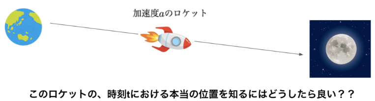

# カルマンフィルタ

## 概念

あるシステムの状態を逐次的（オンライン）に推定する方法で、現実のシステムでの**ノイズ**を考慮して、統計的・確率的に確からしい値を算出する方法

利用においては以下の条件がある。

* そのシステムは何かしらの方法によって**モデリング**されている必要がある
* システムの**状態を適宜観測**できる必要がある


## モデリング

カルマンフィルタを利用する際、事前に対象のシステムを数式で表現できている必要がある。

こんな感じの数式表現のことをモデリングと呼ぶ。

モデリングには種類がある。


| # | 種類                                             | 説明                                                                 |
| - | ------------------------------------------------ | -------------------------------------------------------------------- |
| 1 | 第一原理モデリング（ホワイトボックスモデリング） | 運動方程式等。例えば質量など数式上のパラメータも既知                 |
| 2 | システム同定（ブラックボックスモデリング）       | 内部構造など正確には不明だが、実際の入出力結果からモデリングする方法 |
| 3 | グレーボックスモデリング                         | 上記２つの中間                                                       |

## ユースケース
ノイズを含む観測値から真の状態を出来るだけ正確に推測したい場面で用いられる。

### 1. ロボット・自動運転分野
主な用途：位置・姿勢（自己位置推定）やセンサ統合

例1：GPSとIMUの統合

GPSは「位置」は分かるが更新が遅く、IMU（加速度・角速度センサ）は「動き」は速く分かるがドリフト（誤差蓄積）がある。

カルマンフィルタはこの2つを統合して、「安定した位置と速度」をリアルタイムに推定します。
→ → 自動運転・ドローン・移動ロボットで必須。

例2：SLAM（自己位置推定と地図作成）

拡張カルマンフィルタ（EKF-SLAM）として、ロボットの位置と周囲の地図（ランドマーク）を同時に推定します。

### 2. 航空宇宙分野
主な用途：軌道・姿勢制御

航空機や宇宙機の「位置」「速度」「姿勢（姿勢角）」を推定する。

ノイズの多いレーダーやジャイロ、加速度計のデータを統合して、正確な軌道を推定。
→ GPS航法システム、ミサイル誘導、人工衛星姿勢制御などに利用。

### 3. 信号処理・センサデータ解析
主な用途：ノイズ除去・平滑化

生体信号（心拍・脳波・血圧など）のノイズを低減して「真の波形」を推定。

加速度センサやジャイロなどのノイズを除去して「滑らかな値」を得る。

オーディオ・通信信号の「時系列ノイズ除去」にも応用される。

### 4. 機械学習・AI分野
主な用途：オンライン学習・動的システムのパラメータ推定

動的ベイズネット（Dynamic Bayesian Network）や隠れマルコフモデル（HMM）の連続値版として利用。

ニューラルネットの学習過程を「ノイズ付き状態推定」として表現する手法もある（例：EKF学習）。

### 実例

地球から月に向かって無人ロケットを打ち上げた場合。
着陸にはロケットの位置を正確に知る必要がある。
もしロケットが月に着陸しようとすると、月との距離を正確に算出しなくてはならない。

カルマンフィルタは、移動する物体の正確な位置を知るための手法。





ロケットが一定の加速度 $a$で、初速 $v_0$ 、初期位置 $x_0$ で月に向かう
予測法1: 数式で予測する

$$
x = \frac{1}{2} a t^2 + v_0 t + x_0
$$

問題点：加速度 $a$ を予測することは難しい。
→ずれていく

予測法2: センサによりロケットの位置を把握する

問題点：センサには誤差がある。真値については知ることが出来ない。誤差があるため、正確な位置を知ることはできない。

カルマンフィルタは上記の方法を組み合わせて、より正確なロケットの位置を知る方法。

考え方：2つの値がどちらも微妙に本物の値からずれているのであれば、その平均ととったら、少なくとも片方を使うだけよりも、本当の値になるんじゃないか？

$$
x_{\text{kalman}} = \frac{x_t + y_t}{2}
$$

事前推定値 … 運動方程式によって計算された物理量
観測値 … センサーによって測定さえた値
事後推定値 … カルマンフィルタのよって計算された、事前推定値と観測値の平均
(正確には平均ではありませんが、この解説は続いて行います)

## 数学的説明

カルマンフィルタ（Kalman Filter）の**数学的な仕組み**を、数式ベースでわかりやすく説明します。

カルマンフィルタは、「ノイズを含む観測から、システムの真の状態を最適に推定する」ための**最小二乗推定アルゴリズム**です。

線形ガウスシステムにおける**最適推定器（最小分散推定）**です。

## 🧩 1. モデル（状態空間モデル）

カルマンフィルタは、次のような**状態方程式（State Equation）**と**観測方程式（Observation Equation）**を前提とします。

```math
x_k = A x_{k-1} + B u_k + w_{k-1}
```

```math
k = H x_k + v_k
```

ここで：

| 記号                                                           | 意味                                                                                |
| -------------------------------------------------------------- | ----------------------------------------------------------------------------------- |
| ( x_k )                                                        | 時刻 ( k ) の**状態ベクトル** （例：位置・速度など）                          |
| ( u_k )                                                        | 入力（制御量）                                                                      |
| ( z_k )                                                        | 観測ベクトル（センサの測定値）                                                      |
| ( A )                                                          | 状態遷移行列（システムの時間発展を表す）                                            |
| ( B )                                                          | 入力行列                                                                            |
| ( H )                                                          | 観測行列（状態→観測への写像）                                                      |
| ( w_k )                                                        | プロセスノイズ（システム誤差）                                                      |
| ( v_k )                                                        | 観測ノイズ                                                                          |
| ( w_k \sim \mathcal{N}(0, Q) ), ( v_k \sim \mathcal{N}(0, R) ) | それぞれのノイズは**平均0のガウス分布**で、共分散行列 ( Q, R ) が与えられる。 |

---

## 🔢 2. カルマンフィルタの2つのステップ

カルマンフィルタは時刻ごとに2段階の処理を行います：

1. **予測ステップ（Predict）**
2. **更新ステップ（Update / Correct）**

### (1) 予測ステップ (Prediction)

前時刻 ( k-1 ) の推定値 ( \hat{x} *{k-1|k-1} ) と誤差共分散 ( P* {k-1|k-1} ) を使って、時刻 ( k ) の予測を行います。

```math
\begin{align}

\text{状態予測:} &\quad \hat{x} *{k|k-1} = A \hat{x}* {k-1|k-1} + B u_k \\

\text{共分散予測:} &\quad P_{k|k-1} = A P_{k-1|k-1} A^T + Q

\end{align}
```


### (2) 更新ステップ (Update)

観測値 ( z_k ) が得られたら、それを用いて推定値を修正します。

#### カルマンゲイン（重み）の計算：

$$
K_k = P_{k|k-1} H^T (H P_{k|k-1} H^T + R)^{-1}
$$

#### 状態の更新：

$$
\hat{x} *{k|k} = \hat{x}* {k|k-1} + K_k (z_k - H \hat{x} *{k|k-1})
$$

ここで

$$
(z_k - H \hat{x}* {k|k-1})
$$

は「観測値と予測値の差（=イノベーション）」です。

#### 共分散の更新：

$$
P_{k|k} = (I - K_k H) P_{k|k-1}
$$


## 📉 3. 直感的な意味

| ステップ                         | 直感的な意味                                                                                                                                             |
| -------------------------------- | -------------------------------------------------------------------------------------------------------------------------------------------------------- |
| **予測 (Predict)**         | モデルに基づいて次の状態を予測する（「こう動くはず」）                                                                                                   |
| **更新 (Update)**          | センサーで得た観測値と照らし合わせて修正する（「実際はこうだった」）                                                                                     |
| **カルマンゲイン ( K_k )** | モデルの予測と観測値のどちらをどれくらい信頼するかを決める重み。観測ノイズ (R) が小さいほど観測を重視し、プロセスノイズ (Q) が大きいほど予測を重視する。 |

---

## 📘 4. まとめ（全ステップを一行で）

時刻ごとの計算は以下のようにまとめられます：

[

\boxed{

\begin{aligned}

\text{(1) 予測:} \quad &\hat{x} *{k|k-1} = A \hat{x}* {k-1|k-1} + B u_k \

&P_{k|k-1} = A P_{k-1|k-1} A^T + Q \

\text{(2) 更新:} \quad &K_k = P_{k|k-1} H^T (H P_{k|k-1} H^T + R)^{-1} \

&\hat{x} *{k|k} = \hat{x}* {k|k-1} + K_k (z_k - H \hat{x} *{k|k-1}) \

&P* {k|k} = (I - K_k H) P_{k|k-1}

\end{aligned}

}

]


## 🧮 5. 応用例

* 自動運転車の位置推定（GPS + IMU 統合）
* ロボットの姿勢推定
* 経済・株価予測
* 信号処理（ノイズ除去）


## ⚙️ 6. もし非線形の場合は？

状態方程式・観測方程式が線形でない場合：

* **拡張カルマンフィルタ（EKF）**

  → 非線形関数を1次近似してカルマンフィルタを適用。
* **無香料カルマンフィルタ（UKF, Unscented KF）**

  → シグマ点サンプリングでより高精度に非線形性を扱う。


## 線形ガウシアン

カルマンフィルタの理解にも欠かせない「**線形ガウシアン（linear Gaussian）**」という概念を、数学と直感の両方から説明します。


### ✅ 1. 「線形ガウシアン」とは？

#### 一言でいうと：

> **システムの状態遷移と観測が線形で、すべてのノイズがガウス分布（正規分布）に従う**モデルのことです。

つまり、

* システムの時間発展が「線形方程式」で書けて
* その中に含まれる誤差（ノイズ）が「平均0・分散既知の正規分布」
  である場合を「線形ガウシアンモデル」と呼びます。


### 🧮 2. 数式で表すと

#### 状態方程式（State equation）

[
x_k = A x_{k-1} + B u_k + w_{k-1}
]

### 観測方程式（Observation equation）

[
z_k = H x_k + v_k
]

ここで：

* ( A, B, H ) は**線形行列**（状態や入力に線形に作用）
* ( w_k \sim \mathcal{N}(0, Q) )：**プロセスノイズ**（平均0、共分散 (Q) の正規分布）
* ( v_k \sim \mathcal{N}(0, R) )：**観測ノイズ**（平均0、共分散 (R) の正規分布）


### 🎯 3. 「線形」と「ガウシアン」が意味すること

| 要素                  | 意味              | 例                                      |
| ------------------- | --------------- | -------------------------------------- |
| **線形（Linear）**      | 状態や観測が「一次式」で表せる | (x_k = A x_{k-1} + B u_k + w_k)        |
| **ガウシアン（Gaussian）** | ノイズ（誤差）が正規分布に従う | (w_k \sim N(0, Q)), (v_k \sim N(0, R)) |


### 📊 4. 線形ガウシアンの重要な性質

> 線形変換を施しても、ガウス分布の形は変わらない（再びガウス分布になる）。

#### つまり：

もし ( x \sim \mathcal{N}(\mu, \Sigma) ) なら、
[
y = A x + b
]
もまた
[
y \sim \mathcal{N}(A\mu + b, A\Sigma A^T)
]
になります。

この性質のおかげで、

* 予測（線形変換）
* 更新（ガウス分布の条件付き推定）

のどちらも「ガウス分布のまま」扱える。
→ **カルマンフィルタが解析的に最適解を持つ理由**がここにあります。


### 💡 5. 直感的なイメージ

たとえば、車の位置を推定したいとき：

* 車の位置 (x_k) は「前の位置＋速度×時間＋少しの誤差」で決まる（線形）
* その「誤差」は、ランダムだけど平均0で小さな揺らぎ（ガウス分布）
* センサーで観測した値 (z_k) は「真の位置＋観測ノイズ」（これもガウス）

このような「予測も観測も、線形方程式＋ガウスノイズ」で記述できる世界が、**線形ガウシアンシステム**です。


### 🧠 6. 線形ガウシアンであることのメリット

| 項目             | 説明                            |
| -------------- | ----------------------------- |
| ✅ 数学的に解析解が存在する | すべてガウスなので、最尤推定が閉形式（数式で）で求められる |
| ✅ 計算が高速        | 積分・最大化などが簡単で、行列演算で完結する        |
| ✅ 最小分散推定として最適  | 他の手法よりも誤差が最小（最適推定）になることが証明できる |


### ⚙️ 7. 線形でない or ガウシアンでない場合

| 状況            | 対応する手法                                    |
| ------------- | ----------------------------------------- |
| **非線形**       | 拡張カルマンフィルタ（EKF）や無香料カルマンフィルタ（UKF）          |
| **非ガウシアンノイズ** | 粒子フィルタ（Particle Filter）など確率分布をサンプリングで扱う手法 |


### 🧩 まとめ

> 「線形ガウシアン」とは、
> 状態や観測が**線形方程式**で表され、
> ノイズが**ガウス分布**に従うシステムのこと。

この条件の下では、
カルマンフィルタが**最適な状態推定器**（最小分散推定）になります。


