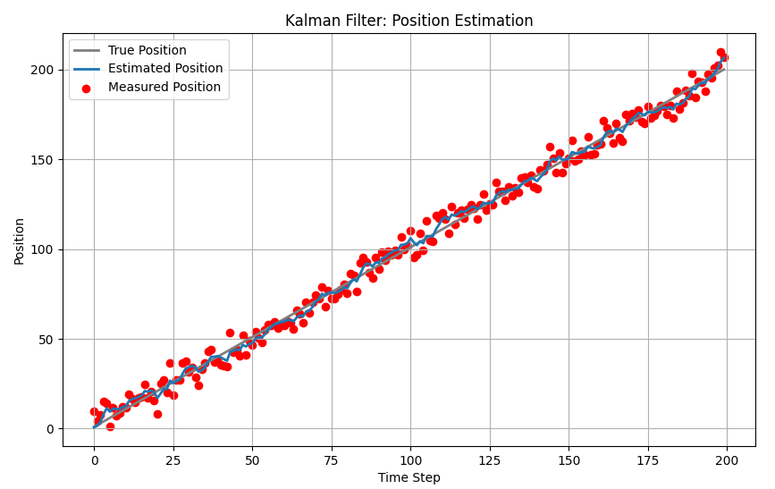

カルマンフィルタにおける問題設定** **

カルマンフィルタは、次の線形な状態方程式と観測方程式で表現できる状態空間モデルにおいて、得られる観測値から状態 x̂t|tx hat sub t vertical line t end-sub

 を推定する問題です。** **

カルマンフィルタリング問題の状態遷移式** **

$$
x_t = F_t x_t + G_t w_t \\
y_t = H_t x_t + v_t
$$

具体的には、実際の状態を $x_t$

 としたとき、$E[(||x_t - x̂_{t|t}||)2|Y_{1∶t}]$

 を最小化するような $x̂$

 を求める問題です。この問題がカルマンフィルタリング問題であり、それを解決するアルゴリズムがカルマンフィルタです。** **

ここで、(1)式に登場する $w_t$ と $v_t$ はそれぞれ状態ノイズ、観測ノイズであり、それぞれ平均0、分散共分散が Qtcap Q sub t

、Rtcap R sub t

 のノイズです。

$$
w_t \sim N(0, Q_t) \\
v_t \sim N(0, R_t)
$$

いい質問です — ではあなたが示した式群（予測→更新の5式）を **線形ガウス系の仮定から厳密に導出**していきます。
導出は「事前分布（予測）と尤度（観測）を掛け合わせて事後分布を求める（ベイズ則）」「ガウス分布の指数部を完成の平方で整理する」という標準的なやり方を使います。行列・確率表記に慣れている方向けに、できるだけ簡潔に示します。

---

## 前提（モデルと記法）

時刻 (t) に対して状態空間モデルを次で与える。
[
\begin{aligned}
x_t &= F_t x_{t-1} + G_t w_{t-1} \qquad ( \text{状態遷移} )
y_t &= H_t x_t + v_t \qquad\qquad\ \ ( \text{観測} )
\end{aligned}
]
ノイズは独立なガウス：
[
w_{t-1}\sim\mathcal{N}(0,Q_t),\qquad v_t\sim\mathcal{N}(0,R_t).
]

記法：

* 事前（予測）平均： (\hat x_{t|t-1})（あなたの本文の (X_t^-)）
* 事後（更新）平均： (\hat x_{t|t})（あなたの本文の (X_t)）
* 事前共分散： (P_{t|t-1})（(P_t^-)）
* 事後共分散： (P_{t|t})（(P_t)）

初期時刻 (t-1) では既に (\hat x_{t-1|t-1},,P_{t-1|t-1}) が与えられているとする。

---

## 1) 事前（予測）ステップの導出（平均と共分散）

状態方程式の一次変換とノイズの線形和により、
条件付き分布 (p(x_t\mid Y_{1:t-1})) はガウスで、その平均と共分散は線形変換則に従う：

**平均の予測**：
[
\hat x_{t|t-1} = \mathbb{E}[x_t \mid Y_{1:t-1}]
= \mathbb{E}[F_t x_{t-1} + G_t w_{t-1} \mid Y_{1:t-1}]
= F_t \hat x_{t-1|t-1}.
]
（(\mathbb{E}[w_{t-1}]=0) を使用）

**共分散の予測**：
[
\begin{aligned}
P_{t|t-1} &= \mathrm{Cov}(x_t - \hat x_{t|t-1}) 
&= \mathrm{Cov}(F_t(x_{t-1}-\hat x_{t-1|t-1}) + G_t w_{t-1}) 
&= F_t P_{t-1|t-1} F_t^\top + G_t Q_t G_t^\top.
\end{aligned}
]
（((x_{t-1}-\hat x_{t-1|t-1})) と (w_{t-1}) は独立で共分散が 0 になる）

これで予測式（あなたの(1),(2)）が得られます。

## 2) 観測尤度と事後分布（ベイズ更新） — 完成の平方による導出

観測モデルにより、観測 (y_t) の条件付尤度は
[
p(y_t \mid x_t) \propto \exp!\Big(-\tfrac{1}{2}(y_t - H_t x_t)^\top R_t^{-1} (y_t - H_t x_t)\Big).
]

事前分布（予測分布）は
[
p(x_t\mid Y_{1:t-1}) \propto \exp!\Big(-\tfrac{1}{2}(x_t-\hat x_{t|t-1})^\top P_{t|t-1}^{-1} (x_t-\hat x_{t|t-1})\Big).
]

事後はベイズ則で比例的に尤度×事前：
[
p(x_t\mid Y_{1:t}) \propto p(y_t\mid x_t), p(x_t\mid Y_{1:t-1}).
]
指数部を合わせて整理（完成の平方）すると、事後もガウスになり、平均と共分散は次の形になります。

### カルマンゲイン (K_t) の導出（閉形式）

事後平均 (\hat x_{t|t}) を求めるには、対数事後を (x_t) で最適化（最大化）すれば良い。対数事後（省略定数）：
[
-\tfrac{1}{2}\big[(x_t-\hat x_{t|t-1})^\top P_{t|t-1}^{-1} (x_t-\hat x_{t|t-1})

* (y_t - H_t x_t)^\top R_t^{-1} (y_t - H_t x_t)\big].
  ]
  これを (x_t) で微分してゼロにすると、
  [
  P_{t|t-1}^{-1} (\hat x_{t|t} - \hat x_{t|t-1}) + H_t^\top R_t^{-1} (H_t \hat x_{t|t} - y_t) = 0.
  ]
  整理すると線形方程式：
  [
  \big(P_{t|t-1}^{-1} + H_t^\top R_t^{-1} H_t\big) \hat x_{t|t}
  = P_{t|t-1}^{-1}\hat x_{t|t-1} + H_t^\top R_t^{-1} y_t.
  ]
  両辺に ((P_{t|t-1}^{-1} + H^\top R^{-1} H)^{-1}) を掛ければ (\hat x_{t|t}) が得られるが、これをカルマンゲインで書き換えると標準形が現れます。代数的に操作して得られる式が：

**カルマンゲイン**：
[
K_t = P_{t|t-1} H_t^\top (H_t P_{t|t-1} H_t^\top + R_t)^{-1}.
]

**事後平均（更新）**：
[
\hat x_{t|t} = \hat x_{t|t-1} + K_t (y_t - H_t \hat x_{t|t-1}).
]
ここで (y_t - H_t \hat x_{t|t-1}) は **イノベーション（予測残差）** です。

（上の (K_t) は上式を代入して得られる代数同値です — いくつかの教科書は「事後平均を最小分散にする (K_t) を導く」ことで同じ式に到達します。）

---

## 3) 事後共分散の導出（更新）

事後共分散は、事後分布の分散（逆行列）を完成の平方から読み取るか、更新式に代入して導出します。標準形は：

**簡潔形**（よく使われる）
[
P_{t|t} = (I - K_t H_t) P_{t|t-1}.
]
ただしこの形は数値誤差で正定値性が失われることがあるため、安定化版（Joseph 形式）として次を使うことも多い：

**Joseph 形式（数値安定）**：
[
P_{t|t} = (I - K_t H_t) P_{t|t-1} (I - K_t H_t)^\top + K_t R_t K_t^\top.
]
Joseph 形式は事後共分散が常に対称正定値になることを明示的に保つ点で有利です。両式は理論上等価になります（数値丸めを除く）。

---

## まとめ：カルマンフィルタの完全アルゴリズム（時刻 (t) の反復）

1. **予測（平均）**
   [
   \hat x_{t|t-1} = F_t \hat x_{t-1|t-1}
   ]
2. **予測（共分散）**
   [
   P_{t|t-1} = F_t P_{t-1|t-1} F_t^\top + G_t Q_t G_t^\top
   ]
3. **カルマンゲイン**
   [
   K_t = P_{t|t-1} H_t^\top (H_t P_{t|t-1} H_t^\top + R_t)^{-1}
   ]
4. **更新（平均）**
   [
   \hat x_{t|t} = \hat x_{t|t-1} + K_t (y_t - H_t \hat x_{t|t-1})
   ]
5. **更新（共分散）**
   [
   P_{t|t} = (I - K_t H_t) P_{t|t-1}
   ]
   （必要なら Joseph 形式を用いる）

以上を時刻ごとに繰り返せば、逐次的に最適（最小分散）推定が得られます。

---

## 補足：なぜこの (K_t) が「最適」か（直感）

カルマンゲイン (K_t) は「事前予測（モデル）と観測のどちらをどれだけ信用するか」のウェイトです。式を見ると：

* (P_{t|t-1})（事前不確かさ）が大きければ、(K_t) は大きくなり観測をより重視する。
* (R_t)（観測ノイズ）が大きければ、分母が大きくなり (K_t) は小さくなり観測をあまり信用しない。

数学的には、上で示した (\hat x_{t|t}) は「事後分布の平均 = 最小二乗（最小分散）推定値」であり、ガウス仮定下では最尤・最小分散の最適性が保証されます。

