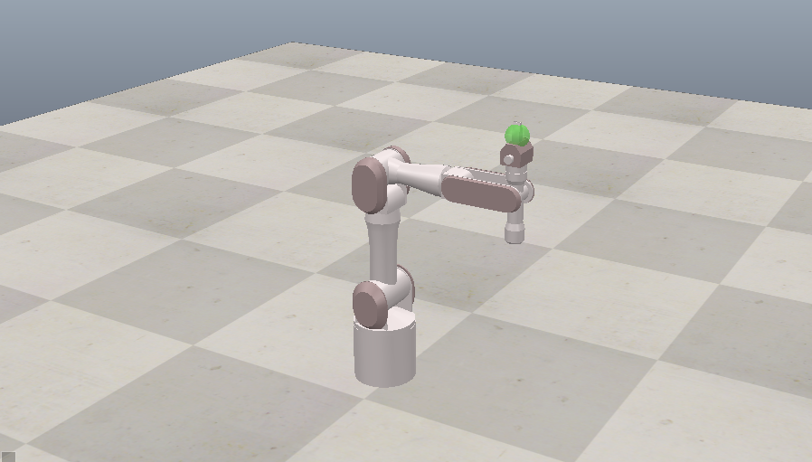

CoppeliaSim（コッペリアシム）は、**ロボットシミュレーション用の統合環境ソフト**です。

以前は  **V-REP** （Virtual Robot Experimentation Platform）として知られていました。以下の特徴があります。

---

## 🟢 1. 基本概要

* **用途** ：ロボットの設計・制御・シミュレーション
* **対象** ：産業用ロボット、移動ロボット、マニピュレーター、ドローンなど
* **提供形態** ：Windows / macOS / Linux 対応

---

## 🟢 2. 特徴

1. **物理シミュレーション**
   * Rigid body dynamics（剛体物理）に対応
   * Bullet、ODE、Vortex、Newtonなど複数の物理エンジンを選択可能
   * 重力・摩擦・衝突などリアルな挙動を再現
2. **多様なロボットモデル**
   * モデルライブラリに多関節ロボット、移動ロボット、センサ類が豊富
   * ユーザーが独自モデルをインポートすることも可能（URDF/OBJ/STLなど）
3. **スクリプト制御**
   * 組み込みの **Luaスクリプト** でロボットを制御
   * Python、C/C++、JavaなどのAPI経由で外部からも制御可能
4. **シミュレーションと制御の統合**
   * センサデータ（距離センサ、カメラ、IMUなど）をリアルタイムで取得
   * モータやアクチュエータに指令を送ってロボットを動かす
   * ROS（Robot Operating System）との連携も可能
5. **可視化**
   * 3Dでロボットや環境の動きを可視化
   * アニメーション、カメラ視点、グラフ表示も対応

---

## 🟢 3. 主な用途

* ロボット制御アルゴリズムの検証
* 移動経路計画やセンサデータ処理のテスト
* マニピュレーターのモーションシミュレーション
* 教育や研究でのロボット挙動の理解

---

## 🟢 4. 利点

* **実機不要で安全にテストできる**
* コードを書きながら物理挙動を確認可能
* 複数ロボットを同時にシミュレーションできる
* Pythonなど他言語と連携して高度な制御も可能

---

💡 まとめると

CoppeliaSim は **ロボットを仮想空間で「動かして試せる」シミュレーション統合環境** であり、

物理挙動の再現、センサ・アクチュエータ制御、外部プログラム連携などができる強力なツールです。

---

もし希望であれば、私が **CoppeliaSimでできる簡単なロボット制御シミュレーション例** を Python 連携コード付きで紹介することもできます。

作ってほしいですか？
