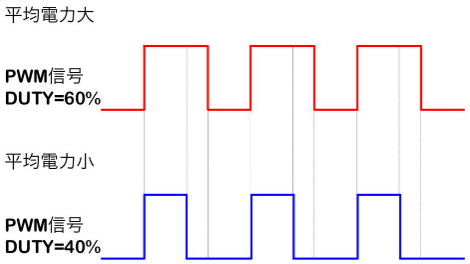
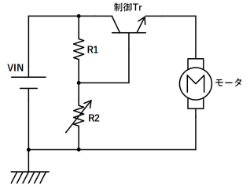
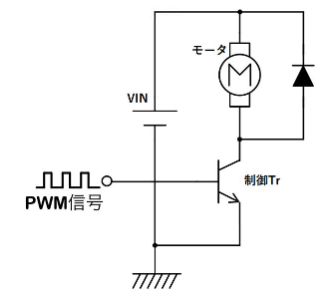
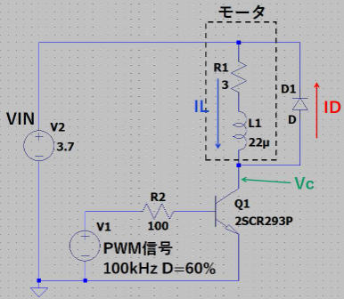
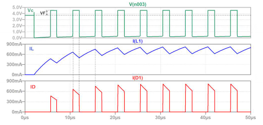
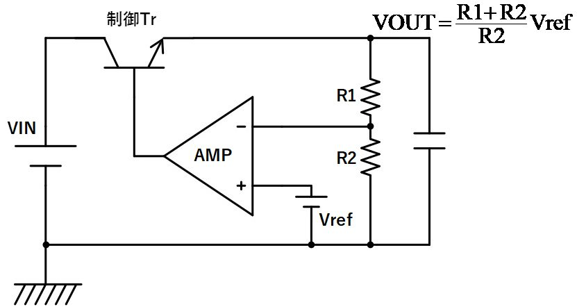
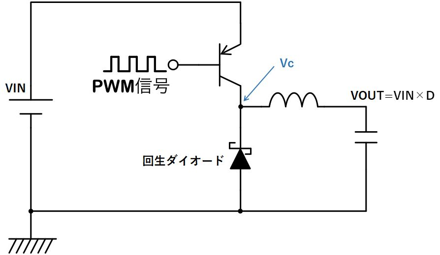
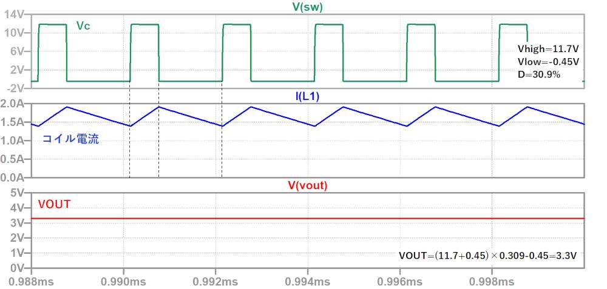

# PWM
PWM(Pulse Width Modulation)とは、半導体を使った電力を制御する方式の１つです。
オンとオフの繰り返しスイッチングを行い、出力される電力を制御する。

一定電圧の入力から、パルス列のオンとオフの一定周期を作り、オンの時間幅を変化させる電力制御方式をPWMと呼びます。

早い周期でスイッチングを行うことで、オンのパルス幅に比例した任意の電圧が得られる。
半導体がオンとオフ状態が最も損失が少ない(中間状態は損失多い)ことを利用した電力制御方式です。

## PWM制御
PWM制御とは、高速スイッチングによりパルス波形を生成し、パルスのHi時間を変化させることで、出力される平均電力を制御する方式です。
Pulse Width Modulationの略。

### 用途
モータ制御、LEDの兆候、スイッチングレギュレータ

PWMは、優れた制御性と、高効率が特長で、インバーター回路で広く使われている技術です。
ブラシ付きDCモーターの回転制御にも使われています。
インバーター回路にて、PWM制御のオンの時間幅(デューティー)を周期的に変化させることにより、モーター駆動に最適な正弦波の交流電圧を作ることができます。

## PWM制御の基本原理

PWM制御は、方形波の周波数を固定し、電圧がHiの時間の割合を変えることで負荷にかかる電力を制御します。
方形波の一周期のうちのHiになっている時間の割合をDUTY（デューティ）と呼びます。

例えば、100kHz(周期が10us)の方形波で、Hiの期間が6usなら、DUTY比:Dは、

D = 6us / 10us = 60%

となります。
DUTY比を制御していることから、DUTY制御と呼ばれることもあります。

PWM信号を用いて、具体的にどのような制御をしているのか、実際のアプリケーションを３つ挙げて説明していきます。

## 従来課題
はじめに基本となるリニア制御（DC制御）について説明します。
リニア制御はモータを制御するための最も基本的な方式で、モータに印加する電圧を変えることで回転数を変化させます。
リニア制御は、下図のような回路です。
可変抵抗の値を変えることでモータにかかる電圧を変えることができます。
回路は単純ですが、モータに印加する電圧を低くするほどトランジスタのCE間電圧が広がるため、発生する損失、発熱が大きくなってしまうという問題があります。

## 解決技術
モータにかかる電圧は一定で、PWM信号でモータの下端のスイッチ（トランジスタ）のオン・オフを切り替えます。
制御用トランジスタはフルオンかフルオフしている状態で使うため、リニア制御に比べると損失がかなり小さくできます。
モータのインダクタンスを22uH、端子間抵抗を3Ω、印加電圧:VIN=3.7Vの条件でシミュレーションをしてみましょう。

モータに流れる電流波形は以下のようになります。

トランジスタのオン時にモータの電流が増加し、オフ時に電流が減少します。
オン・オフの比で釣り合ったところで平均電流が一定になります。
したがって、DUTYを大きくすると平均電流が増え、DUTYを小さくすると平均電流が減少します。

これにより、電圧が一定のままでも回転数を制御することができるのです。

モータと並列に接続されているダイオードは、スイッチがオフの期間のコイル電流を回生させる役割があります。

モータは誘導性負荷（コイル）なので、スイッチがオフになっても電流を流し続けようとします。
ダイオードがなければ、Hi-Zとなっているところに電流を無理やり流すため、トランジスタのコレクタ電圧が急激に上昇（大きな逆起電力が発生）し、トランジスタを破壊してしまいます。

ダイオードを設けることで、コレクタ電圧がVIN + VF まで上昇すると、ダイオードがオンして電流が回生するため逆起電力がクランプされてトランジスタを保護することができます。

## レギュレータとしての用途
電圧レギュレータにもリニア制御のものとPWM制御のものがあります。
前者の代表的なものがシリーズレギュレータ、後者がスイッチングレギュレータです。
シリーズレギュレータは、電圧制御用トランジスタが電力を熱として消費することで入力電圧より低い電圧を生成します。

対してスイッチングレギュレータは、PWM信号で生成した方形波をLCフィルタで平均化することで直流電圧を生成します。

動作波形は下記のようになります。

出力電圧は入力電圧とDUTYによって決まります。
スイッチングトランジスタはフルオン状態で使うため損失が少なく、90%以上の変換効率を達成することも可能です。

## 電圧レギュレータ

電圧レギュレータ（Voltage Regulator）とは、**入力される電圧が変動しても、出力電圧を一定に保つための電子回路や装置**のことです。

### 主な役割
- 電源電圧が不安定な場合でも、**安定した電圧を電子機器や回路に供給**することができる。
- コンピュータ、家電、自動車など、さまざまな電子機器に使われている。

### 種類
1. **リニアレギュレータ（線形レギュレータ）**
   - 入力電圧と出力電圧の差を熱として消費して安定化する。
   - 構造が簡単だが、効率は低め。

2. **スイッチングレギュレータ**
   - トランジスタを高速でON/OFFし、コイルやコンデンサを使って電圧を制御する。
   - 効率が高く、発熱が少ない。

### 例
- スマートフォンの充電回路
- パソコンのマザーボード上の電源IC
- ACアダプタや電源装置

### まとめ
電圧レギュレータは、**安定した電圧供給を実現するための重要な部品**です。

