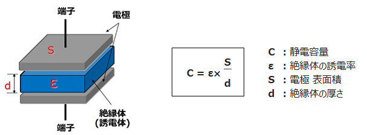
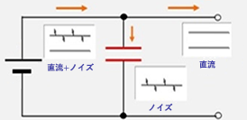
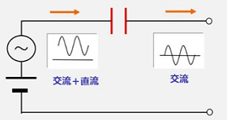
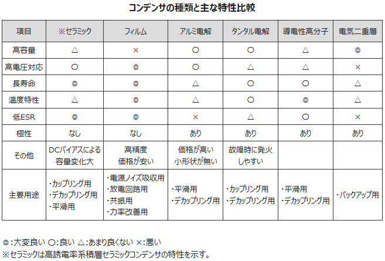
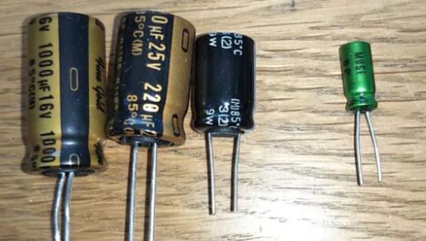
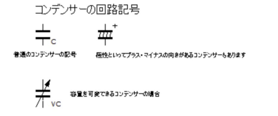

## 1. コンデンサとは？基本知識とその役割

コンデンサは電気エネルギーを一時的に蓄えて放出することで、回路の安定化やノイズ除去、エネルギー蓄積など多彩な役割を果たします。このセクションでは、コンデンサの基本的な仕組みとその重要性について解説します。

## 2. 基本原理

コンデンサは、電気エネルギーを蓄え短時間で放出する電子部品で、充放電を繰り返せます。

コンデンサは、絶縁体（誘電体）を挟んだ金属板（電極）で構成され、蓄えられる電荷の量を静電容量という。

静電容量Cは、絶縁体の誘電率ε、電極の表面積S、絶縁体の厚さで決まります。

### 2-1. 充電と放電のプロセス

コンデンサは、外部電圧を印加すると電荷を蓄積し（充電）、負荷が接続されると放電して電流を供給します。

この特性を活かして瞬間的な電圧変動を補正したり、リプルを平滑化したりするほか、大電流を瞬時に放電できる点を利用してカメラのストロボや緊急時のバックアップ電源としても使用されます。

放電回路では、コンデンサに蓄えた電荷を放電させることで接続されている負荷を動作させます。回路例として、スイッチを電源側に接続するとコンデンサが充電され、電源電圧にまで電荷が蓄積すると充電は停止します。その後、スイッチを負荷（電球）側に接続するとコンデンサは放電を開始し、電球が点灯します。

### 2-2. 直流・交流回路でのコンデンサの挙動の違い

コンデンサは直流を通さず、交流は周波数が高いほど通しやすい特性を持ちます。

#### デカップリング

デカップリング回路は、この特性を利用して信号の結合を分離する回路で、名称の通り「切り離す（デカップリング）」ことを目的としています。

例. 基本の直流に高周波ノイズが含まれている場合、コンデンサを入れることで高周波ノイズ成分のみをコンデンサが通過させ、以降にノイズが伝わらないようにします。

### カップリング

カップリング回路では、直流成分を遮断して交流成分のみを通過させるため、オーディオ増幅回路などでDCオフセットの影響を排除する役割を果たします。

## 3.用途

主な用途は以下。

電圧変動の抑制

ノイズ除去

電力供給の安定化

### 3.1 種類

コンデンサには以下のような種類がある。

#### 誘電体にセラミック（磁器）を使ったコンデンサー

セミコン。小容量のため、カップリング、デカップリング向け。

#### ケミカル

大容量コンデンサの代表。電源の平滑コンデンサ。パスコン。

## 4.回路記号

回路記号は以下のいづれか。

接続形態

---

# ✅ 1. カップリングコンデンサ（Coupling Capacitor）

### 📌 目的

* **直流成分を遮断し、交流成分だけを通す**
* 回路ブロック間で信号をやり取りする際に使う

### 📌 使い方

* アンプ回路の入力や出力に直列に入れる
* DCオフセットを取り除き、純粋に信号（AC成分）だけを次の段に渡す

### 📌 応用例

* オーディオアンプの入力／出力段
* RF回路の段間結合

👉 **信号を“カップリング（つなぐ）”ためのコンデンサ**

---

# ✅ 2. バイパスコンデンサ（Bypass Capacitor）

### 📌 目的

* **信号成分（主にAC成分）をグランドに逃がす**
* 特定の周波数帯だけを短絡（バイパス）して、回路の安定性を高める

### 📌 使い方

* トランジスタのエミッタ抵抗に並列接続して交流信号だけをGNDに流す
* 電源回路で高周波ノイズをグランドへ逃がす

### 📌 応用例

* アンプ回路のゲイン調整（ACゲインだけ大きくする）
* 高周波ノイズのバイパス

👉 **不要な成分を“バイパス”するコンデンサ**

---

# ✅ 3. デカップリングコンデンサ（Decoupling Capacitor）

### 📌 目的

* **電源の変動やノイズを抑え、ICや回路に安定した電源を供給する**
* 電源ラインのインピーダンスを下げて、瞬間的な電流変動を吸収する

### 📌 使い方

* ICやマイコンの  **Vcc と GND の直近に配置** （できるだけ近く！）
* 0.1µF（セラミック）＋10µF（電解）を組み合わせて広帯域の安定化

### 📌 応用例

* マイコン、FPGA、オペアンプなど高速デジタル回路の電源安定化
* 電源のリップル・ノイズ除去

👉 **電源ラインの“カップリング（結合）”を断ち切る → デカップリング**

---

# ✅ まとめ表

| 種類                     | 接続位置                  | 主な目的                   | 応用例                           |
| ------------------------ | ------------------------- | -------------------------- | -------------------------------- |
| **カップリング**   | 信号経路に直列            | DCを遮断しACだけ伝える     | アンプの段間結合                 |
| **バイパス**       | 信号ラインに並列（GNDへ） | AC成分を逃がす             | アンプのエミッタ抵抗、ノイズ除去 |
| **デカップリング** | 電源ライン（ICの近く）    | 電源の変動・ノイズを抑える | マイコンやオペアンプの電源安定化 |

---

🧠 ポイント

* **カップリング** → 信号伝達用
* **バイパス** → 信号成分を逃がす
* **デカップリング** → 電源安定化

---

👉 実際の基板では「0.1µFセラミックコンデンサを各ICの電源ピン近くに必ず配置」なんてルールがあるのですが、そこも解説しますか？
