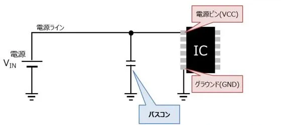
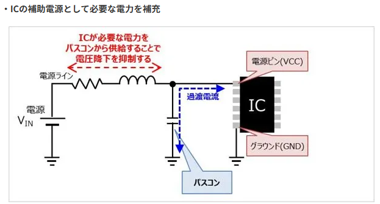
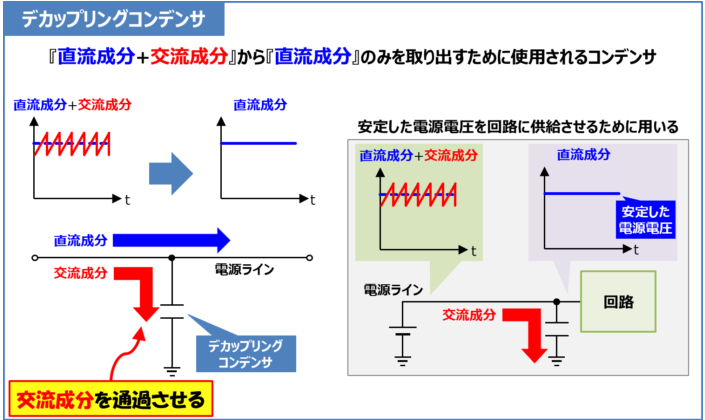

## 1. コンデンサとは？基本知識とその役割

コンデンサは電気エネルギーを一時的に蓄えて放出することで、回路の安定化やノイズ除去、エネルギー蓄積など多彩な役割を果たします。このセクションでは、コンデンサの基本的な仕組みとその重要性について解説します。

## 2. 基本原理

コンデンサは、電気エネルギーを蓄え短時間で放出する電子部品で、充放電を繰り返せます。

コンデンサは、絶縁体（誘電体）を挟んだ金属板（電極）で構成され、蓄えられる電荷の量を静電容量という。

静電容量Cは、絶縁体の誘電率ε、電極の表面積S、絶縁体の厚さで決まります。

構造は以下のように向かい合う2枚の電極の間に誘電体を挟んだ構造をしています。

コンデンサは **電荷（電子）を「電極板の表面」に蓄える素子** です。

* コンデンサは **2枚の導体板（電極板）** と **その間の絶縁体（誘電体）** からできています。
* 電極板の一方に電源から電子が流れ込むと、もう一方の電極板から電子が押し出されます。
* その結果：
  * 一方の電極板に **マイナスの電荷（電子過剰）**
  * もう一方に **プラスの電荷（電子不足）**が生じます。

### ✅ エネルギーの形

コンデンサが蓄えるのは「電荷」そのものというより、

**電極間にできる電界にエネルギーを貯蔵** しています。

エネルギーの式は：

$$
W = \frac{1}{2} C V^2
$$

**C**：容量（F）

**V**：電圧（V）

### 2-1. 充電と放電のプロセス

コンデンサは、外部電圧を印加すると電荷を蓄積し（充電）、負荷が接続されると放電して電流を供給します。

この特性を活かして瞬間的な電圧変動を補正したり、リプルを平滑化したりするほか、大電流を瞬時に放電できる点を利用してカメラのストロボや緊急時のバックアップ電源としても使用されます。

放電回路では、コンデンサに蓄えた電荷を放電させることで接続されている負荷を動作させます。回路例として、スイッチを電源側に接続するとコンデンサが充電され、電源電圧にまで電荷が蓄積すると充電は停止します。その後、スイッチを負荷（電球）側に接続するとコンデンサは放電を開始し、電球が点灯します。

### 2-2. 直流・交流回路でのコンデンサの挙動の違い

コンデンサは直流を通さず、交流は周波数が高いほど通しやすい特性を持ちます。

#### デカップリング

デカップリング回路は、この特性を利用して信号の結合を分離する回路で、名称の通り「切り離す（デカップリング）」ことを目的としています。

例. 基本の直流に高周波ノイズが含まれている場合、コンデンサを入れることで高周波ノイズ成分のみをコンデンサが通過させ、以降にノイズが伝わらないようにします。

### カップリング

カップリング回路では、直流成分を遮断して交流成分のみを通過させるため、オーディオ増幅回路などでDCオフセットの影響を排除する役割を果たします。

## 3.用途

主な用途は以下。

電圧変動の抑制

ノイズ除去

電力供給の安定化

### 3.1 種類

コンデンサには以下のような種類がある。

#### 誘電体にセラミック（磁器）を使ったコンデンサー

セミコン。小容量のため、カップリング、デカップリング向け。

#### ケミカル

大容量コンデンサの代表。電源の平滑コンデンサ。パスコン。

## 4.回路記号

回路記号は以下のいづれか。

### ✅ 1. カップリングコンデンサ（Coupling Capacitor）

### 📌 目的

* **直流成分を遮断し、交流成分だけを通す**
* 回路ブロック間で信号をやり取りする際に使う

### 📌 使い方

* アンプ回路の入力や出力に直列に入れる
* DCオフセットを取り除き、純粋に信号（AC成分）だけを次の段に渡す

### 📌 応用例

* オーディオアンプの入力／出力段
* RF回路の段間結合

👉 **信号を“カップリング（つなぐ）”ためのコンデンサ**

> 直流電圧が重畳された状態で交流信号を送り込むと、2段目の増幅回路に影響を及ぼすことがあります
>
> →直流成分を取り除くために、カップリングを設置。

---

### ✅ 2. バイパスコンデンサ（Bypass Capacitor）

### 📌 目的

* **信号成分（主にAC成分）をグランドに逃がす**
* 特定の周波数帯だけを短絡（バイパス）して、回路の安定性を高める

### 📌 使い方

* トランジスタのエミッタ抵抗に並列接続して交流信号だけをGNDに流す
* 電源回路で高周波ノイズをグランドへ逃がす

### 📌 応用例

* アンプ回路のゲイン調整（ACゲインだけ大きくする）
* 高周波ノイズのバイパス

👉 **不要な成分を“バイパス”するコンデンサ**

> パスコンと略されます。
>
> ノイズをグランドへバイパスすることで安定した電源供給を実現するためのコンデンサ。
>
> 高周波ノイズの除去、電源電圧の安定化、ICへの追加電力供給を目的とする。

こんな用途にもなる。

### 異なる容量のコンデンサを複数付ける場合は、電源ピン側から容量が小さい順に配置する

複数のバイパスコンデンサを配線する場合は、静電容量が小さい部品を電源ピンの近くに配線しましょう。例えば、電源ピン ← 0.01μF ← 0.1μF ← 1μF といった具合に、電源ピンに近い側は容量が小さくなるように並べて配置します。この順番を間違うと、高周波ノイズを取り除きにくくなります。

なお、静電容量が大きいコンデンサはICの電源ピンから離れても距離の影響が小さいので問題ありません。

### ノイズの周波数も考慮して静電容量を決める

バイパスコンデンサの容量は用途によって異なり、高周波ノイズ対策を目的とする場合は数100pF～0.01μF程度、電源電圧の安定化を目的とする場合は数10μF〜数100μFの容量が使われると解説しました。

しかし、コンデンサの容量の大きさでインピーダンスの周波数特性も変わるので、ノイズの周波数も考慮することが大切です。

高周波ノイズ対策では数100pF～0.01μF程度の小容量のほうが、インピーダンスが低くなるので効果的です。低周波ノイズの場合は、10μF以上の大容量でないと、ノイズを吸収できません。

除去するノイズの周波数帯が幅広い場合は、静電容量が異なるコンデンサを用意し、組み合わせて使いましょう。

---

### ✅ 3. デカップリングコンデンサ（Decoupling Capacitor）

### 📌 目的

* **電源の変動やノイズを抑え、ICや回路に安定した電源を供給する**
* 電源ラインのインピーダンスを下げて、瞬間的な電流変動を吸収する

### 📌 使い方

* ICやマイコンの  **Vcc と GND の直近に配置** （できるだけ近く！）
* 0.1µF（セラミック）＋10µF（電解）を組み合わせて広帯域の安定化

### 📌 応用例

* マイコン、FPGA、オペアンプなど高速デジタル回路の電源安定化
* 電源のリップル・ノイズ除去

👉 **電源ラインの“カップリング（結合）”を断ち切る → デカップリング**

> 電源の変動やノイズを抑えて、ICや回路に安定した電源を供給する。
>
> ラインのインピーダンスを低下させて、習慣的な電流変動を吸収する。
>
> ほしいのは直流電流。やり方は電源とグランドをコンデンサで接続する。
>
> ## 回路に供給される電源電圧にノイズ等の交流成分が重畳すると、電圧変動を引き起こし、回路の動作が不安定になる可能性があります。
>
> →高周波数のノイズをデカップリングコンデンサで取り除く

---

## ✅ まとめ表

| 種類                     | 接続位置                  | 主な目的                   | 応用例                           |
| ------------------------ | ------------------------- | -------------------------- | -------------------------------- |
| **カップリング**   | 信号経路に直列            | DCを遮断しACだけ伝える     | アンプの段間結合                 |
| **バイパス**       | 信号ラインに並列（GNDへ） | AC成分を逃がす             | アンプのエミッタ抵抗、ノイズ除去 |
| **デカップリング** | 電源ライン（ICの近く）    | 電源の変動・ノイズを抑える | マイコンやオペアンプの電源安定化 |

---

🧠 ポイント

* **カップリング** → 信号伝達用
* **バイパス** → 信号成分を逃がす
* **デカップリング** → 電源安定化

---

👉 実際の基板では「0.1µFセラミックコンデンサを各ICの電源ピン近くに必ず配置」なんてルールがあるのですが、そこも解説しますか？

# コンデンサのインピーダンス

「なぜコンデンサのインピーダンスが 1jωC\dfrac{1}{j \omega C} になるのか？」を順を追って説明します。

---

# ✅ 1. コンデンサの基本式

コンデンサの関係式は

i(t)=Cdv(t)dti(t) = C \frac{dv(t)}{dt}
です。

👉 「コンデンサに流れる電流 ii は、電圧の時間変化 dv/dtdv/dt に比例する」

---

# ✅ 2. 正弦波入力を考える

交流（正弦波）を入力する場合、

v(t)=V0ejωtv(t) = V_0 e^{j\omega t}
と表せます（フェーザ表示）。

これを時間微分すると：

dv(t)dt=jωV0ejωt\frac = j\omega V_0 e^
----------------------------------------

# ✅ 3. 電流と電圧の比を取る

電流は

i(t)=C⋅dv(t)dt=jωC⋅V0ejωti(t) = C \cdot \frac{dv(t)}{dt}
     = j\omega C \cdot V_0 e^{j\omega t}
となります。

ここでインピーダンスの定義は

Z=VIZ = \frac{V}{I}
なので、

ZC=V0ejωtjωCV0ejωt=1jωCZ_C = \frac}}
    = \frac
-----------

# ✅ 4. 物理的な意味

* ω=2πf\omega = 2\pi f が大きくなる（高周波）と → ZCZ_C が小さくなる → **高周波は通しやすい**
* ω\omega が小さくなる（低周波）と → ZCZ_C が大きくなる → **低周波は通しにくい**
* jj（虚数単位）は「電圧と電流の位相が 90° ずれている」ことを表す

👉 コンデンサは **高周波ショート・低周波オープン** の性質を持つ

---

# ✅ まとめ

* コンデンサは i=Cdvdti = C \frac{dv}{dt} からスタート
* 正弦波入力（フェーザ表示）で微分すると jωj\omega が出てくる
* インピーダンスを計算すると

  ZC=1jωCZ_C = \frac{1}{j \omega C}
* 意味としては「高周波は通しやすい、低周波は通しにくい」＋「電圧より電流が90°進む」
