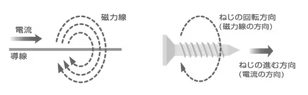
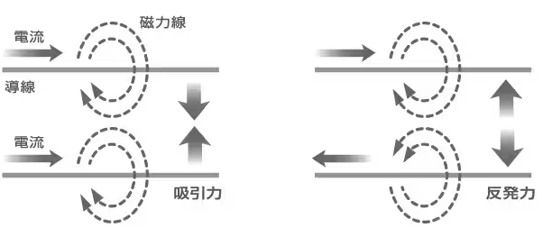
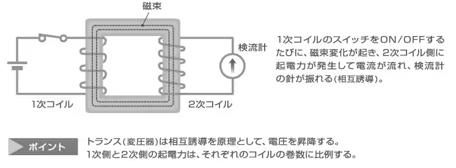
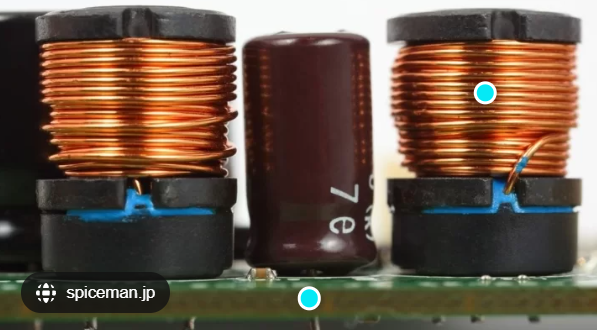

## インダクタンス

電流は磁界をつくり、周囲に磁気作用を及ぼします。

1820年、エルステッドによって発見された「電流の磁気作用」です。

これにより、電流が同方向に流れる平行導線は互いに吸引しあい、電流が逆方向に流れる平行導線は互いに反発しあいます。

この力の大きさを測定するため、アンペールは導線を枠状(角型)にして吊るした装置を製作しました。

さらに、アンペールは導線を円筒状に巻いたコイルをつくり、これをソレノイドと呼びました。これがアンテナコイルなどに用いられるソレノイドコイルのルーツです。電流の流れるソレノイドコイルは磁石と同じ性質を示すことも、このころ発見されました。

## 電磁気の発生

磁力線の方向は「右ねじの法則」で決まります。すなわち、右ねじの進む方向と回転方向は、それぞれ電流方向と磁力線の方向となります。

平行導線に流れる電流が同方向の場合、導線の間には吸引力が作用し、逆方向の場合は反発力が作用します。

## 自己誘導とコイルのインダクタンス

電流が磁力線を生む電流の磁気作用とは逆に、磁束変化が起電力を発生するという「電磁誘導(electromagnetic induction)」現象が、1831年、ファラデーによって発見されました。

たとえば、環状の鉄心に2つのコイルを巻き、1次側のコイルに電池をつないでスイッチをON/OFFすると、2次側のコイルに起電力(誘導起電力)が発生して電流(誘導電流)が流れます。

この電磁誘導現象を相互誘導といいます。

## インダクタンスの大きさ

インダクタンスは通常「L」で表記され、コイルに電流が流れ変化する際に誘導される起電力（電圧）の大きさと関係しています。その値は、以下の物理的なパラメータに依存します。インダクタンスは巻数が多いほど、断面積が広いほど、またコアの透過率が高いほど大きくなります。

* **巻数（N）** :
  コイルの巻数が増えると、インダクタンスは増加します。巻数が多いほど、コイルは強い磁場を作り、その変化に対して抵抗する力が高くなるためです。
* **コイルの長さ（l）** :
  長いコイルほど磁場の変化に対する感度が低くなるため、コイルが長いほどインダクタンスは小さくなります。
* **コアの材質（μ）** :
  磁性体の透過率（μ）が高いほどインダクタンスは増加します。従って、鉄のような透過率の高い材料を使用すると、インダクタンスは大きくなります。
* **コイルの断面積（A）** :
  断面積が広いほどインダクタンスは増加します。断面積が広いと磁束密度が大きくなるためです。

## 応用例

電流の変化に反発する特性を持ち、回路の安定性を高める。

電流の急激なん変化を抑える働きがあるため、スイッチング回路やフィルタ回路で重要な役割を果たす。

インダクタンス（コイル）は「電流の変化に抵抗する性質」を持っていて、エネルギーを磁界に蓄えたり、フィルタリングや変換に利用されます。

---

# ✅ インダクタンスの主な用途と応用例

## 1. **フィルタ回路**

* **用途** ：高周波成分を除去したり、周波数ごとに信号を分ける
* **具体例** ：
* 電源回路のノイズ除去（DC電源に入れるチョークコイル）
* オーディオのクロスオーバーネットワーク（低音用・高音用の分離）
* 無線通信のチューナー回路（特定周波数を選択）

> iωLとして経路で高周波を流しづらくする効果として機能する。
>
> インダクタ L₁ [H] と L₂ [H] を直列接続した回路において、電流 i [A] が流れるとき：
>
> - インダクタ L₁ にかかる電圧：
>
>   $$
>   v_1 = L_1 \frac{di}{dt} \tag{4}
>   $$
> - インダクタ L₂ にかかる電圧：
>
>   $$
>   v_2 = L_2 \frac{di}{dt} \tag{5}
>   $$
> - 電源電圧は各インダクタの電圧の和：
>
>   $$
>   v = v_1 + v_2 \tag{6}
>   $$
> - 合成インダクタンス L [H] に対する電圧：
>
>   $$
>   v = L \frac{di}{dt} \tag{7}
>   $$
>
> (4)、(5)、(7)式を(6)式に代入すると：
>
> $$
> v = L_1 \frac{di}{dt} + L_2 \frac{di}{dt} = (L_1 + L_2) \frac{di}{dt}
> $$
>
> よって、合成インダクタンス L は：
>
> $$
> L = L_1 + L_2 \tag{8}
> $$

---

## 2. **スイッチング電源（DC-DCコンバータ）**

* **用途** ：電圧変換の際にエネルギーを一時的に蓄える
* **具体例** ：
* スマホやPCの電源
* バッテリー駆動のLEDライト（昇圧回路）
* ソーラーパネルのMPPT制御

👉 インダクタに電流を流す → 磁界にエネルギーを蓄える

👉 スイッチを切ると、そのエネルギーが放出されて負荷やコンデンサに移る

---

## 3. **トランス（変圧器）の基本要素**

2つのインダクタの相互インダクタンスを利用。交流電圧を昇圧・降圧したり、回路を絶縁できる。

* **用途** ：交流電圧の昇圧・降圧、絶縁、インピーダンス変換
* **具体例** ：
* 家庭用電源アダプタ
* 送電の昇圧／配電の降圧
* オーディオアンプの出力段

👉 実際にはコイル2つ（一次側・二次側）の相互インダクタンスを利用している

> 相互インダクタンス→２つのコイルが近接している場合に一方のコイルの電流変化が他方のコイルに誘導起電力を生じさせる現象

---

## 4. **モータやソレノイド**

インダクタに電流を通すと磁界が発生し、力に変換できる。

* **用途** ：電磁力の発生源
* **具体例** ：
* DCモータ・ステッピングモータのコイル
* ソレノイド（電磁石で直線運動を作る）
* 電磁リレーの駆動コイル

---

## 5. **エネルギー蓄積素子**

* **用途** ：一時的に電力をためる
* **具体例** ：
* ハイブリッド車やEVの回生ブレーキ回路
* インバータ回路でのエネルギー再利用

---

## 6. **通信・信号処理**

* **用途** ：周波数特性を利用して信号を加工
* **具体例** ：
* ラジオの同調回路（LC共振回路）
* RFIDタグ（コイル共振で通信）
* ワイヤレス充電（磁界結合による電力伝送）

---

# ✅ まとめ

インダクタンス（コイル）は主に：

1. **フィルタ** （ノイズ除去・周波数選択）
2. **電源回路** （エネルギー蓄積と電圧変換）
3. **変圧器・トランス** （交流の電圧変換・絶縁）
4. **モータ・リレー** （電磁力の利用）
5. **通信・信号処理** （共振・ワイヤレス給電）

---

## LC回路

---

# ✅ LC回路の基本

* **インダクタ（L）** ：電流の変化に抵抗、磁界にエネルギーを蓄える
* **コンデンサ（C）** ：電圧の変化に抵抗、電界にエネルギーを蓄える

この2つを組み合わせると、電気エネルギーが **磁界（L）⇔電界（C）** の間で行き来し、

**共振現象（特定の周波数で強く反応）** が起こります。

共振周波数は：

f0=12πLCf_0 = \frac}
---------------------

# ✅ LC回路の応用例

## 1. **同調回路（ラジオ・無線受信機）**

* LC共振回路を使って、特定の周波数の信号だけを取り出す
* 例：AMラジオの選局（アンテナで受けた信号から目的の周波数だけ増幅）

📌  **直列共振回路** ：共振周波数でインピーダンスが最小 → その周波数だけ電流が流れやすい

📌  **並列共振回路** ：共振周波数でインピーダンスが最大 → その周波数だけ電流が流れにくい

---

## 2. **フィルタ回路**

インダクタは高周波を通しにくく、低周波を通しやすい特性を持つ。

コンデンサと組み合わせてローパスフィルタ、ハイパスフィルタ、バンドパスフィルタを構成する。

### ローパスフィルタ（低域通過）

* LとCを組み合わせて、低周波だけ通し高周波を遮断
* 例：オーディオアンプで高周波ノイズ除去

### ハイパスフィルタ（高域通過）

* 高周波だけ通す
* 例：スピーカのツイーター用フィルタ

### バンドパスフィルタ

* 特定の周波数帯だけ通す
* 例：無線通信のチャンネル選択、無線LAN/スマホ回路

### バンドストップフィルタ

* 特定の周波数だけ遮断
* 例：ノッチフィルタ（ハムノイズ 50/60Hz 除去）

---

## 3. **発振回路（LC発振器）**

* LC共振を利用して特定周波数の交流を作り出す
* 例：無線送信機のキャリア信号生成、クロック発振器

---

## 4. **ワイヤレス電力伝送**

* 送信側と受信側にLC共振回路を用意し、同じ共振周波数に合わせると効率的に電力伝送できる
* 例：スマホのワイヤレス充電、ICカードの非接触給電（RFID, NFC）

---

# ✅ まとめ表

| 応用例                 | 回路タイプ   | 説明                     |
| ---------------------- | ------------ | ------------------------ |
| ラジオ選局             | LC共振回路   | 目的の周波数だけ選び出す |
| ローパスフィルタ       | LとCの組合せ | 低周波だけ通す           |
| ハイパスフィルタ       | LとCの組合せ | 高周波だけ通す           |
| バンドパスフィルタ     | LC共振       | 特定の周波数帯だけ通す   |
| バンドストップフィルタ | LC共振       | 特定の周波数帯だけ遮断   |
| 発振器                 | LC共振回路   | 自励発振で信号を作る     |
| ワイヤレス給電         | LC共振       | 磁界共振でエネルギー伝送 |

---

🧠 まとめると：

LC回路は **「特定周波数に強く反応する性質」** を利用して、

* 信号の選別（同調・フィルタ）
* 信号生成（発振器）
* エネルギー伝送（共振給電）

  に広く応用されています。

---

👉 ご希望なら、**簡単な回路図（直列LC・並列LCのイメージ）** を図解にしてみましょうか？
