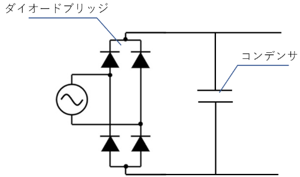
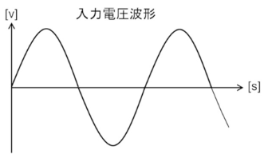
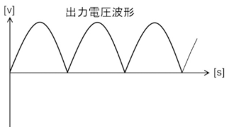
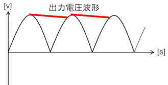
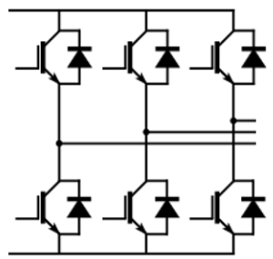
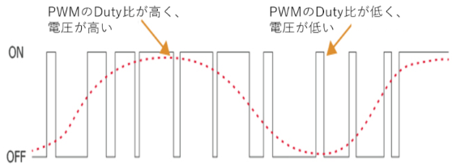

## ロボットを動作させる基礎項目

### コンバータ

コンバータの役割は、**AC電源をDC電源に変える事**です。

コンバータ回路で使われる、メインの回路は**ダイオードブリッジ回路**です。

産業ロボットの回路を作る為には、低電圧指令を満足するよう設計する必要がありますので、細かい事を言うと、このコンバータには、安全設計する為の多くの仕組みを入れる必要がありますが、本記事では、ダイオードブリッジだけに触れたいと思います。

ダイオードブリッジを含む、コンバータの回路は、下記のような回路です。左の電源は工業電源ですので、日本だと200Vである場合が多いです。

入力電源

ダイオードブリッジ

**ダイオードブリッジの後、コンデンサで平滑化され、波形は下記赤線のような波形に変化。**

こうして入力AC電源より、DC電源をつくることが出来た。

この時の電圧は、入力が交流200Vだとすると、200V×√2≒280V程度のDC電源となる。

### インバータの役割

インバータの役割は、DC電源から、**モータを駆動させる、PWM波形を生成する**事です

PWM方式により、矩形波のパルス電圧を出力し、モータのインダクタンスにより、電流は正弦波となります。インバータの回路は単純に下記の図のようになります。

このトランジスタスイッチがオンオフをし、ＰＷＭ制御をする事で、モータを駆動する波形を作ります。

イメージは下の図の通りであり、PWM制御のDuty比を変え、Duty比が高い時は電圧が高く、Duty比が低い時は電圧が低くなり、交流を作ります、そしてその回路が３つついている事で、３相モータを駆動し、ロボットを動かします。

このDutyのコントロールは、コントローラで行っており、どのようにモータを駆動させるべきかを計算し、インバータ内のトランジスタ（IGBT等）を動かします。
