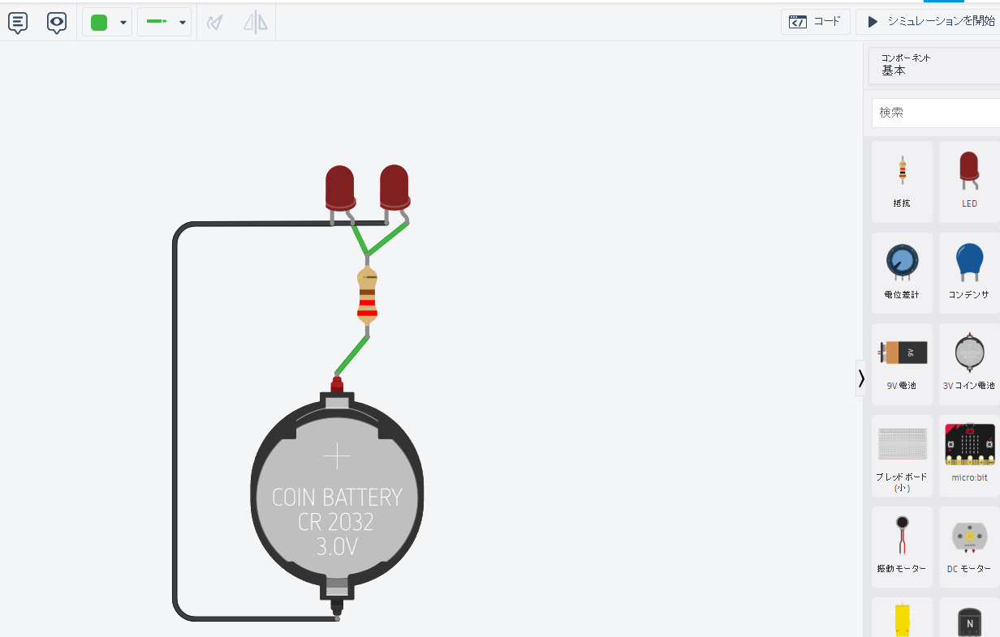

ロボットを動作させる電気（≒電気電子工学）の学習を進めるには、目的に応じて段階的に理解すべき内容があります。以下に「基礎から応用まで」の学習項目をまとめます。

---

## 🔌【1. 基礎編】ロボットを動かす土台を理解する

### ◎ 電気の基本（直流・交流）

* **電圧・電流・抵抗の関係（オームの法則）**
* **電力とエネルギー（P=IV）**
* **直流（DC）と交流（AC）の違い**

### ◎ 回路の基本構成

* **直列・並列回路**
* **基本的な電子部品** （抵抗、コンデンサ、ダイオード、LED、トランジスタ）

---

## 🔧【2. 実用編】制御と動力を理解する

### ◎ センサとアクチュエータ

* **センサの電気的特性** （アナログ or デジタル）
* **サーボモータ・DCモータ・ステッピングモータ**
* **モータドライバ（Hブリッジ回路など）**

### ◎ 電源と保護回路

* **電源回路（バッテリー、電源IC、レギュレータ）**
* **ヒューズ、リレー、保護ダイオード**

---

## 🧠【3. 制御編】ロボットを意図通りに動かす

### ◎ マイコンと信号処理

* **マイコン（Arduino, Raspberry Piなど）とGPIOの使い方**
* **PWM制御、ADC（アナログ→デジタル変換）**
* **通信（I2C, SPI, UART）**

### ◎ 制御理論の初歩

* **フィードバック制御（PID制御の基本）**
* **センサからのデータでの制御ロジック**

---

## 🔌【4. 発展編】複雑なロボットの電気系設計へ

### ◎ 回路設計・基板開発

* **回路図の読解と設計**
* **プリント基板（PCB）設計ソフトの使用（KiCadなど）**

### ◎ 電磁ノイズとEMC対策

* **ノイズ源とシールド対策**
* **グランド設計、デカップリング**

---

## 🧭 学習の進め方例

| 段階   | 学習内容                 | 実践例                            |
| ------ | ------------------------ | --------------------------------- |
| Step 1 | オームの法則とLED点灯    | ブレッドボードでLED回路を作る     |
| Step 2 | モータとスイッチング制御 | Arduinoでモータを正転・逆転させる |
| Step 3 | センサ制御とPWM          | 距離センサでサーボの角度制御      |
| Step 4 | 電源・ノイズ対策         | モータ駆動用に昇圧回路を使う      |
| Step 5 | フィードバック制御       | PID制御でライントレース           |

---

## 📚 おすすめ教材

* 書籍：「トコトンやさしい電気の本」「電子回路の基本と仕組み」
* Web教材：N予備校、EDX、YouTube（電子工作やArduino解説）
* ハンズオン：Arduino、mbed、Raspberry Piを用いた実験キット

---

ご希望があれば、ロボットの種類（例：二輪ロボット、ドローン、アームロボットなど）に応じて重点学習項目をピックアップします。


WEB上でPWM制御（Pulse Width Modulation：パルス幅変調）を勉強するには、以下のようなステップで進めると効率的です。無料で学べる教材やツールも豊富です。

---

## ✅ ステップ別：PWM制御をWebで学ぶ方法

---

### 【ステップ1】PWMの基本を理解する

#### ▶ PWMの基礎とは？

* デジタル信号（ON/OFF）を「疑似アナログ信号」として扱う方法
* モータの回転数調整、LEDの明るさ調整などに使う

#### ▶ 無料教材（基礎理解）

* 🔗 [EDN Japan – PWMの基本](https://ednjapan.com/edn/articles/1804/20/news020.html)
* 🔗 [Arduino日本語リファレンス - analogWrite()](https://garretlab.web.fc2.com/arduino/analogWrite/)
* 🔗 YouTube検索：「PWMとは」「PWM explained」

  ┗ *例: [PWMとは？（日本語解説）](https://www.youtube.com/watch?v=RZ-WnaWVUuM)*

---

### 【ステップ2】実際にPWMを使ってみる

#### ▶ シミュレーターを使って手を動かす

##### ① Arduino Webシミュレーター（ブラウザだけで使える）

* 🔗 [Wokwi Arduino Simulator](https://wokwi.com/)
  * LEDのPWM制御やモータ制御を体験可能
  * コード例: `analogWrite(ledPin, 128);` など

##### ② Tinkercad Circuits（回路シミュレーター）

* 🔗 [Tinkercad Circuits](https://www.tinkercad.com/circuits)
  * Arduinoと回路の両方を視覚的に構築可能
  * PWMでLEDの明るさを変える回路が簡単に作れる

---

### 【ステップ3】コードで学ぶ（Arduino編）

```cpp
int ledPin = 9;  // PWM出力ができるピン

void setup() {
  pinMode(ledPin, OUTPUT);
}

void loop() {
  for (int brightness = 0; brightness <= 255; brightness++) {
    analogWrite(ledPin, brightness);  // 明るさを変える
    delay(10);
  }
  for (int brightness = 255; brightness >= 0; brightness--) {
    analogWrite(ledPin, brightness);
    delay(10);
  }
}
```

👆これをWokwiでそのまま実行できます。

---

### 【ステップ4】応用例で理解を深める

* サーボモータの角度制御（`Servo.h`ライブラリ使用）
* DCモータの速度制御
* RGB LEDの色調整（3つのPWM出力）

---

## 🔁 まとめ：おすすめ学習ルート

1. **PWMの理論** → YouTube & サイトで概念理解
2. **シミュレーター** → WokwiやTinkercadでLED制御を体験
3. **コード学習** → Arduinoで `analogWrite()`練習
4. **応用課題** → モータやサーボの制御に挑戦

---

ご希望があれば、「LEDを滑らかに光らせるコード」や「Wokwi上のサンプルプロジェクトURL」も提供できます！必要ですか？



