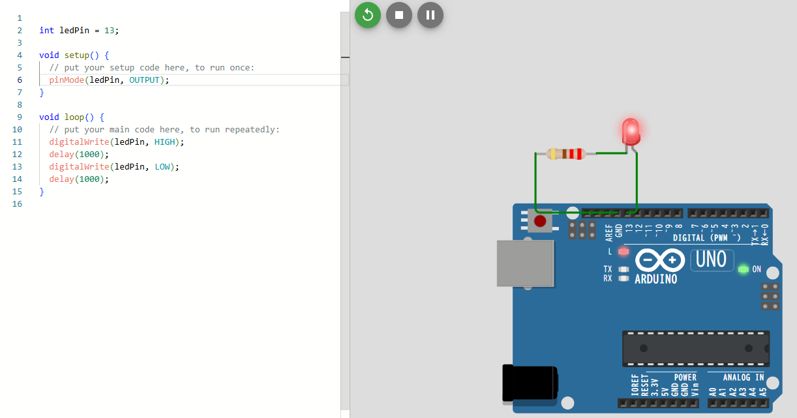

## 目的

wokwiを使ってArduino simulatorを使ったデモを行う。

[Wokwi - Online ESP32, STM32, Arduino Simulator](https://wokwi.com/projects/440121954176851969)

Arduinoを使ってLEDを点滅（点灯・消灯の繰り返し）させるのは「Arduino入門」の王道です。

---

# ✅ 必要なもの

* Arduino本体（Uno, Nano など）
* LED 1個
* 抵抗（220Ω〜1kΩ程度）1本
* ジャンパーワイヤー
* ブレッドボード（あれば便利）

---

# ✅ 配線手順

1. **LEDのアノード（長い足）** → Arduinoの **デジタルピン 13**
2. **LEDのカソード（短い足）** → **抵抗（220Ω）** → Arduinoの **GND**

   （抵抗はLEDを守るために必須です）

👉 Arduino Unoならピン13はオンボードLEDもついているので、外付けLEDなしでも動作確認できます。

---

# ✅ 実装コード（Arduinoスケッチ）

```cpp
// LEDを13番ピンに接続
int ledPin = 13;

void setup() {
  // ピンを出力モードに設定
  pinMode(ledPin, OUTPUT);
}

void loop() {
  digitalWrite(ledPin, HIGH); // LED ON
  delay(1000);                // 1000ミリ秒 = 1秒待つ
  digitalWrite(ledPin, LOW);  // LED OFF
  delay(1000);                // 1秒待つ
}
```

---

# ✅ 動作

* LEDが1秒間点灯し、1秒間消灯 → これを繰り返す（点滅）
* `delay(1000)` の数値を変更すれば点滅速度を変えられます。

  例: `delay(200)` → 0.2秒間隔で点滅（チカチカ早い点滅）

---

👉 この「点滅」ができれば、次は**ボタンでON/OFF切り替え**や、**PWMで明るさ調整**にステップアップできますよ。

---

次のステップとして、

「ボタンを押したらLEDを点滅させる」バージョンも見てみますか？



## setup関数

`setup`関数はプログラム開始時に一度だけ実行され、主にハードウェアの初期設定を行います。

これにより、`loop`関数でデバイスを正常に操作できるようになります。

各種ピンモードの設定やデバイスの初期化は、必要に応じて `setup`関数内で行ってください。

1. ピンモードの設定

pinMode()によりデジタルピンを入力or出力として設定

2. シリアル通信の開始

Serial.begin()でシリアル通信を設定することで、ArduinoとPC間でのデータの送受信が可能となる。

3. 外部機器やセンサの初期化

使用するセンサやディスプレイなどのデバイスの初期設定を行う。

```c
const int ledPin = 13; // LED接続ピン（Arduinoの内蔵LEDはピン13）
 
void setup() {
  pinMode(ledPin, OUTPUT); // LEDピンを出力モードに設定
}
 
void loop() {
  digitalWrite(ledPin, HIGH); // LEDを点灯
  delay(500);                 // 0.5秒待機
  digitalWrite(ledPin, LOW);  // LEDを消灯
  delay(500);                 // 0.5秒待機
}
```

```
説明

pinMode(ledPin, OUTPUT); によって、ledPin（ピン13）を出力ピンとして設定します。
loop関数では、500ミリ秒ごとにLEDを点滅させています。
```
