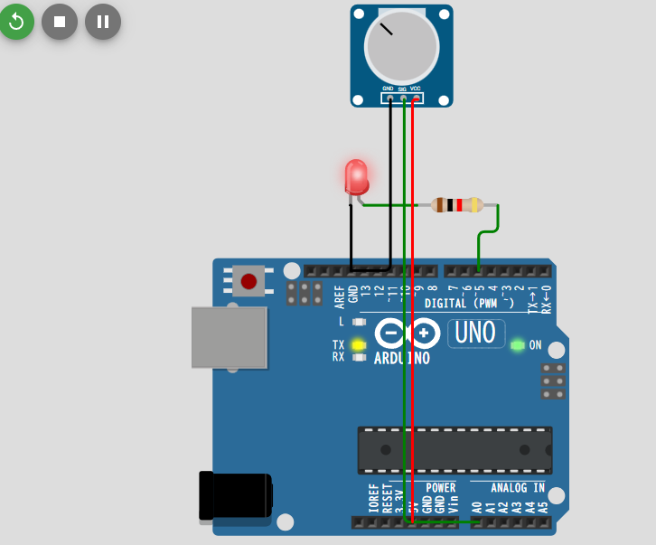

## テーマ

「可変抵抗（ポテンショメータ）でLEDの明るさを調整」は **アナログ入力** と **PWM出力** の両方を理解できる基本練習になります。

---

## 🔌 必要なもの

* Arduino Uno（または互換機）
* 可変抵抗（10kΩ程度）
* LED ×1
* 抵抗（220Ω程度）×1（LED用）
* ジャンパワイヤ

---

## 🛠 配線手順

1. **ポテンショメータ**
   * 中央の端子 → Arduino の `A0`（アナログ入力）
   * 片側端子 → 5V
   * もう片側端子 → GND
2. **LED**
   * アノード（長い足） → Arduino の `D9`（PWM出力可能なピン）を抵抗（220Ω）経由で接続
   * カソード（短い足） → GND

👉 PWMが使えるピン（Unoなら 3, 5, 6, 9, 10, 11）が必要なので、ここでは `D9` を使います。

---

## 💻 Arduinoコード例

```cpp
int potPin = A0;   // ポテンショメータ入力
int ledPin = 9;    // LED出力 (PWM対応)
int potValue = 0;  // 読み取った値
int ledValue = 0;  // LEDに出力する値 (0~255)

void setup() {
  pinMode(ledPin, OUTPUT);
  Serial.begin(9600); // デバッグ用
}

void loop() {
  // ポテンショメータの値を読み取る (0~1023)
  potValue = analogRead(potPin);

  // 0~1023 を 0~255 にマッピング
  ledValue = map(potValue, 0, 1023, 0, 255);

  // LEDの明るさをPWMで制御
  analogWrite(ledPin, ledValue);

  // デバッグ出力
  Serial.print("Potentiometer: ");
  Serial.print(potValue);
  Serial.print(" -> LED PWM: ");
  Serial.println(ledValue);

  delay(10); // 少し待つ
}
```

---

## 🧪 実行するとどうなる？

* ポテンショメータを回すと `A0` の値（0～1023）が変化
* `map()` 関数で `0~1023 → 0~255` に変換
* `analogWrite()` でLEDの明るさを調整

つまり、**つまみを回すとLEDが暗くなったり明るくなったり**します。

---

👉 もし「この次に進める応用」を考えるなら、

* **複数のLEDを制御** （RGB LEDを光の三原色で変化させる）
* **センサー（光や温度）入力でLEDを制御**

  と発展させると、さらに面白くなりますよ。

---

このあと、私が **回路図（ブレッドボード配線図）** を描いて説明するのと、**コードを少し応用してRGB LED版**を出すのとでは、どちらに興味ありますか？


Arduino Unoでデジタル入力するには、A0からA5までの6端子を利用できます。ここに電子部品などを接続して入力することで、どの程度の電圧がかかっているかを読み取ることができます。ただし、A4、A5はI^2^Cと呼ばれるデジタル通信にも利用します。センサやディスプレイなどI^2^Cでのデジタル通信を利用する電子部品を接続する場合は、この端子をアナログ入力として利用できないので注意しましょう。


## Arduino Uno のアナログ入力ピン番号

* **A0, A1, A2, A3, A4, A5**

つまり「A0 ～ A5」の6本がアナログ入力に使えます。

（ピンのシルク印刷で "A0" などと書いてあります）

---

## 補足

* これらのピンは **`analogRead()`** で使用します。
  <pre class="overflow-visible!" data-start="232" data-end="289"><div class="contain-inline-size rounded-2xl relative bg-token-sidebar-surface-primary"><div class="sticky top-9"><div class="absolute end-0 bottom-0 flex h-9 items-center pe-2"><div class="bg-token-bg-elevated-secondary text-token-text-secondary flex items-center gap-4 rounded-sm px-2 font-sans text-xs"><span class="" data-state="closed"></span></div></div></div><div class="overflow-y-auto p-4" dir="ltr"><code class="whitespace-pre! language-cpp"><span><span>int</span><span> value = </span><span>analogRead</span><span>(A0); </span><span>// A0ピンの値を読み取る</span><span>
  </span></span></code></div></div></pre>
* 読み取れる値の範囲は  **0 ～ 1023** （10ビット分解能、0V～5Vを対応）
* 機種によって数は異なります：
  * **Arduino Mega 2560** → A0～A15（16本）
  * **Arduino Nano** → A0～A7（8本）
* デジタルピンとして使える機種もあります（例：`pinMode(A0, OUTPUT)` でデジタル出力可能）


## 結果



