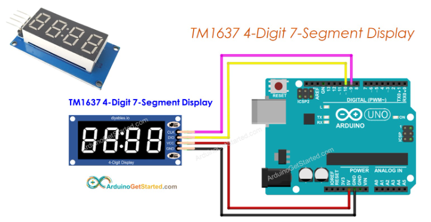
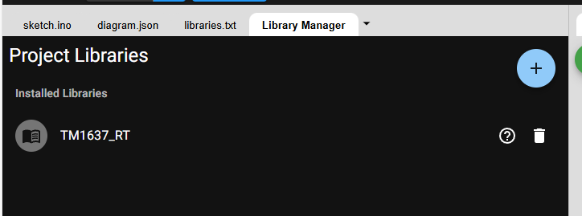
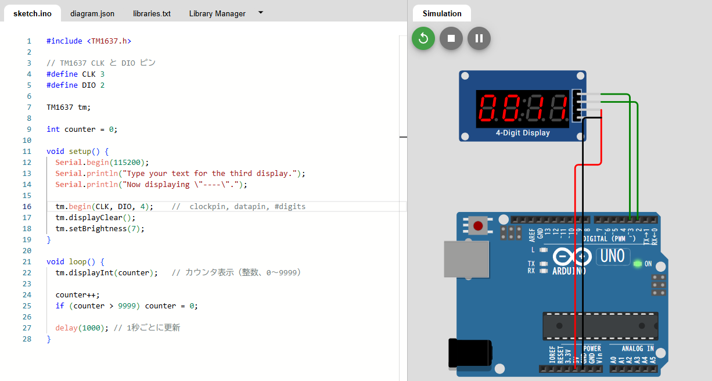

## 目的

**4桁7セグメントディスプレイ** （一般的に「4桁共通アノード/カソード」タイプ）を使って、DHT22の温度を「2桁以上」で表示する実装例を紹介します。

---

## ⚙ 回路概要

### 1. DHT22

* VCC → 5V
* GND → GND
* DATA → Arduino デジタルピン 2
* 10kΩプルアップ抵抗（DATA と VCCの間）

### 2. 4桁7セグ

* セグメント線（a,b,c,d,e,f,g,dp） → Arduino デジタルピンに抵抗を介して接続
* 各桁選択（digit1～digit4） → Arduino のデジタルピンに直結

⚠️ 4桁表示は「ダイナミック点灯方式」なので、Arduino が高速に桁を切り替える必要があります。

---

## 📖 サンプルコード

```cpp
#include "DHT.h"

#define DHTPIN 2
#define DHTTYPE DHT22
DHT dht(DHTPIN, DHTTYPE);

// セグメントピン（a,b,c,d,e,f,g,dp）
int segPins[8] = {3,4,5,6,7,8,9,10};

// 桁選択ピン（digit1～digit4）
int digitPins[4] = {11,12,13,A0};

// 数字データ（a,b,c,d,e,f,g,dp の順）
// 1 = ON, 0 = OFF
byte digits[10][8] = {
  {1,1,1,1,1,1,0,0}, // 0
  {0,1,1,0,0,0,0,0}, // 1
  {1,1,0,1,1,0,1,0}, // 2
  {1,1,1,1,0,0,1,0}, // 3
  {0,1,1,0,0,1,1,0}, // 4
  {1,0,1,1,0,1,1,0}, // 5
  {1,0,1,1,1,1,1,0}, // 6
  {1,1,1,0,0,0,0,0}, // 7
  {1,1,1,1,1,1,1,0}, // 8
  {1,1,1,1,0,1,1,0}  // 9
};

void setup() {
  Serial.begin(9600);
  dht.begin();

  // ピンを出力に設定
  for (int i=0; i<8; i++) pinMode(segPins[i], OUTPUT);
  for (int i=0; i<4; i++) pinMode(digitPins[i], OUTPUT);
}

void loop() {
  float temp = dht.readTemperature();  // 摂氏
  if (isnan(temp)) {
    Serial.println("DHT22 読み取り失敗");
    return;
  }

  Serial.print("温度: ");
  Serial.println(temp);

  // 温度を整数に（例: 23.4℃ → 23）
  int t = (int)temp;

  // 桁ごとに分解
  int values[4];
  values[0] = t / 1000 % 10;  // 千の位
  values[1] = t / 100 % 10;   // 百の位
  values[2] = t / 10 % 10;    // 十の位
  values[3] = t % 10;         // 一の位

  // 数秒間表示（桁スキャン）
  for (int i=0; i<500; i++) {
    displayNumber(values);
  }
}

void displayNumber(int values[4]) {
  for (int d=0; d<4; d++) {
    // まず全部OFF
    for (int i=0; i<4; i++) digitalWrite(digitPins[i], HIGH); 

    // セグメント出力
    for (int i=0; i<8; i++) {
      digitalWrite(segPins[i], digits[values[d]][i]);
    }

    // d桁目をON（共通カソードの場合 LOW、共通アノードなら HIGH）
    digitalWrite(digitPins[d], LOW);

    delay(3); // 点灯時間（短いほどチラつかない）
  }
}
```

---

## 🔍 ポイント

* この例は「整数の温度（例: 23℃）」をそのまま4桁表示します。
* 小数点を使う場合は `dp`（小数点）ピンを制御して 2 桁目と 3 桁目の間に点を出せます。
* **共通アノード/カソード**によって `digitalWrite` のON/OFFが逆になるので注意してください。

---

## 4-digit-7-segment display

[Arduino - TM1637 4-Digit 7-Segment Display | Arduino Tutorial](https://arduinogetstarted.com/tutorials/arduino-tm1637-4-digit-7-segment-display)



## 抵抗が必要な理由

### 1. 7セグの正体は「LEDの集合体」

* 7セグメントディスプレイの各バー（a～g）や小数点（dp）は、**LED** です。
* LEDは「ダイオード」なので、一定の電圧を超えると急激に電流が流れます。
* そのままArduinoなどに直結すると、**過大電流でLEDが焼損**したり、**Arduinoのピンが壊れる**可能性があります。

---

### 2. 電流制限の必要性

* Arduinoの1ピンが安全に流せる電流は  **最大40mA程度（推奨は20mA以下）** 。
* 一般的な赤色LEDの順方向電圧は  **約2V** 。
* Arduinoから5Vを出すと、残りの **(5V - 2V) = 3V** が抵抗で消費されます。
* もし抵抗がなければ、LEDは数百mA流れて一瞬で壊れます。

---

### 3. 抵抗の計算例

例えば「1つのセグメントを約15mAで点灯させたい」場合：

R=V電源−VLEDIR = \frac{V_{電源} - V_{LED}}{I}

R=5−20.015=200 ΩR = \frac{5 - 2}{0.015} = 200\ \Omega
👉 よって、**220Ω程度**がよく使われます。

---

## 🔍 抵抗の入れ方

* **セグメントごとに1本ずつ抵抗**を入れるのが基本。
* 桁ごとに抵抗を共用する方法もありますが、**輝度の不均一**が出るので初心者にはおすすめしません。

---

## ✅ まとめ

* 抵抗は「電流制限」のために必須
* 1セグメントにつき 220Ω 前後を使うのが一般的
* 抵抗がないと LED も Arduino も壊れる

---

👉 ここで確認ですが、あなたの7セグは **共通カソード** と **共通アノード** のどちらでしょうか？

それによって抵抗の入れる位置（電源側かGND側）が変わってきます。

なるほど！TM1637 4-wireタイプですね 😄

これは **普通の7セグと桁選択を個別に制御するタイプ**ではなく、 **TM1637ドライバIC内蔵の4桁7セグ** です。

Arduinoからは  **2本の信号線** （CLK, DIO）で簡単に制御できます。

抵抗や桁スキャンの自作は不要です。

---

## 🔌 接続方法（TM1637 4-wire）

| TM1637 ピン | 接続先（Arduino）            | 備考       |
| ----------- | ---------------------------- | ---------- |
| VCC         | 5V                           | 電源       |
| GND         | GND                          | グランド   |
| DIO         | 任意のデジタルピン（例：D2） | データ線   |
| CLK         | 任意のデジタルピン（例：D3） | クロック線 |

> TM1637は内部に電流制限抵抗が入っているので、外付け抵抗は不要です。

---

## 📖 Arduinoサンプルコード（0から9999カウント）

### 1. ライブラリを使う方法

TM1637用のライブラリが公式/サードパーティにあります。

代表的には **TM1637Display** ライブラリです。

#### ライブラリインストール

1. Arduino IDE → 「スケッチ」→「ライブラリを管理」
2. `TM1637Display` を検索してインストール

#### コード例

```cpp
#include <TM1637Display.h>

// CLK, DIO
#define CLK 3
#define DIO 2

TM1637Display display(CLK, DIO);

int counter = 0;

void setup() {
  display.setBrightness(0x0f); // 輝度最大
}

void loop() {
  display.showNumberDec(counter, true); // true = ゼロ埋め
  delay(1000); // 1秒ごとに更新

  counter++;
  if (counter > 9999) counter = 0;
}
```

---

### 🔹 ポイント

* `showNumberDec(number, true)`
  * `true` を指定すると  **0埋め表示** （例：0001, 0023）
* ハード的に桁選択やセグメント制御を気にしなくてよい
* TM1637内蔵ICが自動でスキャンしてくれるので、チラつきもなし

---

💡 まとめ：

* TM1637は「2線制御」だけで4桁表示が可能
* 抵抗不要（IC内蔵）
* Arduinoライブラリを使えば、カウンタや温度表示も簡単

---

# ライブラリインストール




