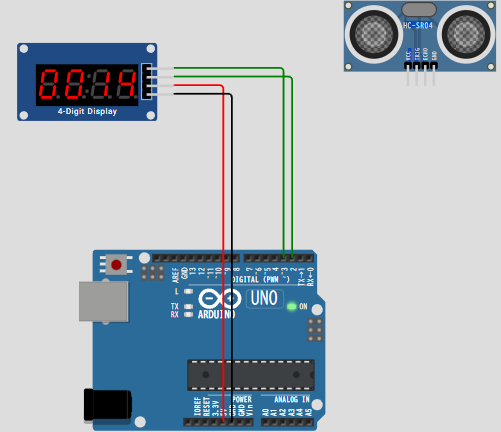
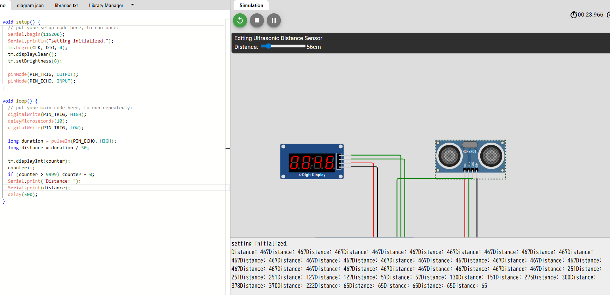
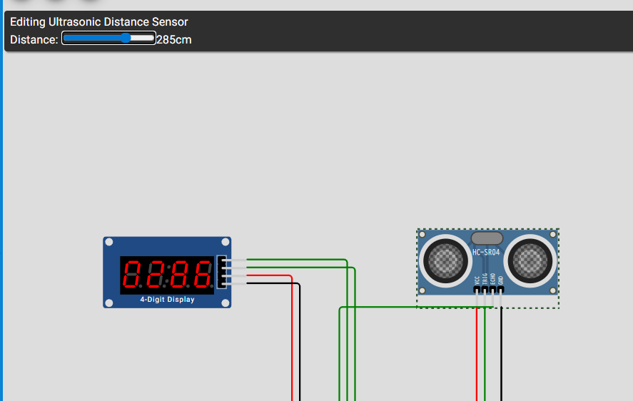

## 目的

超音波センサの値を読み取り、7segに表示する。

## 利用デバイス

HC-SR04

4-digit display

## 手順

1. 4-digit displayを起動する

前回のカウンタを起動。

### 超音波センサ

[wokwi-hc-sr04 Reference | Wokwi Docs](https://docs.wokwi.com/parts/wokwi-hc-sr04)

## 結果：

できました。

センサから読み取った値をそのまま出力できました。

