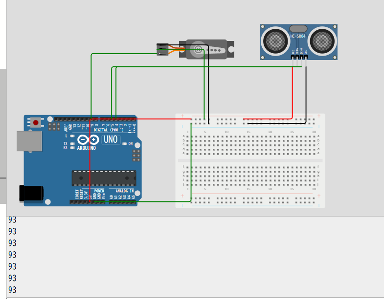
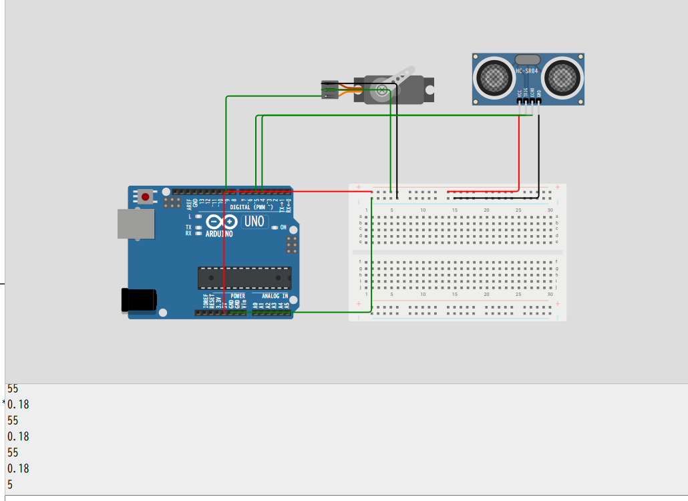

## 目的

センサーの値を読み取ってPWMに出力するパルスを変更→モーターの回転を制御する

## 機器構成

### 1. **コントローラ**

* **Arduino Uno**

  センサー値を読み取り、制御アルゴリズムを実行し、PWMを出力する役割。

  Uno の `~` が付いたデジタルピン（D3, D5, D6, D9, D10, D11）から PWM を出力可能。

### 2. **センサー**

用途に応じて選択：

* **光センサー（CdS, フォトダイオード）** → 明るさに応じてモーター速度制御
* **温度センサー（LM35, DHT11/22, サーミスタ）** → 温度によるファン制御
* **距離センサー（超音波 HC-SR04, 赤外線 GP2Y0A21）** → 物体距離で速度制御
* **電位差計（可変抵抗, VR）** → 手動でモーター速度制御（テスト用に便利）

> まずは **可変抵抗（10kΩ）を A0 に接続** → 値を `analogRead()` して PWM にマッピングするのが入門に最適。

### 3. **モータードライバ**

Arduino Uno は直接モーターを駆動できません（ピン出力は40mA程度しか流せない）。

→ **モータードライバIC or モジュール** を介す必要があります。

代表例：

* **L298N モジュール** （DCモーター双方向制御、最大2A程度）
* **L293D** （小電流向け）
* **MOSFET（例：IRF520モジュール）** （単方向・高効率制御）

用途：

* DCモーターを単方向で回すだけなら MOSFET が簡単
* 正転・逆転したいなら L298N が便利

### 4. **モーター & 電源**

* **DCモーター** （5V〜12V 程度）
* **電源** ：Arduino の 5V ピンから直接は NG。必ず **外部電源（乾電池, DCアダプタ, LiPoバッテリ等）** を使用。
* 例：モーター用 6V or 12V 電源
* Arduino とモータードライバの **GND を共通化**する必要あり

---

### 5. **保護回路**

* モーターは逆起電力を発生 → モジュールには通常フリーホイールダイオード内蔵ですが、MOSFET駆動の場合は **ダイオード(1N4007等)** をモーターと並列に入れる。

```
 [センサー] --(A0)--> [Arduino Uno] --(PWM D9)--> [モータードライバ] --> [DCモーター]
                                          |
                                     USB or 5V電源

 モーター用外部電源 (+V) --------------> [モータードライバ Vcc]
 モーター用外部電源 GND ---------------+
                                       |
                                      [Arduino GND] (共通化)

```

## サーボモータを動かす

先にサーボモータを動作させる。

## ✅ `if(now - lastUpdate >= stepInterval)` が必要な理由

この条件は **「一定時間ごとに処理を実行する」ための仕組み** です。

---

### 🔸 背景

* `loop()` はものすごい速さで何千回も繰り返し実行されています。
* そのままサーボに `myServo.write(angle);` を書いたら、

  → 角度を一気に目標値まで更新してしまう

  → サーボが「ガクッ」と瞬間移動してしまう。

---

### 🔸 そこで `millis()` を使う

```cpp
if (now - lastUpdate >= stepInterval) {
    lastUpdate = now;
    // この中の処理は一定間隔でしか動かない
}
```

* `now` = 現在の時刻（ミリ秒）
* `lastUpdate` = 前回処理した時刻
* `stepInterval` = 更新したい間隔（例: 20ms）

👉 つまり

「前回から `stepInterval` ミリ秒経ったら、次のステップに進む」

という意味になります。

---

### 🔸 イメージ

例えば `stepInterval = 20ms` なら

* 0ms … サーボ角度更新
* 20ms … 次の角度へ
* 40ms … 次の角度へ
* 60ms … 次の角度へ

というように、**一定速度でなめらかに動く** 仕組みです。

---

### 🔸 なぜ必要か？

* `delay()` を使うとプログラム全体が止まってしまう（他の処理ができない）
* `millis()` を使ったこの方法なら

  ✅ サーボを少しずつ動かしながら

  ✅ ほかの処理（センサー読み取りなど）も同時に行える

---

## 🧠 まとめ

`if(now - lastUpdate >= stepInterval)` は

> **「前回更新から一定時間経ったか？」を判定する条件**

であり、サーボを滑らかに、かつ非ブロッキングで制御するために必要です。

---

エラー

なぜか



出力がずっと93のまま・・・

なにかおかしい。。。




動いた。

原因は丸目誤差？

計算式中のtが非常に小さくなってしまっていた。
