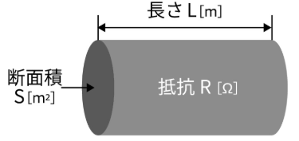
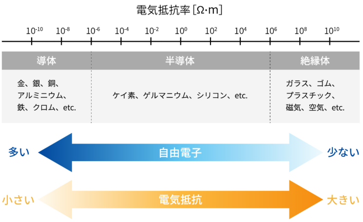

## 電気抵抗

電気抵抗とは、**電流の流れにくさを表した数値のこと**です。
国際単位系における単位は、Ω（オーム）であり、電気抵抗の数値が大きければ大きいほど電流が流れにくいことを意味します。

## 電気抵抗率

電気抵抗率とは、**物質の単位長さと単位断面積あたりの電気の流れにくさを表す指標のこと**で**物質固有の値**となります。
電気抵抗は、同一素材においても物質の長さや面積によって変化するのに対し、電気抵抗率は変化しません。
電気抵抗率の記号はρ[ロー]であり、単位は一般的にΩ・ｍ（オームメートル）またはΩ・cm（オームセンチメートル）が使用されます。

導体の電気抵抗率ρ［Ω・m］は、抵抗R［Ω］、長さL［m］、断面積S［㎡］より、以下の式で表すことができます。



```mathematica
ρ=R 
S
L
［Ω・m］
(ρ：導体の抵抗率［Ω・ｍ］　R：電気抵抗［Ω］　L：導体の長さ［m］　S：導体の断面積［㎡］)
```


## 導体・半導体・絶縁体



