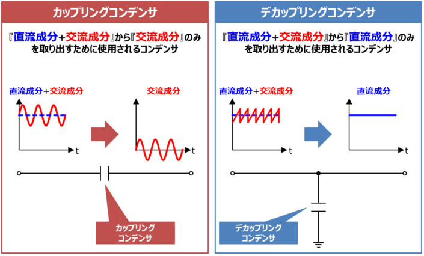

## 『カップリングコンデンサ』と『デカップリングコンデンサ』の違い

**### カップリングコンデンサ**
『**直流成分**+**交流成分**』から『**交流成分**』のみを取り出すために使用されるコンデンサ。

また、カップリングとは『**2つのものを結合させる**』という意味があります。その名の通り、**カップリングコンデンサは**回路を結合させる用途**で用いられます。**

コンデンサのインピーダンスの大きさ**Z**Cは直流成分(**f**=**0**)では無限大になります(分母が0になるから)。そのため、『直流成分+交流成分』を含んだ信号がコンデンサに入力された場合、『直流成分』を遮断して『交流成分』のみを取り出すことができます。

**### デカップリングコンデンサ**
『**直流成分**+**交流成分**』から『**直流成分**』のみを取り出すために使用されるコンデンサ。

デカップリングコンデンサは、コンデンサの交流成分を通過させる特性を利用し、『**直流成分**+**交流成分**』から『**直流成分**』のみを取り出すために使用されるコンデンサです。

コンデンサのインピーダンスの大きさ**Z**Cは次式で表されます。

**Z**C**=**1**ω**C**=**1**2**π**f**C

上式において、**C**はコンデンサの静電容量[F]、**f**は周波数[Hz]、**ω**は角周波数(角速度とも呼ばれる)であり、**ω**=**2**π**f**の関係があります。
