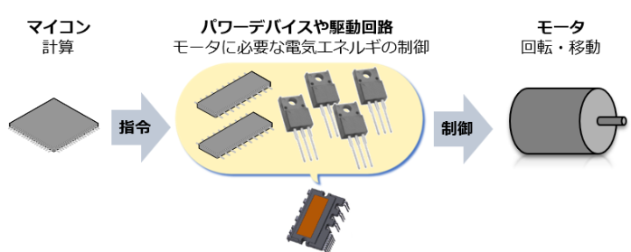
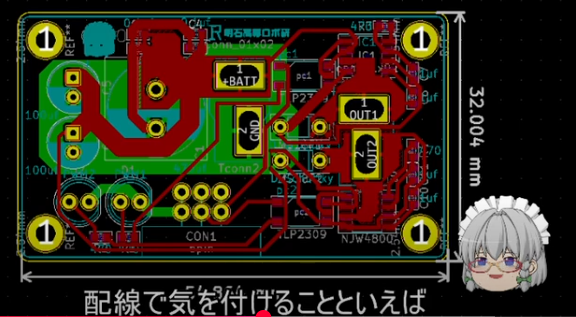
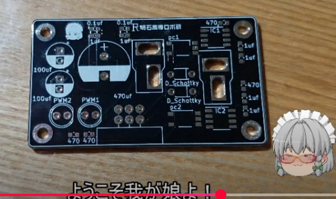
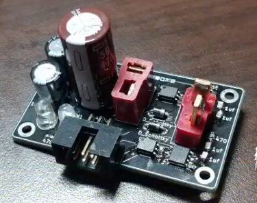
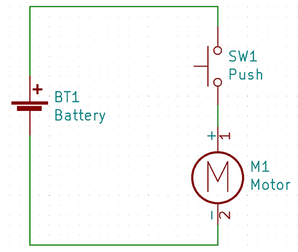
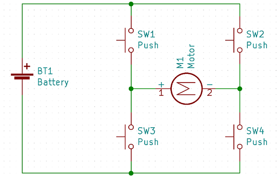
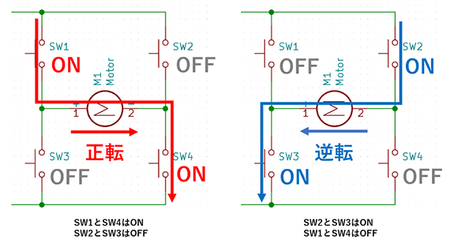

## モータドライバ

モータドライバとは、その名のとおりモータをドライブ（駆動）させることに特化した半導体製品。

直流を交流に変換しモータを制御するためのパワー半導体素子（パワーMOSFET、IGBT）や、ドライバICなど多くの素子がひとつにパッケージングされています。

個別の半導体を並べるよりも実装基板の面積を縮小することができ、結果的に家電などの製品を小型化することができます。

### ドライバによりできること

ドライバがあることで、モータの回転方向を正転、逆転の２方向にできる。

回転スピードを好きに設定できる。

Hブリッジが内蔵

ブートトラップ回路

→ハーフブリッジドライバICが決まれば、抵抗を決めるだけ。

信号の伝達速度を制御するためフォトカプラを選定する必要あり。

KiCadで設計する。だそうです。

ガーバーデータを業者に送付してPCBを作成

## Hブリッジによる正逆転

一方向に回転させるだけの回路

モータを正逆転させるための回路構成として「Hブリッジ（エイチ・ブリッジ）」という方法があります。

モータの両端子に合計4個のスイッチをVCCとGNDの方向に接続する形で構成されます。

## 3. モータドライバICとは

「モータドライバIC」はモータドライバ回路を構成するのに必要とされるMOSトランジスタによるHブリッジ・制御回路・保護回路などがひとつのパッケージにまとめられたICです。数十アンペア級の大電流のモータドライバを作るときはディスクリート部品を組み合わせて回路を作ることもありますが、数アンペア程度のモータドライバであればモータドライバICを使うことで回路の小型化や保護回路による過電流保護の恩恵を受けることができます。
