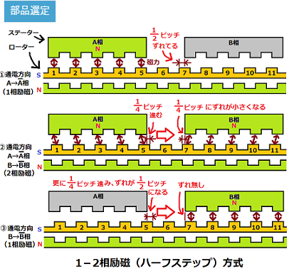
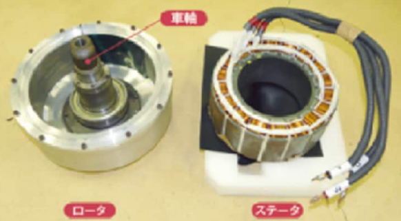

## ブラシ付きDCモータ

DCモーターはバッテリーからの直流電源を使用して動くモーターです。

ブラシ付きDCモーターには小さな金属片でできたブラシが付いており、これがコイルの両端に接続された整流子と接続することで電流が流れます。

流れた電流は、ロータのコイルで磁場を発生させます。その磁場が、ステータの発する磁場と反発したり引き合ったりしてロータを回転させ、ロータを動かします。

### 制御因子

DCモータにどれだけの電流を送るかによってモータの速度、電流の向きによって回転する方向を制御することが出来る。

制御を担うのがブラシ付きDCモータドライバ

## ブラシレスDCモータードライバー

ブラシレスDCモーターにはブラシがなく永久磁石が内蔵されており、その磁極の位置に応じて電流を流すコイルを切り替えることによって永久磁石が回転し、モーターが動くようになっています。

しかし、ブラシレスCモーターには、コイルに流れる電流の方向を切り替えるためのブラシがないため、その切り替えに駆動回路としてのドライバーが必要なのです。

「磁場の位置を検知"しない"」「センサーを内蔵して"いない"」DCBL Motor Driverも一般的に存在することをお伝えしておきます。

## ステッピングモータードライバー

ステッピングモーターは、パルス信号によってモーターが動きます。

DCモーターとは異なり、一定の回転角度で断続的にロータが回転します。

回転角度が予め決まっており、回転数もステータにある鉄芯（ポール）の数によって決まります。

電源のオン・オフが切り変わることによって電流がコイルに流れ、ステータと呼ばれる部分にある電磁石に磁力が発生し、そこで発生するパルス信号に同期してロータが回転してモーターが動くという仕組みです。

一方、ドライバーは、指定の回転数に応じて規則的に電流を流すことによってパルス信号を発生させます。

このパルス信号の数が多くなるほどモーターの回転数が上がり、パルス信号の速さによってモーターが早く動きます。

### 概要

ステッピングモータは制御モータの一種で，電流を流す相を切り替えることで時計のように一定の角度ずつ動いて回転する仕組みのモータです。センサなしに位置決めができます。パルスモータ，ステップ，ステッパモータなどとも呼ばれることがあります。

### ステップモータとは？

* **電気信号を与えると「カチッ」と一定の角度（ステップ角）だけ回転するモータ**です。
* 普通のDCモータは電圧を与えるとずっと回り続けますが、ステップモータは「信号パルス1つ = 指定角度だけ回転」という制御が可能です。
* 3Dプリンタ、NC工作機械、ロボットの関節など、**正確な位置決め**に使われます。

### stepモータ構成要素

* **ステータ（固定子）**

  * モータの外側に配置されたコイル（電磁石）
  * 電流を流すと磁界が発生する
  * いくつもの極（N極・S極）が配置されている
* **ロータ（回転子）**

  * モータの中心にある回転部分
  * 永久磁石（PM型）またはソフト磁性体の歯車状（VR型）で構成される
  * ステータの磁界に引き寄せられて回転する
* **シャフト**

  * ロータに接続され、外部に回転を伝える部分
* **ベアリング**

  * シャフトを滑らかに回転させるための支持構造

### 回転の仕組み

ステップモータは「コイルの通電順序を切り替えることで、ロータを一定角度ずつ回転させる」仕組みです。

1. コイルに電流を流すと磁界ができる

* ステータのあるコイルに電流を流すと、その部分が **N極 / S極** になる
* ロータの永久磁石（または鉄の歯）がその磁界に引き寄せられる

2. 次のコイルに電流を切り替える

* 別のコイルに通電すると、磁界の位置が変わる
* ロータは次のコイルに向かって一定角度「カチッ」と回転する

3. これを繰り返すと連続回転になる

* 「コイルの励磁パターン」を順番に切り替えていくことで、

  → ロータが少しずつ移動

  → 結果として連続的な回転になる
