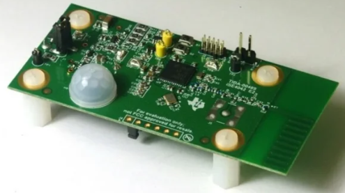
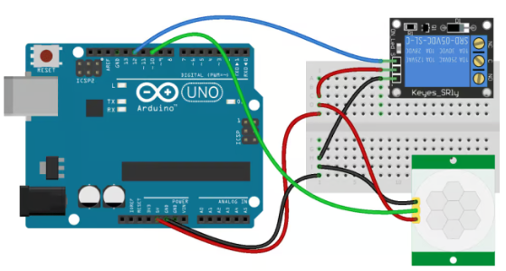

## 概要

**PIR（パッシブ赤外線）** センサーは、人や動物などの熱源からの赤外線を感知するモーションセンサーです。

パッシブ動作のため、熱を感知しますが、自身はエネルギーを放出しません。

そのため、エネルギー効率が高く、様々な用途に最適です。

PIRセンサーは、  **セキュリティシステム** ,  **スマート照明** 、 そして **自動ドア**動きを検知し、アラームを作動させ、照明を自動的に制御するのに役立ちます。PIRセンサーは現代の **オートメーション** そして **動き検出** テクノロジーにより、生活はより簡単かつ安全になります。

### 焦電効果

PIRセンサーが検出 **赤外線** 人間、動物、あるいは温かい物体などの熱源から放射される赤外線。

絶対零度以上の物体はすべて赤外線を放射しており、 **PIRセンサー** 拾います。

センサーの核となるのは **焦電材料**赤外線を吸収すると小さな電気信号を生成する能力を持つ素材です。

温度が変化すると、この素材が反応して微小な電気信号を生成し、センサーがその信号を使って動きを検知します。

### 検出メカニズム

PIRセンサーは通常 **2つのセンシング素子** 動きを検知するために連携して動作する。

環境が安定しているときは、両方の要素が同じレベルの赤外線を拾う。しかし、 **熱源** 検出領域を通過すると、1 つの要素が他の要素よりも先に温度変化を感知します。

これにより、 **差動信号**センサーは何かが動いたことを感知し、この信号を送信してアラームやその他のデバイスを起動します。

### PIRセンサーのコアコンポーネント

**PIRセンサー** いくつかの重要な部分が含まれます:

* **センシング素子** : 熱源からの赤外線を検出します。
* **アンプと信号プロセッサ** : センシング素子からの信号を強化および処理します。
* **コンパレータIC** : 信号を処理し、動きが検出されると出力をトリガーします。
* **調整可能なポテンショメータ** : センサーの **感度** そして **遅れ** パフォーマンスを向上させるための設定。

