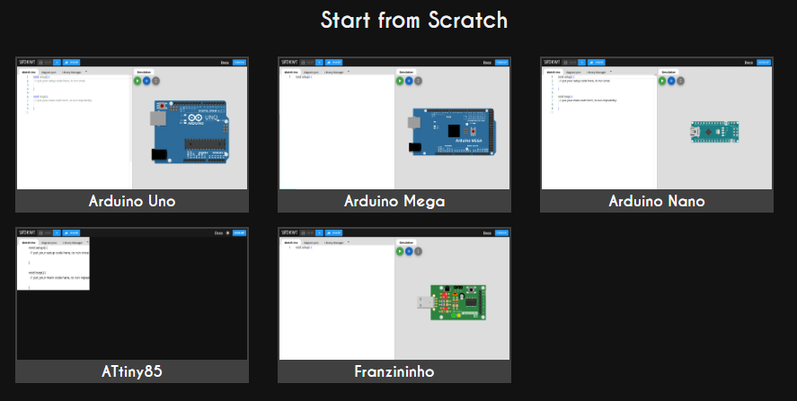

## 本サイト

arduinoのサイト

[Arduino on Wokwi - Online ESP32, STM32, Arduino Simulator](https://wokwi.com/arduino)

機器の一覧

[Supported Hardware | Wokwi Docs](https://docs.wokwi.com/getting-started/supported-hardware#motors)

here is the site



## 流れ

電気の回路主要素

1. 抵抗、ダイオード
2. コンデンサ、インダクタンス
3. IC

話と合わせて、マイコンの制御について説明

モータ制御などのサンプルを３例程度扱う

## マイコンのシミュレーション環境

[Wokwi - Online ESP32, STM32, Arduino Simulator](https://wokwi.com/projects/440121954176851969)

## テーマ

Arduinoを使ってマイコンの勉強をするなら、**「回路・センサ・制御・通信」**の要素を少しずつ触れるテーマを選ぶのがおすすめです。

段階ごとに成長できるテーマを挙げますね。

---

## 🔰 初級（入門：入出力の基本を理解）

* **LED点滅（Lチカ）**

  → デジタル出力とプログラムの基本
* **スイッチ入力でLEDをON/OFF**

  → デジタル入力、プルアップ/プルダウン抵抗の理解
* **可変抵抗（ポテンショメータ）でLEDの明るさを調整**

  → アナログ入力＋PWM出力

---

## 🛠 中級（センサ・アクチュエータで実験）

* **温度センサ（LM35, DHT11など）で室温モニタ**

  → センサ値の読み取り、シリアルモニタ表示
* **光センサで自動点灯ライト**

  → if文や閾値判定の練習
* **サーボモータを角度制御**

  → PWM制御とタイミングの理解
* **超音波距離センサ＋ブザーで障害物警告**

  → 複数デバイスを組み合わせた制御

---

## 🚀 上級（通信・複合システム）

* **赤外線リモコンで家電操作**

  → 外部ライブラリ活用と信号解析
* **Bluetooth/WiFiでスマホ制御ロボット**

  → 無線通信＋モータ制御
* **データロギングシステム**

  → SDカードにセンサデータを保存
* **ミニロボット製作（自走カー）**

  → センサ入力（超音波・赤外線）＋モータ制御＋電源管理

---

## 💡 学びのポイント

* **最初は1つのセンサ・1つの出力**から始める
* 慣れたら「入力＋出力を組み合わせる」テーマに進む
* さらに「通信・データ保存・複数モジュール連携」に挑戦すると一気に理解が深まります

---

👉 もし「勉強目的」より「実用目的」で何か作りたいなら、たとえば **部屋の環境モニタ（温度・湿度・照度を測って記録/スマホに送る）** は楽しくて応用範囲も広いですよ。

---

ご質問ですが、あなたは

* **基礎をしっかり固めたい（電子回路の理解重視）**
* **面白いものを作りながら学びたい（モノづくり重視）**

  どちら寄りでテーマを探していますか？


# モータの動作


いいですね — センサ値を使ってモータ回転数を決めるときに考えるべき選択肢と実装の具体例をまとめます。用途（位置制御か速度制御か）、モータ種類（ステッパ／DCブラシ／BLDC／ACサーボ）や安全限界で最適解が変わるので、ここでは**一般的に使える方法と具体的な数値例**を出します。

# 1) 回転数（RPM）の決め方のパターン

* **オン／オフ**
  * センサが閾値を超えたら定速（例：1000 rpm）、未満なら停止。シンプルで安全。
* **比例（線形マッピング）**
  * センサ値に比例してrpmを連続的に変化。
  * 例：`rpm = rpm_min + (sensor - s_min)/(s_max-s_min) * (rpm_max - rpm_min)`
* **非線形マッピング**
  * 感度を変えるために指数や二乗、対数で変換（例：急加速が必要なら二乗で増やす）。
* **段階（ディスクリート）制御**
  * センサレンジをN段階に分け、それぞれ固定rpmを割り当てる（安定性が良い）。
* **フィードバック（PID）速度制御**
  * センサで求めた「目標速度」を設定し、エンコーダで実速度を取りPIDで追従。高精度で安定。
* **軌道（プロファイル）制御**
  * 目標rpmへ台形（trapezoid）やS字（S-curve）で加減速して滑らかに遷移。摩耗・振動対策に有効。

センサが閾値を超えたらmax。

段階制御。

PID制御。

S-curveで加減速してなめらかに遷移。

# 2) 現実的なRPMの目安（モータ別）

（機種により大きく変わるため「目安」）

* **ステッピングモータ（一般的なハイブリッド）**
  * 実用領域：数 rpm ～ 数百 rpm（例：0〜300 rpmがよく使われる）
  * 高速化は可能だがトルク低下・脱調に注意。
* **DCブラシ／BLDCモータ（低〜中速）**
  * 数十 rpm ～ 数千 rpm（例：0〜3000 rpm）
* **産業用サーボ・ACモータ**
  * 数 rpm ～ 数万 rpm（用途で大きく変動）

※ 実際の上限はモータのスペック（定格回転数、冷却、伝達ギア比）で決まります。必ずデータシートを確認してください。

※ステッピングモータの実用領域。

※産業用サーボ、ACモータ

# 3) ステッパを使う場合：rpm → ステップ周波数の換算

* `step_rate [steps/s] = steps_per_rev * microstep * rpm / 60`
* 例：標準200ステップ/rev、16分解能（microstep=16）で `steps_per_rev = 200*16 = 3200`
  * rpm = 300 のとき：`3200 * 300 / 60 = 16,000 steps/s` → パルス周波数 16 kHz
  * 注意：MCUやドライバがこの周波数のパルスを扱えるか確認。高周波はCPU負荷やパルスジッタ問題あり。

# 4) センサ→rpmマッピング（具体式）

* センサ値 `s` が範囲 `[s_min, s_max]` のとき、線形マップ：

```text
rpm = rpm_min + (s - s_min) / (s_max - s_min) * (rpm_max - rpm_min)
```

* 例：センサ0〜1023 → rpm 0〜1200 の場合

```text
rpm = 0 + s/1023 * 1200
```

# 5) 実装上の注意点（安全と性能）

* **加速度制限（ラグ・摩耗対策）**
  * 急にrpmを変えず、最大加速度 `α_max (rpm/s)` を設定して段階的に変化させる（トラペゾイドプロファイル推奨）。
* **サンプリング周期**
  * フィードバック制御ではサンプリング周期（制御ループ周期）を十分速く：速度制御なら数十〜数百Hz、位置制御や高応答ならkHzオーダー。
* **分解能とノイズ**
  * エンコーダ分解能が粗いと低速域での制御が不安定。必要分解能を確保する。
* **最大トルク・温度**
  * 高回転でトルク低下、過熱の恐れあり。連続運転の定格を超えないこと。
* **デッドバンド**
  * 小さなセンサノイズで頻繁に微速度変化しないようデッドバンド（閾値）を設ける。

# 6) PIDで目標rpmを追従する例（疑似コード）

（エンコーダで実回転速度を測り、目標rpmをフィードバック制御）

```python
# 疑似コード
target_rpm = map_sensor_to_rpm(sensor_value)
measured_rpm = measure_rpm_from_encoder()   # 例：counts_per_interval -> rpm計算
error = target_rpm - measured_rpm

# PID terms (dtは制御周期)
integral += error * dt
derivative = (error - prev_error) / dt
output = Kp*error + Ki*integral + Kd*derivative

# output をモータ入力に変換（PWM幅、またはステップ周波数に変換）
set_motor_speed(convert_output_to_pwm(output))

prev_error = error
```

* **rpm測定式** ：

```text
rpm = (counts_in_interval / pulses_per_rev) * (60 / interval_seconds)
```

# 7) ステッパ向けの具体的数値例（現実的スタート設定）

* センサ範囲 0–1023 を rpm 0–300 にマッピング。
* マイクロステップ 16、ステップ数 200 → `3200 steps/rev`。
* 制御ループ周期：`dt = 5 ms`（200 Hz）から始める（必要なら速く）。
* 加速度上限：`Δrpm_per_s = 1000 rpm/s`（用途により調整）。
* PID 初期ゲイン（かなり粗い開始点、チューニング必須）：
  * Kp = 0.5
  * Ki = 0.1
  * Kd = 0.01

    （**必ず**実機で小さく始め、振動・発熱を確認しながら調整）

# 8) Arduino向けの簡単サンプル（ステッパをPWMで速度制御するDCドライバ想定）

```cpp
// 擬似コード（概念説明用）
int sensorPin = A0;
int pwmPin = 9;
float rpm_min = 0;
float rpm_max = 300;
unsigned long lastMillis = 0;
float dt = 0.01; // 10 ms
float integral = 0, prevError = 0;
float Kp=0.5, Ki=0.1, Kd=0.01;

void loop() {
  unsigned long now = millis();
  if (now - lastMillis < dt*1000) return;
  lastMillis = now;

  int s = analogRead(sensorPin); // 0-1023
  float target_rpm = rpm_min + (s/1023.0)*(rpm_max - rpm_min);

  float measured_rpm = getRpmFromEncoder(); // 実装必要
  float error = target_rpm - measured_rpm;
  integral += error * dt;
  float derivative = (error - prevError) / dt;
  float out = Kp*error + Ki*integral + Kd*derivative;

  // PWMにマッピング（例：-255..255 -> 0..255）
  int pwm = constrain((int)map(out, -300, 300, -255, 255), -255, 255);
  setMotorPWM(pwm);

  prevError = error;
}
```

# 9) チェックリスト（実装前に）

* モータの最大許容rpm・トルク・温度を確認。
* エンコーダの分解能と配線（ノイズ対策）を準備。
* ドライバが速度指令（PWM or step-frequency）を受けられるか確認。
* 制御ループ周期、加速度制限、非常停止条件を定義。
* ログ（目標rpm・実rpm・出力）を取り、チューニングに使う。


## Webots


https://github.com/cyberbotics/webots/tree/3e6ea77604ac443d9f36f74e2a17836a017b8915


