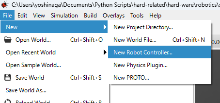

コントローラをウィザードより選択




Webotsコントローラの作成手順

Webotsのコントローラ（制御コード）を作成する手順を、一般的な**Pythonコントローラ**を例に、ステップバイステップで説明します。

この手順に従えば、Webotsのシミュレーション内でロボットを思い通りに動かせるようになります。

---

## 🚀 ステップ 1: コントローラファイルの作成

Webotsのプロジェクトフォルダ内に、制御コードを格納するためのファイルを作成します。

1. **プロジェクトの特定:** Webotsで制御したいロボットが配置されているワールドファイル（`.wbt`）を含むプロジェクトフォルダを開きます。
2. **フォルダ作成:** プロジェクトフォルダ内の `controllers` フォルダの中に、新しくコントローラ名と同じフォルダ（例: `my_robot_controller`）を作成します。
3. **Pythonファイルの作成:** 作成したコントローラフォルダ内に、メインとなるPythonファイルを作成します。ファイル名は通常、コントローラフォルダ名と同じにし、拡張子を `.py`にします（例: `my_robot_controller.py`）。
   > 💡 **より簡単な方法:** Webotsのメニューバーから `Wizards` > `New Robot Controller...` を選択し、言語にPythonを選んで作成すると、自動的にフォルダと基本ファイルが生成されます。
   >

---

## 💻 ステップ 2: 基本コードの記述

作成したPythonファイルに、Webotsコントローラとして動作するために必須のコードを記述します。

### 1. 必要なライブラリのインポート

Webotsの機能を使うために、`controller` モジュールから必要なクラスをインポートします。

**Python**

```
from controller import Robot, Motor, Camera 
# 他にDistanceSensor, PositionSensorなども必要に応じてインポート
```

### 2. ロボットとタイムステップの初期化

コントローラの実行環境（ロボット自身とシミュレーション時間）を設定します。

**Python**

```
# ロボットのインスタンスを取得
robot = Robot()

# 基本タイムステップを取得（シミュレーションの更新間隔）
# 通常は getBasicTimeStep() の戻り値を使用
timestep = int(robot.getBasicTimeStep())
```

### 3. デバイスの取得

制御したいモーターや、使いたいセンサー（カメラ、距離センサーなど）を、Webotsのシーンツリーに設定されている**名前**で取得します。

**Python**

```
# 例：モーターの取得
# WebotsのScene Treeに設定されたモーター名を使用
left_motor = robot.getDevice('left wheel motor') 
right_motor = robot.getDevice('right wheel motor') 

# 例：センサーの取得と有効化
camera = robot.getDevice('camera')
if camera:
    camera.enable(timestep) 
```

### 4. メインループの作成

ロボットの動作を決定する主要な処理を、シミュレーションが終了するまで繰り返します。

**Python**

```
# メインループ
while robot.step(timestep) != -1:
    # --- ここに制御ロジックを記述 ---
  
    # 例：車輪を一定速度で回す
    left_motor.setVelocity(5.0)
    right_motor.setVelocity(5.0)
  
    # ---------------------------------
```

---

## 🔧 ステップ 3: ロボットへのコントローラ割り当て

作成したコードを、シミュレーション上のロボットに紐付けます。

1. **Webotsの起動:** ワールドファイル（`.wbt`）を開きます。
2. **ロボットの選択:** シーンツリー（左側）で、制御したいロボットのノード（例: `Ers7` や `Pioneer 3-DX` など）を選択します。
3. **コントローラの設定:** インスペクタ（右側）の**`controller`**フィールドをクリックし、ドロップダウンリストから、作成したコントローラ名（例: `my_robot_controller`）を選択します。
   * 💡 **`external`** を選ぶと、Webots外のIDEやデバッガから制御できます。
4. **シミュレーションの実行:** Webotsのツールバーにある**再生ボタン（▶）**を押してシミュレーションを開始します。

これで、コードの動作がシミュレーション上に反映されます。あとはステップ2のメインループ内のロジックを修正・洗練させていくだけです。
