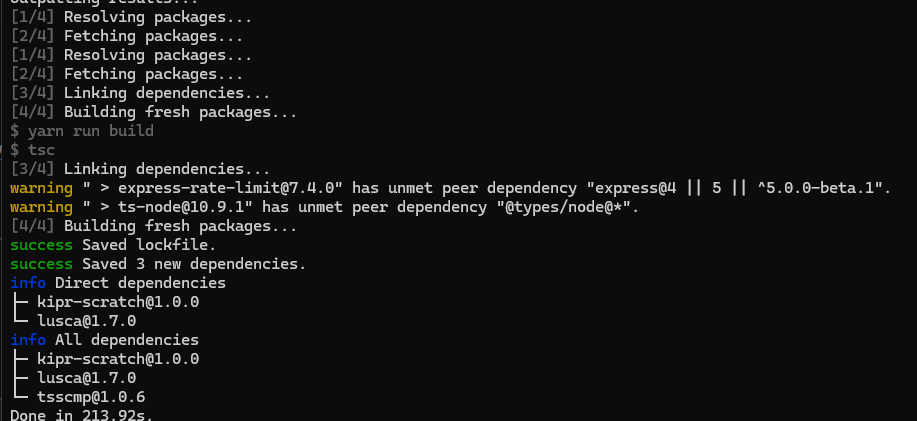

## 目的

kiprのシミュレーション環境を構築する

## レポジトリ

[https://github.com/kipr/Simulator](https://github.com/kipr/Simulator)

WSL(Windows Subsystem for Linux) 上でも、基本的にはほぼ同じ手順でOKです。

ただし、Node.js の最新版を apt で入れるために **NodeSource リポジトリ追加** が必要です。

以下は **WSL Ubuntu 用の手順**です。

---

## ✅ **WSL(Ubuntu)でのセットアップ手順**

### 1. パッケージ更新

```bash
sudo apt update
sudo apt upgrade -y
```

### 2. NodeSource リポジトリ追加（Node 18例）

```bash
curl -fsSL https://deb.nodesource.com/setup_18.x | sudo -E bash -

sudo apt-get install -y nodejs
```

> Node 20なら `setup_20.x` に変更。

### 3. 必要パッケージのインストール

```bash
sudo apt install -y wget git git-lfs cmake build-essential \
python3 python3-distutils default-jre swig zlib1g-dev \
doxygen nodejs pkg-config
```

### 4. npm / yarn インストール


```bash
sudo npm install --global npm
sudo npm install --global yarn
```

### 5. バージョン確認

```bash
node -v
npm -v
yarn -v
```


## ✅ **もし yarn が動かない場合**

WSL再起動 or root で実行

```bash
# WSLの再起動
wsl --shutdown
```

または

```bash
sudo yarn
```

---

## 📌 補足

| 項目                        | 補足                                                |
| --------------------------- | --------------------------------------------------- |
| WSLはUbuntuとほぼ同じ       | コマンドは同じでOK                                  |
| Node 最新を入れたいなら     | NodeSource 追加が必要                               |
| Windows側 Node を使わないで | Linux側の Node を使用するため PATH が自動設定される |

---

## ✨ 参考: Node バージョン管理したい場合

WSLなら `nvm` の利用もおすすめ

```bash
curl -o- https://raw.githubusercontent.com/nvm-sh/nvm/v0.39.7/install.sh | bash
source ~/.bashrc
nvm install 20
nvm use 20
```

# kiprインストール

```
mkdir kipr
cd kipr
```

### Clone this repository and its submodules:

```
git clone --recurse-submodules https://github.com/kipr/Simulator
```

## Build Dependencies

```
# Python 3.7+ is required for the build process
yarn run build-deps
```


### java エラー

```
Java is required to build scratch-blocks.
Traceback (most recent call last):
  File "dependencies/build.py", line 233, in <module>
    subprocess.run(
  File "/usr/lib/python3.8/subprocess.py", line 516, in run
    raise CalledProcessError(retcode, process.args,
subprocess.CalledProcessError: Command '['python3.8', PosixPath('/home/yoshishinnze/kipr/Simulator/dependencies/kipr-scratch/build.py')]' returned non-zero exit status 1.
error Command failed with exit code 1.
info Visit https://yarnpkg.com/en/docs/cli/run for documentation about this command.
```

エラー内容を整理すると、以下のポイントが重要です：

> **"Java is required to build scratch-blocks"**

Scratch のビジュアルブロック部分（scratch-blocks）をビルドするために **Java（JDK）が必要**ですが、現在Javaが無い／設定されていないため処理が失敗しています。

それに伴って、Python スクリプト `dependencies/kipr-scratch/build.py` がエラーを返し、`yarn` が停止しています。

```
sudo apt update
sudo apt install default-jdk -y

```



## Install JavaScript Dependencies

[](https://github.com/kipr/Simulator#install-javascript-dependencies)

Navigate to the root directory of this repository, then run:

```
yarn install
```

## Build Translations

```
yarn run build-i18n
```

sudo apt remove nodejs -y
curl -fsSL https://deb.nodesource.com/setup_16.x | sudo -E bash -
sudo apt install -y nodejs

## RUN

```
yarn watch
```

もう一つのターミナルで以下を実行する

```
cd kipr/
cd Simulator/

```

このエラーは、**アプリが Firebase 認証情報を必要としているのに設定されていない**ため発生しています。

```
Error: FIREBASE_SERVICE_ACCOUNT_KEY_STRING or FIREBASE_SERVICE_ACCOUNT_KEY_FILE must be set
```

つまり Firebase のサービスアカウントキーを環境変数で渡す必要があります。

---

## ✅ 解決方法

### **方法 1: JSON キーをファイルで設定（推奨）**

1. Firebase Console → **サービスアカウント** から秘密鍵 JSON をダウンロード

   ( *project-XXXX-firebase-adminsdk-XXXX.json* )
2. ファイルをプロジェクトに置く（例: `~/kipr/Simulator/firebase-key.json`）
3. 環境変数を設定

```bash
export FIREBASE_SERVICE_ACCOUNT_KEY_FILE=./firebase-key.json
```

4. 再実行

```bash
node express.js
```

---

### **方法 2: キーを環境変数に直接埋め込む**

Firebase JSON をコピーして

```bash
export FIREBASE_SERVICE_ACCOUNT_KEY_STRING='{
  "type": "service_account",
  "project_id": "...",
  ...
}'
```

その後:

```bash
node express.js
```

---

### **方法 3: `.env` ファイルで設定する**

`.env` を作成：

```
FIREBASE_SERVICE_ACCOUNT_KEY_FILE=./firebase-key.json
```

そして dotenv を使う設定があるなら（プロジェクト次第）自動読み込みされます。

---

## ✅ 補足

### 手元で Firebase を使う必要がないなら？

開発用途で Firebase を使わないモードがあるかもです。

プロジェクト README の `local dev` / `offline mode` / `disable firebase` を確認してください。

場合によっては config.js 内で Firebase 読み込みを無効化できます。

例:

```js
process.env.DISABLE_FIREBASE = true;
```

※ プロジェクトに応じて異なります

---

## ✅ 今やるべきこと（まとめ）

| ステップ | 内容                                |
| -------- | ----------------------------------- |
| 1        | Firebase Console でサーバーキー取得 |
| 2        | `firebase-key.json`として保存     |
| 3        | export して設定                     |
| 4        | `node express.js`実行             |

---

## 次に聞かれる可能性のある点

* Firebase の JSON どこで取得する？
* WSL で env 永続化したい
* Docker で渡すには？
* Firebase なしモードありますか？

必要なら全部サポートします 👍

---

続けますか？

どれを希望します？

1. Firebase JSON 取得方法
2. WSL 環境変数設定
3. Docker 化サポート
4. Firebase 無効モードの探し方
5. 上記アプリのセットアップ手順最適化

番号で教えてください。
