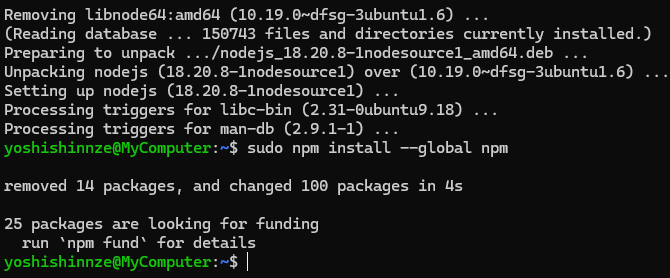
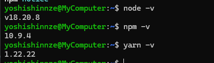
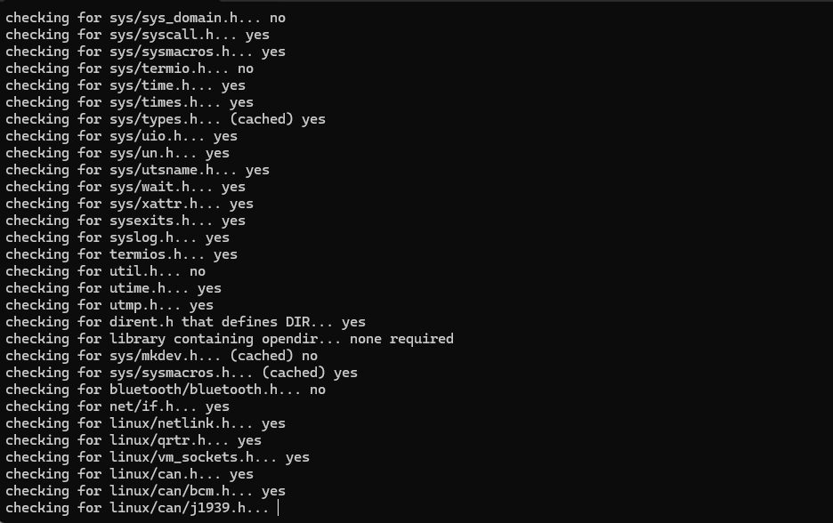

WSL(Windows Subsystem for Linux) 上でも、基本的にはほぼ同じ手順でOKです。

ただし、Node.js の最新版を apt で入れるために **NodeSource リポジトリ追加** が必要です。

以下は **WSL Ubuntu 用の手順**です。

---

## ✅ **WSL(Ubuntu)でのセットアップ手順**

### 1. パッケージ更新

```bash
sudo apt update
sudo apt upgrade -y
```

### 2. NodeSource リポジトリ追加（Node 18例）

```bash
curl -fsSL https://deb.nodesource.com/setup_18.x | sudo -E bash -

sudo apt-get install -y nodejs
```

> Node 20なら `setup_20.x` に変更。

### 3. 必要パッケージのインストール

```bash
sudo apt install -y wget git git-lfs cmake build-essential \
python3 python3-distutils default-jre swig zlib1g-dev \
doxygen nodejs pkg-config
```

### 4. npm / yarn インストール



```bash
sudo npm install --global npm
sudo npm install --global yarn
```

### 5. バージョン確認

```bash
node -v
npm -v
yarn -v
```



## ✅ **もし yarn が動かない場合**

WSL再起動 or root で実行

```bash
# WSLの再起動
wsl --shutdown
```

または

```bash
sudo yarn
```

---

## 📌 補足

| 項目                        | 補足                                                |
| --------------------------- | --------------------------------------------------- |
| WSLはUbuntuとほぼ同じ       | コマンドは同じでOK                                  |
| Node 最新を入れたいなら     | NodeSource 追加が必要                               |
| Windows側 Node を使わないで | Linux側の Node を使用するため PATH が自動設定される |

---

## ✨ 参考: Node バージョン管理したい場合

WSLなら `nvm` の利用もおすすめ

```bash
curl -o- https://raw.githubusercontent.com/nvm-sh/nvm/v0.39.7/install.sh | bash
source ~/.bashrc
nvm install 20
nvm use 20
```


# kiprインストール


```
mkdir kipr
cd kipr
```


### Clone this repository and its submodules:

```
git clone --recurse-submodules https://github.com/kipr/Simulator
```


## Build Dependencies

```
# Python 3.7+ is required for the build process
yarn run build-deps
```


