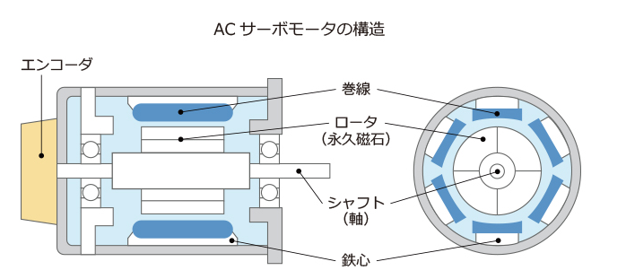
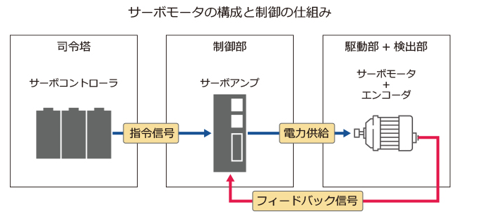

# サーボ

## 概要

ラテン語のＳｅｒｖｕｓ（サーバス：奴隷）が語源といわれ、奴隷は命令（指令）に対して、忠実に動く（動作）の意から、このような動きができる制御機構を一般にはサーボと呼ぶ。

__サーボの機構__

1. 動作命令部(司令部)
2. 命令通りにモータを動かす制御部分(サーボアンプ)
3. 動きの状態を監視する検出器を持つモータ部(サーボモータ)

__種類__

1. ACモータとDCモータ用の２種類
2. ACモータはDCモータに比べて制御が複雑。従来はDCモータが主流だったが、制御技術の進展によりDCモータ以上の制御が可能となる。
3. DCモータ特有のブラシ保守から開放される

## 構成

サーボモータは、過酷な環境で何度も起動と停止を繰り返しながら動くため、一般的なモータよりも信頼性が高く、壊れないような構造になっている。

かつては直流で動くDCサーボモータが使われていましたが、現在は交流で動くACサーボモータが主流になっている。

DCサーボモータには「ブラシ」という機械式なスイッチを必要とする。しかし、ブラシの定期的な交換や、摩耗による粉塵の発生などがあり、保守性や信頼性に問題があった。

現在主流は以下のACサーボモータ。構成はロータとステータより構成される。

1. ステータ

コアとなる鉄心の周りに電線が巻き付けられたもの。
電線に電流が流れると、ステータの中は電磁石になる。
交流は電流の向きと大きさが交互に変わるため、電磁石もそれに伴ってN極とS極に切り替わる。

2. ロータ

ロータはモータの軸にあたる部分で、そこにもN極とS極の強力な永久磁石が埋め込まれている。

3. エンコーダ

ロータ後部には回転センサであるエンコーダ。
エンコーダの内部にはスリットが切られていて、絶対位置をスリットより推測して回転角度を割り出すことが出来る。

## 仕組み

サーボモータは正確かつ素早く回転する機械ですが、モータ単体だけでは何も出来ない。

モータを動かすためには、司令塔の役割を果たす「プログラマブルコントローラ（PLC）」と、実際にサーボモータを動かす「サーボアンプ」（ドライバ）が基本的には必要。

サーボアンプは、容量ごとに異なるサーボモータの性能を最大限に発揮できるようにチューニングされているため、メーカーによって両者がセットで販売されることが一般的。

### 動作
1. プログラマブルコントローラから、サーボモータをどう動かすべきか「位置/速度/回転力」についての目標値が出力
2. サーボアンプは、サーボモータが目標値どおりに動くために必要な出力（電力）を供給
3. エンコーダが実際のサーボモータの回転位置や速度を検出し、その電気信号をサーボアンプに返す。
4. プログラマブルコントローラから出された目標値とフィードバック信号を比較して、その誤差がゼロに近づくように、サーボモータの出力をうまくコントロール

