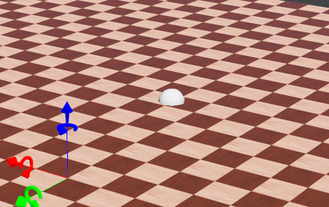

はい、サーボ機構（サーボモータ＋制御系）を勉強・設計・検証するために使えるフリー／オープンソースまたは無償ツールをいくつか紹介します。

ツールを選ぶときは、**動力学シミュレーション** が可能か、**モータ・制御系モデル** を組み込めるか、インターフェース（プログラミング言語、GUIなど）が使いやすいかを基準にすると良いです。

以下に候補と特徴を挙げ、それぞれ使いどころやメリット・デメリットを説明します。

---

## ✅ フリー / オープンソースのシミュレータ・ツール例

| ツール名                                                  | 種類 / 特性                                                                                                                                                                 | サーボ機構シミュレーションの可能性                                                                                                                                                                                                                                                           | メリット・注意点                                                                              |
| --------------------------------------------------------- | --------------------------------------------------------------------------------------------------------------------------------------------------------------------------- | -------------------------------------------------------------------------------------------------------------------------------------------------------------------------------------------------------------------------------------------------------------------------------------------- | --------------------------------------------------------------------------------------------- |
| **Webots**                                          | ロボット 3D シミュレータ（オープンソース） ([Cyberbotics](https://cyberbotics.com/?utm_source=chatgpt.com "Cyberbotics: Robotics simulation with Webots"))                        | モータ・アクチュエータをモデル化可能。サーボ（関節駆動）を含むロボットの動作制御を試せる                                                                                                                                                                                                     | GUI あり、ROS や Python インターフェースも対応。物理モデルの精度設定が必要                    |
| **Gazebo + ROS**                                    | ロボットシミュレータ環境                                                                                                                                                    | 関節駆動、モータモデル、トルク制御、PID 制御などをプラグインで拡張可能（多く使われる組み合わせ）                                                                                                                                                                                             | 学習コストあり。プラグイン設計が必要。物理エンジン（ODE, Bullet, etc.）のパラメータ調整が重要 |
| **Hopsan**                                          | メカトロニクス／流体混成システム向けシミュレータ ([ウィキペディア](https://en.wikipedia.org/wiki/Hopsan?utm_source=chatgpt.com "Hopsan"))                                         | 機械部品、モータ、伝動系、制御系をモデル化できるため、サーボ機構のダイナミクスを扱うことができる                                                                                                                                                                                             | GUI + スクリプト制御。伝動要素やセンサモデルの拡張が可能。                                    |
| **MuJoCo**                                          | 高精度物理エンジン（商用ライセンス必要）                                                                                                                                    | 関節動作や制御、モータ駆動などを扱える。サーボ制御を含む制御器との統合も可能                                                                                                                                                                                                                 | 無償版制限あり。研究用途ではライセンスが必要な場合あり。                                      |
| **Open-Source ROS-Gazebo アクチュエータプラグイン** | ROS / Gazebo 向け拡張                                                                                                                                                       | コンプライアント（柔らかい）アクチュエータ特性を追加するプラグインなど。サーボ駆動特性をシミュレート可能 ([Frontiers](https://www.frontiersin.org/journals/robotics-and-ai/articles/10.3389/frobt.2021.713083/full?utm_source=chatgpt.com "An Open-Source ROS-Gazebo Toolbox for Simulating ...")) | 既存のロボットモデルやプラグインとの互換性チェックが必要。                                    |
| **Circuit Simulator Applet**                        | 電子回路シミュレータ（Web ベース） ([Falstad](https://www.falstad.com/circuit/?utm_source=chatgpt.com "Circuit Simulator Applet"))                                                | サーボモータ回路（ドライバ＋センサ回路）部分をシミュレートする用途に使える                                                                                                                                                                                                                   | 機械側の動力学モデルは含まれない。回路動作観察用途向け。                                      |
| **Motion Perfect**                                  | 無償のサーボドライブ調整ソフトウェア ([Trio Motion Technology](https://www.triomotion.com/public/software/motionPerfectv5.php?utm_source=chatgpt.com "Trio • Motion Perfect 5")) | ドライブパラメータ調整、リアルタイム制御モニタ用。動力学全体シミュレーションではない                                                                                                                                                                                                         | 実機志向。シミュレーションというより「設定・調整」ツールとして活用可能                        |

---

## ⚙️ 使い方・選び方ヒント

1. **物理動力学の精度**

   — モータの慣性、減速機、摩擦、トルク定格、飽和などをモデル化できることが望ましい。
2. **制御系との統合性**

   — PID、モデル予測制御（MPC）、カルマンフィルタなどを組み込めるか。プラグインやインターフェース（Python, C++ など）を通じて制御器を実験できると理想的。
3. **拡張性**

   — 既存モデルを変更したり、要素を追加できる自由度があるか（たとえばジョイント摩擦モデル、バックラッシュ、剛性の変化など）。
4. **動作速度とリアルタイム性**

   — シミュレーション速度が実機に近いか、リアルタイム制御が可能か。
5. **ユーザコミュニティ・資料**

   — チュートリアル、プラグイン例、使用例が多いと学びやすい。


Webotはインストールしていた。

どうやってサーボするか確認したい。


## Webotsの簡単なシミュレーション

**Webots** は無料で使えるオープンソースの 3D 物理シミュレータで、

モータやセンサを持つ「サーボ機構（Servo mechanism）」を非常にリアルに再現できます。

Python や C/C++、ROS2 との連携も容易なので、学習から研究・開発まで幅広く使えます。

---

## 🔧 まず概要 — Webotsでのサーボ機構とは？

Webots では、

サーボモータを  **`RotationalMotor`** （回転型） または  **`LinearMotor`** （直動型）ノードとして定義します。

これらを関節（Joint）に取り付けることで、

「モータ制御（トルク／速度／位置）付きのメカ機構」をシミュレートできます。

---

## 🚀 ステップ1：Webotsのインストール

1. 公式サイトからダウンロード

   👉 [https://cyberbotics.com/#download](https://cyberbotics.com/#download)
2. OSに合わせてインストール

   * Windows / macOS / Ubuntu 全対応
   * Python コントローラを使う場合は Python3 が必要（自動検出されます）
3. 起動後、メニューから

   **“File → New Project Directory...”**

   を選んでプロジェクトを作成します。

---

## ⚙️ ステップ2：簡単なサーボ機構モデルを作る

ここでは「回転モータでリンクを動かす」簡単な例を作ります。

### world ファイル例（`servo_test.wbt`）

```txt
#VRML_SIM R2023b utf8
WorldInfo {
  basicTimeStep 16
}

Viewpoint {
  orientation -0.6 0.7 0.3 1.0
  position 0 1 2
}

# 地面
Solid {
  translation 0 -0.05 0
  children [
    Shape {
      appearance PBRAppearance {
        baseColor 0.2 0.7 0.2
      }
      geometry Box {
        size 2 0.1 2
      }
    }
  ]
}

# 回転ジョイント＋リンク
HingeJoint {
  jointParameters HingeJointParameters {
    axis 0 0 1
  }
  device [
    RotationalMotor {
      name "servo_motor"
      maxTorque 5
      maxVelocity 5
    }
    PositionSensor {
      name "servo_sensor"
    }
  ]
  endPoint Solid {
    translation 0 0.1 0
    children [
      Shape {
        appearance PBRAppearance {
          baseColor 0.3 0.3 0.9
        }
        geometry Box {
          size 0.5 0.05 0.1
        }
      }
    ]
    mass 0.1
  }
}
```

これで、**モータ付きのリンク** が床の上に配置されます。

---

## 🧠 ステップ3：Python コントローラでサーボを制御

Webots のプロジェクトディレクトリに

`controllers/servo_control/servo_control.py` を作成します。

### servo_control.py

```python
from controller import Robot

robot = Robot()
timestep = int(robot.getBasicTimeStep())

# デバイス取得
motor = robot.getDevice("servo_motor")
sensor = robot.getDevice("servo_sensor")
sensor.enable(timestep)

# 目標位置の設定
motor.setPosition(0.5)  # 0.5 rad の位置へ
motor.setVelocity(1.0)  # 回転速度
motor.setTorque(2.0)    # 出力トルク制限

while robot.step(timestep) != -1:
    pos = sensor.getValue()
    print(f"現在角度: {pos:.3f} [rad]")
```

---

## ▶️ ステップ4：実行

1. Webots 上で「Controller」タブから

   → `servo_control` を選択して **Run** ▶️
2. コンソールに角度が出力され、モータが一定角度まで回転します。

---

## 🧩 ステップ5：サーボ制御を発展させる

Webotsでは以下のような拡張も可能です：

| 制御内容                     | 概要                                                                           |
| ---------------------------- | ------------------------------------------------------------------------------ |
| **PID制御**            | 自分で `error = target - pos`を計算し、`motor.setTorque()`を動的に更新可能 |
| **速度制御モード**     | `motor.setPosition(float('inf'))`で速度指定のみの制御                        |
| **トルク制御モード**   | 物理的なトルク制御（例：柔らかいサーボ挙動）も再現可能                         |
| **外乱付加**           | 他の物体との衝突や重力で、モータが負荷を受ける                                 |
| **Pythonから動的制御** | 時間変化する目標位置、PIDチューニング、自動追従制御などが可能                  |

---

## 📚 さらに勉強したい方向け

* [Webots公式ドキュメント: RotationalMotor](https://cyberbotics.com/doc/reference/rotationalmotor)
* [Webotsチュートリアル: モータ制御入門](https://cyberbotics.com/doc/guide/tutorial-4-more-about-controllers)
* [Webots + ROS2連携](https://cyberbotics.com/doc/guide/using-ros)

---

もしよければ次に：

* ✅ PID制御で位置を滑らかに追従するサーボ制御
* ✅ トルク制御モードで外乱応答を再現する例

のどちらかを、Webots用Pythonスクリプトで実装してみましょうか？


Webots公式チュートリアル

* **Webotsチュートリアル** **：Webotsの公式ドキュメントには、さまざまなロボットやモーターを制御するための包括的なチュートリアルが用意されています。**
* **「4輪ロボット」（Tutorial 6）** **：車輪の回転モーター（サーボの一種である** `RotationalMotor`）を制御する基礎を学べます。プログラミング言語ごとのコード例も掲載されています。
* **コントローラープログラミング** **：基本的なコントローラーの作成方法から解説されており、C、C++、Python、Java、MATLABなど、複数の言語に対応しています。**
* **Webotsリファレンスマニュアル** **：**`Motor`ノードや `HingeJoint`ノードの詳細な解説が含まれています。アームなどの多関節ロボットを扱う場合、サーボモーターの速度や位置を制御する際に役立ちます。** **

YouTubeチャンネル

* **公式チャンネル（Cyberbotics）** **：Webotsの開発元であるCyberboticsが運営するチャンネルです。チュートリアル動画が多数公開されています。**
* **Soft_illusionチャンネル** **：Redditの** `r/robotics`で紹介されたチャンネルで、Webotsの基本操作からアクチュエーター（リニア/ローター）の制御まで、ゼロから学べるチュートリアルシリーズを提供しています。
* **サードパーティのチュートリアル動画** **：Webotsでのモーター制御を解説した動画が多数アップロードされています。**
* **例：「Webots tutorial 3: Controller code to drive a differential drive robot」** **（チャンネル名：Robot Learning）**
  * **差動駆動ロボットのモーター制御コードを解説しており、サーボ制御の考え方を学ぶ上で参考になります。**

学習の進め方

1. **公式チュートリアルから始める** **：まずは公式ドキュメントの「4輪ロボット」のチュートリアルを試すのがおすすめです。車輪の** `RotationalMotor`の制御から始めて、基本的なモーターの扱い方を理解しましょう。
2. **サンプルプロジェクトを参考にする** **：Webotsには多数のサンプルワールドが付属しています。関節を持つロボットアームなどのサンプルを参照すると、より複雑なサーボ機構の構成と制御方法を学べます。**
3. **YouTube動画で実践的な例を見る** **：動画は視覚的に分かりやすいので、公式ドキュメントと合わせて見ると理解が深まります。**
4. **リファレンスで詳細を確認** **：特定のパラメーターの意味や設定方法が分からない場合は、公式のリファレンスマニュアルで** `Motor`ノードの項目を調べましょう。** **


## wbtファイル

WBTファイルは、ロボットシミュレーションソフトウェアである**Webotsの世界（ワールド）ファイルを保存するファイル**です。** **

具体的には、WBTファイルには以下のような情報がテキスト形式で保存されています。

* **ワールドの構造** **: シミュレーション環境全体のレイアウト。床、壁、地形、家具などの静的なオブジェクトが定義されます。**
* **ロボットのモデル** **: ロボットの形状、センサー、モーターなどの構成要素の定義。それぞれのコントローラー（ロボットを動かすプログラム）のファイル名も含まれます。**
* **物理的な特性** **: 各オブジェクトの重力、摩擦、反発係数といった、物理エンジンの計算に必要なパラメーター。**
* **光源とカメラ** **: シーンの照明設定や、ユーザーの視点となるカメラの位置情報。**

これらの情報が `#VRML_SIM V8.5 utf8`といったヘッダーから始まるテキスト形式で記述されており、Webotsで開くことで、シミュレーションの仮想世界が再現されます。WBTファイルは、Webotsのプロジェクトにおいて中心的な役割を果たすファイルです。


WBTファイルをWebotsに適用する（読み込んでシミュレーションする）手順は、主に以下の3つの方法があります。** **

1. メニューから開く** **

最も一般的な方法です。

1. **Webotsを起動します。**
2. **メインメニューの**「File」** **から** **「Open World...」**を選択します。**
3. **表示されたファイル選択ダイアログで、開きたいWBTファイルを探して選択し、「開く」をクリックします。**
4. ドラッグ＆ドロップで開く

WBTファイルをWebotsのウィンドウに直接ドラッグ＆ドロップして開くこともできます。** **

1. **Webotsを起動します。**
2. **エクスプローラーやFinderでWBTファイルが保存されているフォルダを開きます。**
3. **WBTファイルをWebotsの3Dビューにドラッグ＆ドロップします。**
4. ダブルクリックで開く** **

WBTファイルがWebotsに関連付けられていれば、OSの機能を使って直接開けます。

1. **WBTファイルをダブルクリックします。**
2. **Webotsが自動的に起動し、指定したワールドが読み込まれます。**

補足：サンプルワールドを開く場合

Webotsには、さまざまな機能やロボットのサンプルワールドが付属しています。** **

1. **メインメニューの**「File」** **から** **「Open Sample World」**を選択します。**
2. **ダイアログが表示され、多くのサンプルWBTファイルがリストアップされます。**
3. **キーワードで検索したり、カテゴリで絞り込んだりして、目的のサンプルワールドを選んで開くことができます。**

WBTファイルの適用に関する注意点

* **プロジェクトフォルダ構造** **: WBTファイルは、通常、Webotsのプロジェクトフォルダ内の** `worlds`というサブディレクトリに保存されます。関連するコントローラーのコード（ロボットの動作を定義するプログラム）は、同じプロジェクトフォルダ内の `controllers`ディレクトリに保存されるのが一般的です。
* **関連ファイルの確認** **: WBTファイルにはコントローラーのファイル名が記述されています。そのため、WBTファイルを開くだけでなく、そのコントローラーコードも存在し、ワールドファイルから正しく参照されている必要があります。コードがない場合、ロボットは動作しません。**



